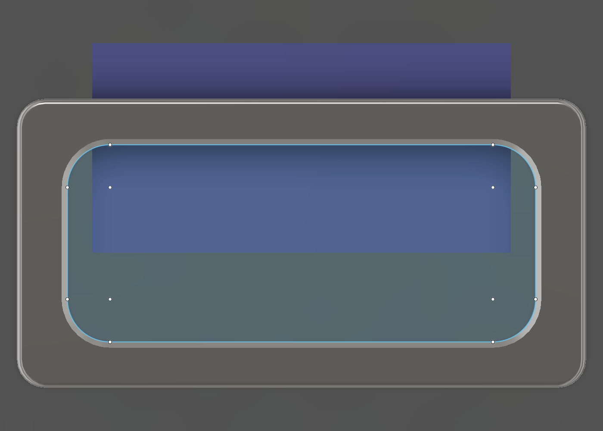

# Decca OLED Display Bezel — Rev Q Build Report

Status: **OPEN — bezel-only integration prototype. NOT released, NOT for merge.**

Date: 2026-08-30
Controlled requirements: `Decca_OLED_Display_Bezel_CAD_Brief_revQ.md` at commit
`7b107f2389b2ce128c18bef2f5195ef5ab468890` ("require two-loop inset wall"),
which supersedes `ebfa277` via `edab34b` ("define Rev Q interference fit"),
plus **five owner changes made on the model, recorded in §3.5 to §3.8**
Specification: `Decca_OLED_Display_Mount_Spec_v1.0.md` v1.2, §2 and §4
Carrier: **Rev P.5, RELEASED and FROZEN — unchanged, and proved unchanged (§9)**

> **The fit is now a real one.** The previous issue put the inset wall at
> 36.20 × 17.20 mm against a measured 35.20 × 15.30 opening — 1.00 mm oversize
> across and 1.90 mm up, which could not enter at all. The owner's fifth change
> (§3.8) pulls it back to **35.40 × 15.45**, giving **0.100 mm per side across
> and 0.075 mm per side up**. Both sit inside the 0.05–0.15 mm band a thin
> printed wall takes up by flexing, and the 0.20 mm lead-in leaves the tip
> *under* the opening so entry is free before the interference engages.
>
> **The first Rev Q print is an integration prototype, not a release part.**
> Three things it must settle and CAD cannot: whether the interference seats
> without stressing the original Perspex; whether the production slicer really
> lays **at least two continuous 0.40 mm loops** all the way round; and the
> **opening corner radius**, which has still never been confirmed — the R4.25
> insert corner is sized to cover the whole plausible range rather than to match
> a measurement (§8.3). Nothing in this report is a claim about appearance.

---

## 1. What Rev Q changes---

## 1. What Rev Q changes

The Rev N pair of side locating rails is deleted and replaced by a single
continuous rearward inset wall around the **complete** inside perimeter of the
Perspex opening — left, right, top, bottom and all four corners.

```text
front
BEZEL FACE
──────────────  seats against the Perspex front face,  z = +3.000
       │
       │  continuous inset wall, 2.80 mm rearwards,
       │  1.25 mm at the sides / 0.80 mm top and bottom
PERSPEX│
───────┘        wall rear tip,                         z = +0.200
rear
```

The wall is a **masking and locating skirt**. It is not a snap, not a clamp
and not a structural feature, and it carries no load. It runs on an
**interference on both axes** — 0.100 mm per horizontal side and 0.075 mm per
vertical side against the measured opening (§3.8) — with the thinner top and
bottom wall deliberately taking the smaller figure. The two Rev N recessed
adhesive pads are DELETED at owner instruction (§3.5), so retention is by the
fit alone; if adhesive is still wanted it goes on the flat seating face, and
**PETG creep means a press fit will slacken over months** — plan on adhesive if
the bezel must not drop out.

### 1.1 What the amendments and the owner changes did

| | first issue (`ebfa277`) | brief amendment (`7b107f2`) | **as built now** |
|---|---:|---:|---:|
| Bezel face opening | 30.40 × 14.90 | 30.90 × 15.35 | **32.90 × 13.85** |
| Inset-wall outer envelope | 34.90 × 15.00 | 35.40 × 15.20 | **35.40 × 15.45** |
| Horizontal fit | 0.15 clearance/side | 0.10 INTERFERENCE/side | **0.100 INTERFERENCE/side** |
| Vertical fit | 0.15 clearance/side | 0.05 clearance/side | **0.075 INTERFERENCE/side** |
| Wall | 0.40 (one loop) | 0.80 (two loops) | **1.25 sides / 0.80 top+bottom** |
| Outer corner radius | R0.60, UNRESOLVED | R2.00 | **R4.25** |
| Inner corner radius | R0.20 | R1.20 | **R3.00** (derived from the side wall) |
| Recessed adhesive pads | two, preserved | two, preserved | **deleted** (owner) |
| Wall inner envelope | 34.10 × 14.20 | 33.80 × 13.60 | **32.90 × 13.85** |
| Aperture | straight | tapered in Y | **straight bore, flush all four sides** |
| Effective optical opening | 30.40 × 14.20 | 30.90 × 13.60 | **32.90 × 13.85** |
| Depth | 2.80 | 2.80 | 2.80 (unchanged throughout) |

The corner radius has been through five owner values and is **still not a
measurement** — the real opening corner has never been confirmed, so R4.25 is
chosen to cover the plausible range rather than to match anything (§8.3). The
open risks now, in order: whether the interference seats without stressing the
Perspex, the **slicer**, and the unconfirmed opening corner.

---

## 2. Verified facts

### 2.1 Recovered from the released Rev N bezel — read-only evidence

`Front_Bezel_revN.step` was parsed as a BREP and every figure below was
measured out of it. The file was **not** opened for edit, not regenerated and
not re-exported.

| Recovered feature | Value | How |
|---|---|---|
| Overall envelope | 40.000 × 20.300 × 4.000 mm | vertex bounding box |
| X / Y extents | ±20.000 / ±10.150 mm | vertex bounding box |
| Z levels present | +0.200, +3.000, +3.300, +3.800, +4.200 | vertex Z census |
| External corner radius | **R2.000** at (±18.000, ±8.150) | cylindrical surfaces |
| Front edge break | **R0.400**, torus major 1.600 at the corners | toroidal surfaces |
| Visible window | 30.400 × 14.900, **R0.800** at (±14.400, ±6.650) | planes + cylinders |
| Window edge break | **R0.400**, torus major 1.200 | toroidal surfaces |
| Adhesive pads | x ±12.000, y 7.850…9.850 and −9.850…−7.850 | planes |
| Adhesive pad depth | 0.300 (floor at z = +3.300) | plane at z = 3.300 |
| **Locating rails — TWO ONLY** | x 15.300…17.450 and mirror, **y −4.000…+4.000** | R0.600 cylinders |
| Rail depth | z +0.200 … +3.000 = **2.800 mm** | plane pair |

Cross-checked against the Rev P build review §16, which independently states
40.00 × 20.30 × 4.00, a 2.80 mm lip depth, rearmost material at z = +0.200 and
0.500 mm clearance to the OLED glass. Both sources agree exactly.

> Note on the brief's `bezel_window_h` derivation. Brief §4 annotates
> 15.35 mm as "Rev N 15.10 + 0.25". 15.10 is the **v1.0 design-intent**
> figure from Spec §4; the **as-built** Rev N window measures **14.900 mm**
> in the released STEP. The 15.35 mm target itself is taken as authoritative
> and is built exactly; only the annotation's starting point is superseded.
> The width annotation ("Rev N 30.40 + 0.50") matches the as-built part.

### 2.2 The Z-chain — unchanged from Rev N and Rev P.5

```text
z = +4.200   bezel front face
z = +3.000   Perspex FRONT face  == bezel seating plane
z =  0.000   Perspex REAR face   == DATUM A, carrier hard stop
z = -0.300   OLED glass front face
             wall rear tip at z = +0.200
             -> 0.200 mm clear of the Perspex rear face
             -> 0.500 mm clear of the OLED glass  (the RELEASED value)
```

### 2.3 What the Rev N rails proved, and what they did not

* **PROVED:** the 2.80 mm engagement depth, and that a 34.90 mm outer envelope
  clears the opening in X.
* **NOT PROVED — anything in Y.** The rails span only y −4.000…+4.000. No Rev N
  surface has ever touched the top or bottom of the Perspex opening.
* **NOT PROVED — anything at any corner.** Rev G's note that the rail design
  "tolerates opening corner radii to R3.65" is the giveaway: that architecture
  was chosen *precisely so the unknown corner form would not matter*. Rev Q is
  the first bezel geometry that has to go into those corners.

### 2.4 Measured fascia geometry — Spec v1.2 §2

| Parameter | Value | Source |
|---|---:|---|
| Display opening | **35.20 × 15.30 mm** | measured, Rev C |
| Perspex thickness | **3.00 mm** | measured |
| Opening corner radius | **NOT RECORDED** | — see §8 |

The released Rev P generator models the opening as a **sharp-cornered box**.
Rev Q's reference panel does the same, so the two representations stay
identical. That is a modelling convention, not a measurement, and this report
never treats it as one.

---

## 3. Named parameters

Created before any dependent geometry and mirrored into Fusion user parameters,
the derived ones as real formulas so the derivation is visible in the UI.
Source of truth is the `P` dict in
`../CAD/Decca_Display_Bezel_revQ_fusion.py`.

### 3.1 Controlling parameters

| Parameter | Value | Class | Note |
|---|---:|---|---|
| `panel_open_w` | 35.20 mm | MEASURED | Rev C |
| `panel_open_h` | 15.30 mm | MEASURED | Rev C |
| `panel_t` | 3.00 mm | MEASURED | |
| `panel_open_corner_r` | 0.00 mm | **UNRESOLVED** | modelled sharp, as the released Rev P reference. Not a measurement. |
| `bezel_w` / `bezel_h` / `bezel_t` | 40.00 / 20.30 / 4.00 mm | PRESERVED | Rev N |
| `bezel_outer_r` | 2.00 mm | PRESERVED | Rev N external corner |
| `bezel_edge_break` | 0.40 mm | PRESERVED | front face break |
| `bezel_window_w` | **32.90 mm** | **OWNER** | was 30.90, +1.00 per side — §3.6 |
| `bezel_window_h` | **13.85 mm** | **OWNER** | must equal the skirt inner height — §3.7, §3.8 |
| `bezel_window_r` | **3.00 mm** | **OWNER** | must equal the skirt inner corner — §3.7, §3.8 |
| `pads_enabled` | **False** | **OWNER** | the two recessed adhesive pads are DELETED — §3.5 |
| `pad_*` | 12.00 / 7.85 / 9.85 / 0.30 mm | retained | Rev N values, kept only so the pads can be restored |
| **`bezel_lip_outer_w`** | **35.40 mm** | **OWNER** | 36.20 − 0.80 — §3.8 |
| **`bezel_lip_outer_h`** | **15.45 mm** | **OWNER** | 17.20 − 1.75 — §3.8 |
| **`bezel_lip_depth`** | **2.80 mm** | PROVEN | Rev N engagement depth |
| **`bezel_lip_wall_y`** | **0.80 mm** | **OWNER** | top/bottom, 2 loops — unchanged since the brief amendment |
| **`bezel_lip_wall_x`** | **1.25 mm** | **DERIVED** | sides — set by the flush requirement, 3.125 loops |
| **`bezel_lip_corner_r`** | **4.25 mm** | **OWNER** | outer corner radius; R2.00 (brief) → R3.00 (§3.5) → R3.40 (§3.7) → R4.25 (+25%, §3.8) |
| **`bezel_lip_lead`** | **0.20 mm** | PROVISIONAL | minimum entry lead-in |
| **`extrusion_width`** | **0.40 mm** | PRODUCTION | every wall is at least two of these |
| `ap_root_relief` | **0.00 mm** | MODELLING | anti-tangency — no longer needed, §3.4 |

### 3.2 Derived — never entered twice

| Parameter | Formula | Value |
|---|---|---:|
| `bezel_lip_interf_x` | `(bezel_lip_outer_w − panel_open_w) / 2` | **+0.100 mm** (interference) |
| `bezel_lip_interf_y` | `(bezel_lip_outer_h − panel_open_h) / 2` | **+0.075 mm** (INTERFERENCE) |
| `bezel_lip_clear_y` | `(panel_open_h − bezel_lip_outer_h) / 2` | **−0.075 mm** — negative, because it is an interference |
| `bezel_lip_wall_x` | `(bezel_lip_outer_w − bezel_window_w) / 2` | **1.250 mm** |
| `bezel_lip_inner_w` | `bezel_lip_outer_w − 2 × bezel_lip_wall_x` | **32.900 mm** = the face opening, i.e. flush |
| `bezel_lip_inner_h` | `bezel_lip_outer_h − 2 × bezel_lip_wall_y` | **13.850 mm** = the face opening, i.e. flush |
| `bezel_lip_inner_r` | `bezel_lip_corner_r − bezel_lip_wall_x` | **3.000 mm** = the face opening corner, i.e. flush |
| `wall_loops_x` / `wall_loops_y` | `wall / extrusion_width` | **3.125** / **2.000** |
| `aperture_rear_h` | `bezel_lip_inner_h` | 13.850 mm |
| `bezel_face_t` | `bezel_t − bezel_lip_depth` | 1.200 mm |
| `z_lip_rear` | `z_panel_front − bezel_lip_depth` | +0.200 mm |

Three constraints are enforced in code and refuse to build if violated:

* every wall must be **at least two** `extrusion_width`s. It is a minimum,
  applied per side, and the sides and the top/bottom are free to carry
  different numbers — the owner's clarification, §3.6. Below two the slicer
  cannot resolve the wall as complete loops and substitutes gap fill or a
  variable-width wall, which is what the brief amendment exists to stop;
* `bezel_lip_corner_r ≥ bezel_lip_wall_x`, since the inner corner radius is
  `corner_r − wall_x` and cannot go negative;
* `bezel_window_h` and `bezel_window_r` must **equal** the derived skirt inner
  height and corner radius. That is what keeps the aperture flush on all four
  sides (§3.7); if a driver is changed so they drift apart, the generator
  refuses to build rather than quietly producing a set-back or a ledge;
* no export path may write a file whose name contains `revN`, `revO` or `revP`.

### 3.3 The aperture no longer tapers — and why it used to

**Kept because the reasoning still governs the constraint the generator
enforces**, even though the feature it produced has now been designed out.

The brief's amended face opening was **15.35 mm** high while the entire inset
wall was only **15.20 mm** high, so the face opening was 0.075 mm taller *per
side than the outside of the wall*, and at the top and bottom the wall footprint
fell entirely inside it. A straight-walled face opening would have left the top
and bottom runs of the wall **detached from the bezel face** — roughly 31 mm of
free-standing cantilever floating in the aperture, unprintable and not one sound
solid. The fix was to taper the aperture in Y, from the wall inner opening at
the seating plane out to the face opening at the front face, at 36.10° — inside
the 45° self-supporting threshold.

**The owner's fourth change removed the condition entirely.** The face opening
is now flush with the skirt inner envelope on all four sides (§3.7), so:

| | value |
|---|---:|
| Aperture at the seating plane (z = +3.000) | 32.900 × 13.850, R3.000 |
| Aperture at the front face (z = +4.200) | 32.900 × 13.850, R3.000 |
| Taper angle from vertical | **0.00° — a straight bore** |
| Wall root landing on solid face material | the full 0.800 mm |

The generator still derives the taper rather than assuming zero, and the
validator still measures it, so re-opening the face beyond the skirt would
bring the taper back automatically instead of producing a detached wall. What
is *not* automatic, and is now enforced, is flushness: `bezel_window_h` and
`bezel_window_r` must equal the derived skirt inner height and corner radius or
the build is refused (§3.2).

One thing was lost with the taper. Spec v1.2 §4 asks for a flared aperture "to
reduce tunnel effect through the 3 mm Perspex", and a straight bore does not
flare. It is a **declared deviation**: flush was the owner's explicit
instruction, and a flare can only be reintroduced by cutting the face opening
*larger* than the skirt, which is exactly the set-back the owner rejected.

### 3.4 Two small modelling measures, both declared

**`ap_root_relief` — introduced at 0.02 mm, now back to 0.00.** It made the
aperture stop 0.02 mm per side *outside* the wall inner opening rather than
exactly on it. Landing it exactly on
y = ±6.800 makes the tapered wall tangent to the wall's inner face along a line
at z = 3.000, and the tessellator answers that with a seam of zero-area
triangles — **52 of them in the first export, all at exactly z = 3.0000**.
Backing the aperture off cured it at the time. The **real** cause was that the
two profiles coincided along the straight runs but differed at the corners; now
that the aperture's rear section carries the skirt's own corner radius (§3.6)
the profiles match exactly, there is no mismatch left to relieve, and the
relief is back to **0.00** with no degenerate triangles (minimum triangle area
3.484 × 10⁻³ mm²).

**The window edge break is a chamfer, not a fillet.** The outer envelope keeps
the Rev N R0.40 *fillet* exactly. The window edge cannot: the tapered aperture
is a single NURBS surface whose front edge is one closed NURBS curve with a
varying dihedral — 90° down the vertical left and right walls, 53.9° where the
top and bottom lean back, sweeping between the two through the corners. Fusion
refuses a fillet there at **every radius tried (0.40, 0.30, 0.20, 0.10 — all
`ASM_BL_UNFIN_SHEET`)**, whole-loop and per-edge alike. A **0.40 × 45°
chamfer** succeeds cleanly and is what is built. At 0.40 mm on a matt black
part the two are indistinguishable by eye, and the window had already been
re-dimensioned and flared by the amendment, so its section could not have been
carried over from Rev N unchanged in any case. **This is a declared deviation
and the only one in the visible face detail.**

### 3.5 Two owner changes made on the model

Both were directed after inspecting the built model, and both are **deviations
from the controlled brief**. Both are single named parameters, so either can be
reversed without touching anything else.

**1. The two recessed adhesive pads are deleted.** `pads_enabled = False`.
Brief §3.1 lists the "recessed adhesive pads" among the Rev N features to
preserve, and Rev N has two: 24.00 × 2.00 mm, 0.30 mm deep into the seating
face at y ±7.85…9.85. The owner identified them as the "two rectangle cut outs
on the underside" and directed their removal.

The deviation is defensible on its own terms. Rev N located on two side rails
with a **clearance** fit and needed adhesive to stay put. Rev Q is held by an
**interference** fit on both axes — 0.100 mm per side across and 0.075 mm up as
built (§3.8) — which makes bonded pads redundant, and a pocket in the seating
face is a place for the bezel to rock or for adhesive to squeeze out. The
seating face is now one unbroken annulus of **277.141 mm²**. Note the caveat in
§8.1: PETG creep will slacken a press fit over months, so if the bezel must not
drop out, adhesive on the flat face is the reliable retention.
Set `pads_enabled = True` to restore them exactly; the Rev N pad dimensions are
retained in the parameter table for that purpose.

**Consequence for retention:** the bezel is now retained by the interference fit
alone. If adhesive is still wanted it goes on the flat seating face rather than
into pads. **Removability must be re-checked on the prototype** — §10 Stage 1.

**2. The inset-wall outer corner radius is raised 50%, R2.00 → R3.00.** The
owner judged R2.00 not to match the real Perspex opening corner. Brief §2 and §4
state 2.00, but §7 explicitly allows the named corner parameters to be changed
when the fit needs it, so this is observation superseding a provisional value —
which is the whole point of an OPEN revision.

The inner corner radius follows from it and is not entered separately:
`bezel_lip_inner_r = 3.00 − 0.80 = 2.20` at the time. Both numbers moved
again under §3.6, §3.7 and §3.8 — the outer corner is now **R4.25** and the
inner **R3.00** — but the reasoning below is what set the direction, and it has
been the direction every time since.

It makes the part strictly more robust where it matters and slightly worse where
it does not:

| | R2.00 | **R3.00** |
|---|---:|---:|
| Deepest penetration, any plausible opening corner | 0.100 up to R_panel 2.05 | **0.100 across the whole range** |
| Tightest wall-loop radius at the corner | 1.400 | **2.400** — easier to slice |
| Unmasked corner gap, sharp opening | 0.562 | **0.836** |
| Ring cross-section area | 76.2025 mm² | 74.8290 mm² (85.5432 after §3.6, 102.1057 after §3.7, **83.4857** after §3.8) |

A corner that is too **square** jams before the bezel seats; a corner that is
too **round** merely leaves a little cut edge visible at each corner. The change
trades the first failure mode for the second, which is the safer direction while
the opening corner remains unmeasured. §8.3 has the full table.

---

### 3.6 Third owner change — the flush aperture and the split wall

> **Superseded in part by §3.7 and §3.8.** The reasoning here is what
> established the flush rule and the non-uniform wall, and both still
> govern. The figures moved out under §3.7 and then most of the way back
> under §3.8; as built the side wall is **1.25 mm** again, exactly as this
> section derived it, with the outer corner at R4.25 and the clear opening
> at 32.90 × 13.85.

Directed after inspecting the model: *"increase the horizontal opening by 1 mm
each side, expand the thickness of the perspex insert wall to make it flush
with the opening, no change to the outer dimension"* — and, on the meaning of
flush, *"not set back as in the current design on the left and right side."*

That set-back was real. The face opening was 30.90 and the skirt inner was
33.80, so looking in through the window the skirt stood **1.45 mm outboard**
on each side — a visible rearward ledge.

**The three constraints solve uniquely, and they collided with the loop rule.**
Opening 32.90 and a fixed 35.40 outer envelope force a wall of
`(35.40 − 32.90)/2 = 1.25 mm`. At a 0.40 mm extrusion that is **3.125 loops** —
not a whole number. Worse, applying 1.25 mm uniformly would have dragged the
vertical clear opening from 13.60 to 12.70 and cost another 0.45 mm of lit
band, which the owner ruled out.

**The owner then clarified the rule itself:** it is **at least** two loops, and
**the sides and the top/bottom need not carry the same number**. That releases
the wall from having to be uniform, and all three constraints can be met at
once:

| | value | loops | why |
|---|---:|---:|---|
| Side wall (X) | **1.250 mm** | 3.125 | **derived** from the flush requirement |
| Top/bottom wall (Y) | **0.800 mm** | 2.000 | entered — holds the 13.600 clear height |
| Through the corners | 0.800 → 1.193 mm | ≥ 2.000 | sweeps between the two |

The inner corner radius follows the **thicker** wall,
`R1.75 = R3.00 − 1.25`. That is not a free choice: it puts the inner corner arc
centre on the same x as the outer arc centre, so the wall sweeps smoothly and
reaches its minimum exactly at the top/bottom tangent. **Any smaller inner
radius squares the corner off and thins the wall below 0.800** — at R0 it
collapses to 0.189 mm. R1.75 is the smallest value that keeps two full loops
all the way round, and `validate()` re-measures it rather than trusting the
derivation.

**What it costs: nothing vertically.** The clear opening goes
30.90 × 13.60 → **32.90 × 13.60**. The height is untouched, so the visible lit
band stays at **7.450 mm**. The aperture gains 2.00 mm of width and loses the
side ledge entirely.

**What it costs: insertion force.** The interference is horizontal, so it is
resisted by the *side* wall — the one that just went to 1.25 mm. Bending
stiffness scales with thickness cubed, so that wall is **≈31× stiffer than the
original 0.40 mm** and **≈3.8× stiffer than the 0.80 mm** it replaced on the
sides. Brief §3.8 wants the printed wall to take the deflection and the Perspex
to be left unstressed; at 1.25 mm that is a materially harder ask. **This makes
the fit gauge mandatory rather than advisable** — see §8.1.

**Two knock-on model fixes**, both found by the validator and both fixed at the
root rather than waived:

* the aperture's rear section used to over-run 0.05 mm below the seating plane.
  Harmless while the aperture was 30.90 wide inside a 33.80 skirt; with the
  side flush the two share a width, and the over-run bit the top of the wall at
  all four corners — **0.84 mm² of ring area missing at z = 2.95** while
  z = 0.45 and 1.60 measured correctly. The rear section now stops exactly on
  the seating plane.
* the aperture's rear corner radius was the window's R0.80 against the skirt's
  R1.75, so it bulged outside the skirt corner and left a crescent-shaped 90°
  ledge hanging over the aperture — **3.40 mm² of unsupported overhang** across
  the four corners. The rear section now carries the skirt's own R1.75. With
  the profiles matching exactly, `ap_root_relief` is back to **0.00** — the
  0.02 mm anti-tangency dodge existed only to paper over that mismatch.

---

### 3.7 Fourth owner change — the interference fit

> **Superseded by §3.8, and kept because the finding is the point.** This
> change put the skirt 1.00 mm oversize across and 1.90 mm oversize up
> against the measured opening, which could not be assembled. It was
> reported as such by the generator, the validator and the offline verifier
> rather than softened, and the owner then pulled the geometry back in §3.8.
> **The flush rule, the straight bore and the loop accounting introduced
> here all survive unchanged.**

Directed after inspecting the model: *"the refinement now is to create the
interference fit. 1) without changing the size of the horizontal opening add a
single vertical wall loop to each of the outer faces of the perspex insert.
2) increase the vertical opening by 2 mm, ie moving the top and bottom perspex
insert walls up and down by 1 mm."*

Scope was confirmed with the owner before modelling: the extra loop goes on the
**left and right outer faces only**, and the bezel face opening is opened with
the skirt so the vertical clear opening gains the full 2.00 mm.

**Move 1 — one extra 0.40 mm loop on each side, added outward.**

| | before | after |
|---|---:|---:|
| Outer envelope width | 35.400 | **36.200** |
| Side wall | 1.250 (3.125 loops) | **1.650 (4.125 loops)** |
| Outer corner radius | R3.000 | **R3.400** |
| Opening width and inner corner | 32.900, R1.750 | **32.900, R1.750 — unchanged** |

The loop is applied at the corners as a **true outward offset**, and that is not
decoration. The inner corner radius is `corner_r − wall_x`, so holding the outer
corner at R3.00 while the wall went 1.25 → 1.65 would have dragged the *opening*
corner from R1.75 to R1.35. The instruction was to leave the horizontal opening
alone, so the outer corner absorbs the loop and the opening comes through
bit-for-bit identical.

**Move 2 — the top and bottom walls move 1.00 mm out each.**

| | before | after |
|---|---:|---:|
| Outer envelope height | 15.200 | **17.200** |
| Top/bottom wall | 0.800 (2.000 loops) | **0.800 — translated, not thickened** |
| Inner envelope height | 13.600 | **15.600** |

**The face opening had to follow.** At 15.35 it would have become the new
limiter and delivered +1.83 mm of vertical opening instead of the +2.00 mm
asked for, so it goes to **15.60** — and its corner radius goes to **R1.75** as
well. That second part is not cosmetic tidying: at R0.80 the face corner is
*fuller* than the skirt's R1.75, so once the two share the same extents the face
corner would have become the visible one and sharpened the clear opening from
R1.75 to R0.80. R1.75 leaves what the eye actually sees exactly as it was.

**What it buys — the aperture becomes one straight flush bore.** Face opening,
skirt inner envelope and corner radius are now identical, so the taper is gone
(§3.3), the wall root lands on its full 0.800 mm of face material, and there is
no ledge, set-back or corner crescent anywhere in the bore. The offline verifier
measures the opening at three heights — two in the face plate, one down in the
skirt — and gets 32.9000 × 15.6000 at every one, spread 0.0000 mm.

**What it buys optically.** The clear opening goes 32.90 × 13.60 →
**32.90 × 15.60**, and for the first time the lip gives opening back rather than
costing it: the visible lit band goes **7.450 → 8.450 mm**, which is 0.350 mm
*more* than Rev N ever showed. §5 has the full accounting.

**What it costs, and this is the finding of the whole change.** Both moves push
material outward into the Perspex opening:

| | skirt | measured opening | fit |
|---|---:|---:|---|
| Width | 36.200 | 35.200 | **+0.500 mm per side, interference** |
| Height | 17.200 | 15.300 | **+0.950 mm per side, interference** |

The vertical figure was a 0.050 mm *clearance* before this change. It is now a
0.950 mm interference, and **that is not a press fit — the skirt is 1.90 mm
taller than the hole and cannot enter it.** PETG will not give that up, and the
0.20 mm entry lead-in no longer buys free entry either: even at the tip the
skirt is 0.60 mm over the opening width, so the interference is resisted from
first contact.

Two readings are possible and CAD cannot choose between them:

* `panel_open_h = 15.30` is a **MEASURED Rev C** value that no Rev N surface
  ever touched (§2.3, §8.4). If the real opening is taller than recorded, the
  figures above are wrong and the fit may be reasonable. **Re-measure the
  Perspex opening before printing a bezel.**
* Or the 1.00 mm per side vertical move overshoots and should be reduced.

The measured panel figures are **deliberately not adjusted** to make the numbers
look right. The generator, the validator and the offline verifier all state the
interference plainly and all three refuse to soften it. This triggers the
brief's second stop condition — see §11.

**Everything else is unchanged**: the 40.00 × 20.30 × 4.00 envelope, the 2.80 mm
depth, the 0.20 mm lead-in, the 0.80 mm top/bottom wall, the two-loop minimum,
and all Rev P.5 carrier geometry and files.

---

### 3.8 Fifth owner change — pulling the fit back into range

Directed after reading §3.7: *"increase the perspex corner radius by 25%,
reduce the perspex insert width by 0.8 mm, decrease insert height by 1.75 mm."*
The dimensions were cross-checked with the owner before modelling.

| | before | change | **after** |
|---|---:|---:|---:|
| Outer width | 36.200 | −0.800 | **35.400** |
| Outer height | 17.200 | −1.750 | **15.450** |
| Outer corner radius | R3.400 | ×1.25 | **R4.250** |

**This is the fit the revision needed.** Against the measured 35.20 × 15.30
opening:

| | insert | opening | per side |
|---|---:|---:|---|
| Width | 35.400 | 35.200 | **+0.100 interference** |
| Height | 15.450 | 15.300 | **+0.075 interference** |

Both figures land inside the **0.05–0.15 mm** band a thin printed wall takes up
by flexing rather than by pushing on the acrylic, and the smaller vertical
figure is deliberate — it is resisted by the thinner 0.80 mm wall. Two things
matter as much as the numbers:

* the **0.20 mm lead-in now buys free entry again**. At the tip the skirt is
  35.000 × 15.050, which is **0.100 mm per side under** the opening across and
  **0.125 mm per side under** it up, with the full section restored by
  z = +0.400. The part locates before it engages, instead of fighting from
  first contact as §3.7 left it;
* **print tolerance is the same size as the fit.** A well-tuned FDM machine
  holds roughly ±0.10 mm on a small external dimension and tends to run over
  nominal, so an intended 0.100 mm interference realistically arrives anywhere
  between 0.00 and 0.25 mm. That is the real reason the value cannot be picked
  from theory and the fit gauge exists.

**The side wall returns to 1.250 mm.** The −0.800 mm on the width exactly undoes
the outward loop §3.7 added, so the wall is back to the 3.125 loops §3.6 derived
from the flush requirement, and the interference is now resisted by a wall
≈31× stiffer in bending than the original 0.40 mm rather than ≈70×.

**The corner only ever goes up, and here is why.** The two failure modes are
asymmetric: an insert corner **squarer** than the opening corner touches before
the flanks do, so the part jams and never seats — a hard failure. An insert
corner **rounder** than the opening merely leaves a crescent of cut edge visible
at each corner apex — cosmetic. So every unit of uncertainty in the unmeasured
opening corner should be spent on the round side. At R4.25 the flanks set the
fit for any opening corner up to R4.00, which covers the whole plausible range;
§8.3 has the sensitivity table.

**What it costs optically.** The clear opening goes 32.90 × 15.60 →
**32.90 × 13.85**, because the wall thickness is unchanged and the face opening
is flush to it, so the aperture tracks the insert height exactly. The lit band
goes 8.450 → **7.575 mm**, which is 0.525 mm less than Rev N. That is the +2.00
of §3.7 coming back off, less 0.25. §5 has the full accounting.

**And the aperture corner opens to R3.00**, derived as R4.25 − 1.25. It is not a
free choice — the flush rule makes the face opening carry the skirt's own corner
— so a rounder insert corner necessarily gives a rounder window. At R3.00 on a
13.85 mm tall opening, 7.85 mm of the height is straight and the rest is arc:
the aperture reads as a distinctly rounded rectangle. Squaring it up would mean
thickening the side wall, which would narrow the clear opening about 1.5 mm for
0.75 mm of corner squareness — a poor trade, and not one that was asked for.

**Unchanged**: the 40.00 × 20.30 × 4.00 envelope, the 2.80 mm depth, the 0.20 mm
lead-in, the 0.80 mm top and bottom wall, the flush rule, the straight bore, the
two-loop minimum, and all Rev P.5 carrier geometry and files.

---

## 4. Exact resulting dimensions

| | mm |
|---|---:|
| Bezel envelope | **40.000 × 20.300 × 4.000** |
| Bezel face thickness | 1.200 |
| External corner radius | R2.000 |
| Front edge break, outer | R0.400 fillet |
| Front edge break, window | 0.400 × 45° chamfer (§3.4) |
| Seating plane (Perspex front) | z = +3.000 |
| Bezel front face | z = +4.200 |
| **Bezel face opening, at the front face** | **32.900 × 13.850**, R3.000 |
| Aperture at the seating plane | **32.900 × 13.850**, R3.000 — identical, i.e. flush |
| Aperture taper | **0.00° — a straight bore** |
| **Inset-wall outer envelope** | **35.400 × 15.450** |
| **Inset-wall inner envelope** | **32.900 × 13.850** — flush with the face opening on all four sides |
| **Wall thickness** | **1.250 sides / 0.800 top and bottom**; corners sweep 0.800 → 1.216, never below 0.800 |
| **Wall depth** | **2.800** (z +3.000 → +0.200) |
| Outer corner radius | **R4.250** |
| Inner corner radius | **R3.000** |
| Entry lead-in | 0.200 × 45°, outer rear edge only |
| Section at the tip, after the lead-in | 35.000 × 15.050 — **0.100 / 0.125 mm per side UNDER the opening** |
| Bezel flange remaining outboard of the skirt | 2.300 sides / 2.425 top and bottom |
| **Horizontal fit** | **0.100 INTERFERENCE per side** |
| **Vertical fit** | **0.075 INTERFERENCE per side** |
| Interference volume, as modelled | **15.391 mm³** |
| Rearmost material | z = **+0.200** — 0.200 clear of the Perspex rear face |
| Clearance to OLED glass front face | **0.500** — the released Rev N/P value |
| Minimum distance to the Rev P.5 carrier | **0.939** |
| **Effective optical opening** | **32.900 × 13.850**, R3.000 |
| Seating face | one unbroken annulus, **277.141 mm²** (no adhesive pads) |
| Solid volume | 0.6618 cm³ (mesh 653.322 mm³) |
| Mass in PETG @ 1.27 g/cm³ | ≈ **0.84 g** |
| Mesh | 3660 triangles, 1830 vertices, closed, manifold, no degenerates |

---

## 5. Optical masking introduced by the wall

**The wall costs clear height again after §3.8**, having briefly given some back
under §3.7. The whole accounting, restated:

| | Rev N | Rev Q | change |
|---|---:|---:|---:|
| Clear opening width | 30.400 | **32.900** | **+2.500** |
| Clear opening height | 14.900 | **13.850** | **−1.050 total, −0.525 per side** |
| Corner radius | R0.800 | **R3.000** | the skirt corner, now shared by the face |

The clear opening is controlled by the **skirt inner envelope on all four
sides**, with the bezel face opening flush to it, so neither one masks the
other. A continuous wall has to exist at the top and bottom of the opening and
has to have a thickness — that is the structural reason the height is a loss,
and it is unavoidable. What *is* a choice is how far out the whole wall sits,
and the owner has moved that four times.

The history, since the direction of travel matters more than any single figure:

| | clear opening | lit band |
|---|---:|---:|
| Rev N | 30.40 × 14.90 | 8.100 |
| Rev Q, 0.40 mm wall | 30.90 × 14.20 | 7.750 |
| Rev Q, 0.80 mm wall | 30.90 × 13.60 | 7.450 |
| Rev Q, flush sides (§3.6) | 32.90 × 13.60 | 7.450 |
| Rev Q, walls out (§3.7) | 32.90 × 15.60 | 8.450 |
| **Rev Q as built (§3.8)** | **32.90 × 13.85** | **7.575** |

Width has only ever grown. Height ends 1.05 mm below Rev N, having been 1.30 mm
below it at the brief amendment and 0.70 mm above it one change ago.

### 5.1 Effect on the powered image

Taking the OLED position from the **released Rev P.5** model — active area
29.42 × 14.70 mm, active centre at y = +6.70 mm after the Rev P.5 +7.00 mm rise:

| | Rev N | Rev Q at §3.7 | **Rev Q as built** |
|---|---:|---:|---:|
| Visible active width | 29.420 | 29.420 | **29.420** (unchanged throughout) |
| Visible active height | 8.100 | 8.450 | **7.575** |
| Active height versus Rev N | — | +0.350 | **−0.525**, all at the TOP edge |
| Unlit board visible below | 6.800 | 7.150 | **6.275** |

The bottom edge of the aperture is nowhere near the active area — the active
area's own bottom edge sits at y = −0.650 mm, well inside the aperture — so the
bottom of the wall costs no active area at all and hides 0.525 mm more unlit
board than Rev N did. **The entire optical cost is 0.525 mm off the top of the
lit band**, about 6.5 % of what was visible at Rev N.

For context, the already-released Rev P.5 condition still dominates: only
8.30 mm of the 14.70 mm active height falls inside the Perspex opening at all.
Rev Q takes a further 0.525 mm off the top of that.

`Decca_OLED_Display_Bezel_revQ_optical.png` shows this to scale.

> **CAD does not get a vote on whether this is acceptable.** It reports the
> geometry. Whether the intended screen content is readable through a
> 32.90 × 13.85 mm aperture, and whether an R3.00 corner on it looks right, are
> settled by the powered test in §10 and by nothing else.

---

## 6. Validation results

Two independent tools. Neither check was altered, relaxed or removed.

### 6.1 In Fusion — `validate()` — **52/52 PASS**

| Group | Result |
|---|---|
| Solid integrity | one body, closed solid, **1 shell, 1 lump**, 0 sliver faces < 0.001 mm², 0 sliver edges < 0.005 mm; 45 faces, 108 edges |
| Envelope | 40.00000 × 20.30000 × 4.00000; front face +4.20000; rearmost +0.20000 |
| **Wall continuity, by AREA** | full ring **83.4857 mm²** at z = 0.45, 1.60 and 2.95 — matching the analytic value to four decimals |
| Continuity by region | top **21.5200**, bottom **21.5200**, right **8.6875**, left **8.6875**, corners **23.0707 mm²** — every one exact |
| Outer envelope | exactly 35.4000 × 15.4500 |
| **Flush, all four sides** | skirt inner **32.9000 × 13.8500 R3.0000** == face opening **32.9000 × 13.8500 R3.0000** — three separate gates |
| Wall through the R4.25 corners | sweeps **0.8000 → 1.2164 mm**, never below the 0.80 top/bottom wall, never above the 1.25 side wall |
| Loop rule, per side | sides **3.125** loops, top/bottom **2.000** loops, corners never below **2.000**; corner loop radii **4.050** and **3.650**, no cusp; centrelines exactly **0.4000** apart |
| **Interference present** | **15.3914 mm³** of overlap |
| Interference bounded | deepest **0.1000 mm** in X and **0.0750 mm** in Y — exactly the declared values, nowhere more |
| Interference located | confined to the lip depth, z 0.3000…3.0000 — it starts at +0.300, below which the lead-in holds the section clear |
| Relief test | with 0.100/0.075 mm relief applied, overlap falls to **0.000000 mm³** |
| Behind the Perspex rear face | **0.000000 mm³** |
| OLED glass | 0.000000 mm³; clearance 0.5000 mm |
| **Rev P.5 carrier** | **0.000000 mm³**; minimum distance **0.9394 mm** |
| Optical opening, plug test | a 32.86 × 13.81 plug passes clean through (0.000000 mm³); a 32.94 × 13.89 plug does not |
| Aperture | 32.900 × 13.850 at both the seating plane and the front face — taper **0.00°** |
| Print orientation | wall worst overhang **0.000°**; 0.0000 mm² of >45° overhang outside the bed-adjacent break; bed contact 278.438 mm² |

Two gates are reports rather than pass/fail: the fit summary, and the **entry
clearance at the tip** — 0.100 mm per side across and 0.125 mm per side up,
stated every run so the lead-in's contribution cannot quietly disappear again.

Continuity is proved by **cross-section area**, not by point sampling.
`BRepBody.pointContainment` is not trustworthy on this body — containment
reported the middle of the open aperture as solid and scattered points inside
the wall as void. Area, taken by boolean intersection with a thin slab, is
exact, and it is the **stronger** proof: any break, thin spot or gap anywhere in
the ring removes area, and an exact match leaves nowhere for one to hide.

### 6.2 Offline from the mesh — `Decca_Display_Bezel_revQ_verify.py` — **47/47 PASS**

Reads only `../STL/Front_Bezel_revQ.stl`, numpy only, exits non-zero on
failure. It re-derives every claim from triangles and compares against figures
typed in by hand from the controlled documents — deliberately *not* imported
from the generator.

```text
1. MESH TOPOLOGY       every edge shared by exactly 2 triangles; consistent
                       winding; ONE connected component; no orphan vertices;
                       NO degenerate triangles (min area 6.754e-03 mm2);
                       3660 triangles, volume 653.3216 mm3
2. ENVELOPE            40.0000 x 20.3000 x 4.0000; front +4.2000; rear +0.2000
3. BEHIND THE PERSPEX  lowest z = +0.2000; 0.2000 clear of the rear face;
                       0.5000 clear of the OLED glass
4. WALL SECTIONS       35.4000 x 15.4500 at z = 0.45, 1.60 and 2.95
5. WALL CONTINUITY     720/720 stations x 3 depths, 0 voids
                       left 88/88  right 88/88  top 88/88  bottom 88/88
                       corner 368/368
                       wall MEASURED at 720 of 720 stations, none skipped
                       min 0.7950  max 1.2450  mean 0.9993
                       through the R4.25 corners: 368 stations, 0.7950..1.2450
5b. LOOP RULE          sides 3.125 loops, top/bottom 2.000, thinnest measured
                       0.7950; corner loop radii 4.05 / 3.65, no cusp;
                       centrelines 0.4000 apart; inner corner R3.00; FLUSH
6. ENVELOPE + FIT      inner 32.9000 x 13.8500; depth 2.8000;
                       INTERFERENCE +0.1000/side X and +0.0750/side Y
7. FACE + OPTICAL      13.8500 at z = 3.70, 3.20 and 1.60, spread 0.0000;
                       32.9000 wide at all three; taper 0.000 deg;
                       EFFECTIVE 32.9000 x 13.8500
8. LEAD-IN             tip 35.0020 (expected 35.0000); full section restored
                       by z = +0.400; the tip is 0.100 mm per side UNDER the
                       opening, so entry is free before the fit engages
RESULT: 47/47 PASS
```

> **Two defects in this verifier were found and fixed at the previous issue, and
> one invalidated a figure published before that.** The inward wall walk stopped
> at 0.600 mm, which is less than even the 0.80 mm top wall, so it never found
> an exit, dropped every station, and left the wall array **empty** — the three
> gates that depend on it were never created at all. That is not the same as
> passing, and the figure published then was reading the gate's *label*, which
> prints the expected constants, not a measurement. The walk now reaches twice
> the thickest wall and a gate fails unless all 720 stations return a figure.
> Separately, the even-odd inside test double-counted a ray landing exactly on a
> tessellation seam; coincident crossings are now collapsed before the parity
> count.

### 6.3 Sprung-post and module corridors

Covered rigorously rather than by inspection. A synthetic solid spanning
**everything behind the Perspex rear face** (the full opening footprint and far
beyond, z from −30 to 0) was intersected with the bezel: **0.000000 mm³**.

Every corridor of concern — the four sprung posts and their noses (forward-most
at z = −0.400), the module insertion and removal path, the glass, the PCB and
the carrier itself — lies entirely at z < 0. The bezel's rearmost material is at
z = +0.200 and it does not reach z = 0. It therefore cannot enter any of them,
and this is proved without needing to model any of them individually.

---

## 7. Print orientation and settings

**Orientation: bezel FRONT FACE flat on the bed, wall pointing up. No supports.**

In this orientation:

* the wall is a **vertical wall** — measured worst overhang across all 26 wall
  faces is **0.000°**;
* the wall is printed **last**, standing on the already-solid bezel face, so it
  is supported at its root for its entire 2.80 mm height;
* the 0.20 mm entry lead-in is at the **top** of the print and tapers *inward*,
  so it is self-supporting;
* the aperture is a **straight bore** — there is no taper left to check against
  the 45° threshold, and no ledge anywhere in it;
* bed contact is **278.4 mm²** of flat cosmetic face.

The alternative (rear face down) is wrong: the wall would print first as an
unsupported free-standing ring, and the bezel face would then be a full 90°
overhang over it.

### 7.1 The wall loops — at least two, per side

The loop rule is **at least two 0.40 mm loops, applied per side** — the sides
and the top/bottom are free to carry different numbers (§3.6). The first issue's
0.40 mm wall resolved as a single loop, which is what the brief amendment fixed.
The side wall has since been 1.25 (§3.6), 1.65 (§3.7) and is **1.25 again**
(§3.8), so it carries three; the top and bottom have been 0.80 throughout.

What CAD can prove, and does:

| Property | Value |
|---|---|
| Side wall / extrusion width | **1.250 / 0.400 = 3.125 loops** |
| Top/bottom wall / extrusion width | **0.800 / 0.400 = 2.000 loops exactly** |
| Measured wall, 720 stations | min **0.7950**, max **1.2450**, mean **0.9993** — every station measured, none skipped |
| Measured wall through the corners | 368 stations, **0.7950 → 1.2450**, never below two loops |
| Corner wall sweep, analytic | **0.8000 → 1.2164 mm** across the arc; the full 1.250 is carried on the straight side runs |
| Outer loop centreline radius at the corner | 4.25 − 0.20 = **4.050** |
| Inner loop centreline radius at the corner | 4.25 − 0.60 = **3.650** |
| Loop centreline separation | **0.400** — one extrusion, everywhere |
| Smallest offset radius | **3.650** — no cusp, no self-intersection |

With an R4.25 outer and R3.00 inner corner both loop centrelines remain smooth
closed curves the whole way round, and neither collapses or merges at the
corners. The tightest loop radius is 3.650 mm — the easiest it has been at any
issue, and one of the quiet benefits of the owner's repeated corner increases.

> **CAD cannot prove what the slicer does.** It proves the geometry *admits*
> the loops. The production slicer preview is a separate, physical gate — see
> §10 Stage 0b.

| Setting | Value | Why |
|---|---|---|
| Nozzle / extrusion width | **0.40 mm** | the wall *is* two of these |
| Layer height | 0.15–0.20 mm | 14–19 layers up the wall |
| Perimeters | **at least 2** in every wall | the sides take 3, the top and bottom 2 — a variable-width generator such as Arachne is HELPFUL here, not a hazard, because the two thicknesses differ |
| Thin-wall / gap fill | **OFF** if it can be | 0.80 is exactly two extrusions and needs none; if the slicer inserts gap fill in the top or bottom wall, the setting is wrong |
| Arachne / variable width | acceptable, but **check the preview** | Arachne may merge 0.80 into one 0.8 mm-wide extrusion — that is a single loop and **fails** the requirement |
| External perimeter speed | ≤ 25 mm/s in the wall | a 2.80 mm tall standing ring |
| Cooling | 100 % over the wall | tiny per-layer loop |
| Material | PETG / PETG-HF, matt or satin **black** | as Rev N |
| Supports | **none** | nothing needs them |
| Bed face | 4+ top/bottom layers or ironing | it is the visible cosmetic face |

> **If your extrusion width is not 0.40 mm**, set `bezel_lip_wall_y` to at
> least **two** *actual* extrusion widths and regenerate. The side wall is
> derived from the flush requirement and is not yours to set. Everything
> downstream — `bezel_lip_inner_w/h`, `bezel_lip_inner_r`, the aperture and
> therefore the optical opening — follows automatically, and the generator
> refuses to build any wall carrying fewer than two loops.

---

## 8. Open risks

### 8.1 The interference fit — back in range, and still the primary gate

After §3.8 the numbers are ordinary again: **0.100 mm per side across and
0.075 mm per side up**, against a skirt that measures 35.400 × 15.450 into a
measured 35.200 × 15.300 opening. Both sit inside the 0.05–0.15 mm band a thin
printed wall takes up by flexing rather than by pushing on the acrylic, and the
0.20 mm lead-in leaves the tip 0.100 and 0.125 mm per side *under* the opening
so the part locates before it engages.

That does not close the gate, for three reasons.

**Acrylic does not share the deflection.** It is brittle and notch-sensitive
— it has no meaningful yield, so it takes up interference by storing tensile
stress near a cut edge that already carries tool marks. That is how crazing
appears weeks later rather than as a crack on the day. The design intent is that
essentially all the deflection goes into the printed wall, and at 1.25 mm side /
0.80 mm top and bottom against a 3 mm panel that is a reasonable expectation —
but it is an expectation, not a measurement. Brief §3.8 requires it.

**Bending stiffness scales with thickness cubed.** The 1.25 mm side wall is
**≈31× stiffer than the original 0.40 mm** and ≈3.8× stiffer than 0.80 mm. The
0.80 mm top and bottom walls are far more compliant and carry the smaller
figure, which is the right pairing, but the sides are stiff enough that the
split is no longer self-evident.

**Print tolerance is the same size as the fit.** A well-tuned FDM machine holds
roughly ±0.10 mm on a small external dimension and tends to run over nominal,
so an intended 0.100 mm interference realistically arrives anywhere between 0.00
and 0.25 mm. **This is the dominant uncertainty and no CAD check can touch it.**

One further thing to plan for: **PETG creeps.** A press fit that is snug on the
day will relax over weeks or months. If the bezel must not drop out, adhesive on
the flat seating face is the reliable retention — the recessed pads were deleted
(§3.5), so nothing else holds it.

`Bezel_Fit_Gauge_revQ` exists to settle all of this before a whole bezel is
committed: five loose end-tabs at **0.00 / 0.05 / 0.10 / 0.15 / 0.20 mm**
interference per side, notch-numbered 1…5. The sweep now brackets the declared
0.100 mm properly for the first time — two below, two above. Each is the complete
right-hand end of the real Rev Q wall — full 15.45 mm height, both R4.25 corners,
the real 1.25 mm side wall and 2.80 mm depth — so it engages exactly as the bezel
will. 1.59 cm³ for all five, about 2 g.

### 8.2 The slicer — the second physical gate

The two-loop requirement is a **production** requirement, not a geometric one.
A single variable-width wall, a missing second loop, gap-fill substitution or
locally merged loops all fail it, and all of them are slicer behaviours that
CAD cannot see. §10 Stage 0b is the check.

### 8.3 The opening corner radius — still unmeasured, and covered by design

The corner radius of the real Perspex opening has **never been confirmed**. It
could not be recovered from Rev N (§2.3), and a drill-shank estimate attempted
during this work was withdrawn. `panel_open_corner_r` therefore stays
**UNRESOLVED** and nothing in the model depends on it.

It does not need to. The two failure modes are asymmetric, and R4.25 is sized to
sit on the safe side of that asymmetry:

* an insert corner **squarer** than the opening corner touches before the flanks
  do, so the part jams and never seats — a **hard** failure;
* an insert corner **rounder** than the opening merely leaves a crescent of cut
  edge visible at each corner apex — **cosmetic**.

Deepest penetration per side, and the unmasked corner gap, against every
plausible opening corner:

| assumed `R_panel` | deepest penetration | largest corner gap |
|---:|---:|---:|
| 0.00 (sharp) | +0.100 | 1.147 |
| 1.50 | +0.100 | 1.015 |
| 2.00 | +0.100 | 0.808 |
| 2.50 | +0.100 | 0.601 |
| 3.00 | +0.100 | 0.394 |
| 3.50 | +0.100 | 0.187 |
| 4.00 | +0.100 | −0.020 |
| 4.50 | **+0.228** | — |
| 5.00 | **+0.435** | — |

**The flanks set the fit for any opening corner up to R4.00**, which covers the
whole plausible range for an opening only 15.30 mm tall. Beyond that the corner
takes over and the part jams: at R4.50 it would have to give up 0.228 mm at the
four stiffest points on the skirt, and at R5.00, 0.435 mm.

The price of that margin is corner masking. Against a sharp opening the unmasked
crescent is 1.147 mm; against a plausible R2.50 it is 0.601 mm. **This is the one
place where Rev Q's masking is knowingly incomplete**, and it is a deliberate
trade: a corner that is too square jams before it seats, while one that is too
round leaves a little cut edge visible. §10 Stage 2 records what is actually
there.

**How to close it cheaply.** The fit-gauge tabs carry the real R4.25 corner.
Offer one into the opening: if it beds on the flanks with a visible light gap at
the corner apex, the insert corner is the rounder of the two and the design is on
the safe side. If it rocks on the corner and will not seat, it is too square and
`bezel_lip_corner_r` needs raising. That is a functional measurement of the only
thing that matters, and it needs no gauge.

### 8.4 The outer height — the least-corroborated dimension

`bezel_lip_outer_h` has never been physically proven, because **no Rev N surface
ever touched the top or bottom of the opening** (§2.3). Rev N located on two side
rails and left the vertical entirely unexercised, so `panel_open_h = 15.30` has
no corroboration from any part that has ever been made.

At 15.450 the vertical interference is 0.075 mm per side, so an error of even
0.15 mm in the recorded opening height would flip it to a clearance or double it.
That is well within the plausible error of a single measurement of a hand-cut
opening. It is second-order compared with print tolerance — but it is the reason
§10 Stage 0 asks for the opening to be measured at both ends and the middle while
the gauge is in hand.

---

## 9. Frozen Rev P.5 carrier — hash comparison

Hashes computed **before** any modelling and **again** after all CAD work,
exports and snapshots, for both the first issue and this amendment. **All six
frozen Rev P.5 files match the Rev Q brief §2 exactly. The freeze is intact.**

Reproduce with:

```bash
python mechanical/CAD/Decca_Display_Bezel_revQ_frozen_check.py
```

```text
  [PASS] Decca_Display_Mount_revP.f3d                    matches as as-is
  [PASS] Decca_Display_Mount_revP_fusion.py              matches as CRLF
  [PASS] Decca_Display_Mount_revP_verify.py              matches as CRLF
  [PASS] Rear_Display_Carrier_revP.step                  matches as as-is
  [PASS] Rear_Display_Carrier_revP.stl                   matches as as-is
  [PASS] Decca_Display_Mount_revP_assembly.step          matches as as-is

  RESULT: all 6 frozen Rev P.5 files match the Rev Q brief. FREEZE INTACT.
```

| File | Brief §2 | Before | After | Result |
|---|---|---|---|---|
| `CAD/Decca_Display_Mount_revP.f3d` | `d69bf537…c8e0c8ba` | same | same | **UNCHANGED** |
| `CAD/Decca_Display_Mount_revP_fusion.py` | `719ffd66…273d9656` | same | same | **UNCHANGED** |
| `CAD/Decca_Display_Mount_revP_verify.py` | `7cef57d4…549aa11907` | same | same | **UNCHANGED** |
| `CAD/Rear_Display_Carrier_revP.step` | `1b25a24d…1f05a0c359` | same | same | **UNCHANGED** |
| `STL/Rear_Display_Carrier_revP.stl` | `ec8a4adb…f224e5897` | same | same | **UNCHANGED** |
| `CAD/Decca_Display_Mount_revP_assembly.step` | `e7d9c40d…4173b2d24a` | same | same | **UNCHANGED** |

The released Rev N bezel baseline is likewise untouched:
`Front_Bezel_revN.step` `d15481bc…`, `Front_Bezel_revN.stl` `3547fe10…`,
`Decca_Display_Mount_revN.f3d` `be21762c…`.

Three further independent confirmations:

* `git status` — **no tracked file under `mechanical/` is modified** except the
  Rev Q artefacts themselves;
* `git diff --name-only origin/main HEAD` — **no path containing `revN`,
  `revO` or `revP` appears**;
* comparing blob object ids directly, `origin/main:<file>` and `HEAD:<file>`
  are **identical for all nine** frozen and baseline files.

The Rev P.5 carrier STEP was **read** — imported as a reference body for the
interference checks — and never written. The generator additionally refuses, in
code, to write any path whose basename contains `revN`, `revO` or `revP`.

### 9.1 A line-ending trap worth recording

Two of the six brief values, both `.py` files, do **not** match a plain
`sha256sum` of the bytes on disk in this clone. They match the **CRLF**
rendering of the same content.

This is not a discrepancy in the files, and it is not a defect in the brief.
The brief's table was produced on a Windows checkout, where git's
`core.autocrlf=true` writes text files to the working tree with CRLF endings.
In this clone the two `.py` files happen to sit as LF while the `.step` files
sit as CRLF, so a naive `sha256sum` sweep matches four entries and appears to
fail two.

It is worth recording because **it looks exactly like a frozen file has been
tampered with**, and it briefly did so during this work before being run down.
The content was never in doubt once the blob object ids were compared.

`Decca_Display_Bezel_revQ_frozen_check.py` exists so this cannot mislead anyone
again: it hashes every text file three ways — as-is, forced LF and forced CRLF
— accepts a match on any, and reports which rendering matched. **No change to
the brief is needed.**

---

## 10. Prototype test procedure

Print in **PETG, matt or satin black**, front face down, no supports, per §7.

### Stage 0 — fit gauge first

1. Print `Bezel_Fit_Gauge_revQ` (5 tabs, ≈1.71 cm³, ≈2 g) with the **production
   profile you will use for the bezel**.
2. Offer each tab into the end of the real opening, notch 1 (0.00 mm
   interference) first, working up.
3. Record the largest interference that still seats **fully, by hand, without
   excessive force**, and that releases without marking, spreading or whitening
   the Perspex. Check both ends of the opening — they need not agree.
4. **Measure the opening while you are there** — width and, above all,
   height, at both ends and the middle. §8.1 and §8.4 turn on whether
   `panel_open_h = 15.30` is still right. Record what you find whatever it is.
5. Set `bezel_lip_outer_w` and `bezel_lip_outer_h` from the largest interference
   that seated, and regenerate. **Do not force it, and do not modify the
   Perspex.** If nothing at or below 0.10 mm per side seats without stressing
   the Perspex, **stop and report** — brief §8 first stop condition.

> The tabs carry the full **15.45 mm** skirt height and both **R4.25** corners,
> so a single tab answers three questions at once: does the interference seat,
> does the vertical fit, and is the insert corner rounder than the opening
> corner (§8.3). Offer one in before anything else is printed.

### Stage 0b — slicer preview, before any bezel is printed

6. Slice `Front_Bezel_revQ.stl` with the production profile.
7. Step through **every layer of the wall**, from the first layer above the
   bezel face to the top, and confirm **at least two continuous 0.40 mm loops**
   around the complete perimeter — four on the side runs, two on the top and
   bottom, and never fewer than two through **all four R4.25 corners**.
8. **Reject** the profile if you see any of: a single variable-width wall, a
   missing second loop, gap fill substituted for a loop, or the two loops
   locally merged into one wide extrusion. Fix the slicer — do not thicken
   `bezel_lip_wall_y` to work around it without recording why.
9. The gauge tabs from Stage 0 carry the same section; slicing one is a quick
   proxy for the same check.

### Stage 1 — dry fit, unpowered, carrier not fitted

10. Offer the bezel to the opening by hand. It must seat with **light, even hand
   pressure** — snug, but not forced. If it needs real force, stop.
11. Confirm the face seats **flush** against the Perspex with no rocking and no
    visible gap on any side.
12. Confirm it lifts out again, and inspect the Perspex for marking, scuffing
    or stress whitening — especially at the four corners and along the two
    interference flanks. Any mark at all is a fail: reduce the interference and
    reprint.
13. Inspect the wall: continuous, opaque, straight and unbroken all the way
    round, with no wave, split or delamination between the two loops. A wavy or
    translucent wall is a **print** failure, not a design failure — revisit §7.1.

### Stage 2 — cut-edge masking, unpowered

14. With the bezel seated, view the opening from directly in front and then
    from oblique angles, left/right and up/down, in good light.
15. Confirm the Perspex cut edge is concealed on all four sides. **Expect a
    visible crescent at each corner** — §8.3 predicts 0.6 mm against a
    plausible R2.50 opening and up to 1.1 mm against a sharp one. Measure or
    photograph it: it is the only place Rev Q's masking is knowingly
    incomplete, and it is also the best available read on the real opening
    corner radius.
16. Photograph it. This is the appearance record the design decision rests on.

### Stage 3 — with the released carrier fitted

17. Fit the **unchanged Rev P.5 carrier** with the original bolts and captive
    nuts. Confirm the bezel remains independent of the bolts and of the carrier
    load path — it must lift out with the carrier still bolted up.
18. Confirm nothing about the carrier's fit, the OLED's insertion or its removal
    has changed. It should not have: the bezel never reaches z = 0.

### Stage 4 — powered

19. Power the OLED with the intended content and photograph the visible active
    area edges.
20. Confirm the required information is still readable through the
    **32.90 × 13.85 mm** aperture. The lit band is **7.575 mm** tall, 0.525 mm
    less than Rev N, all of it off the top. Judge the **R3.00 corner** on the
    aperture at the same time — it is noticeably rounder than Rev N's R0.80 and
    is a consequence of the corner margin in §8.3, not a styling choice.
21. Check specifically for anything the wall could have introduced: a new edge
    shadow, a reflection off the inner face of the wall, or light leaking
    between the wall and the Perspex.
22. Run the cabinet lighting through its brightness range with the OLED showing
    black, dim and normal content, and check for light leak around the aperture.

### Acceptance

Rev Q may be considered for release only when 6–22 pass on a real part with the
real Perspex and the released carrier. Until then the revision stays **OPEN**.

If the fit needs adjustment, change only `panel_open_w` / `panel_open_h` (if
you have re-measured them), `bezel_lip_outer_w`, `bezel_lip_outer_h`,
`bezel_lip_wall_y`, `bezel_lip_corner_r` or `bezel_lip_lead`, and reprint.
Changing `bezel_lip_outer_w` moves the side wall and therefore the clear
opening width; changing `bezel_lip_outer_h` moves the clear opening height.
**Do not modify the Perspex, and do not modify the Rev P.5 carrier, to make the
bezel fit.**

---

## 11. Stop conditions — status

The brief's six stop conditions, honestly assessed:

| Condition | Status |
|---|---|
| The wall corners (now R4.25) or the declared interference cannot seat without damaging or visibly stressing the Perspex | **OPEN — the primary prototype gate.** Was triggered at §3.7 and is now **un-triggered**: the fit is back to 0.100/0.075 mm per side, inside the band a thin printed wall flexes out, with the lead-in giving free entry. Whether the wall takes the deflection instead of the acrylic is physical. Fit gauge first. §8.1 |
| Continuous wall needs more than 0.10 mm per horizontal side, or masks unacceptably | **NOT triggered on the fit** — it needs exactly 0.100 mm per horizontal side, the brief's own figure. **Masking is knowingly incomplete at the four corners**, by 0.6 mm against a plausible R2.50 opening, as the price of keeping the insert corner rounder than the unmeasured opening corner. Acceptability is deferred to §10 Stage 2. |
| Slicer cannot maintain at least two continuous loops | **NOT triggered, but NOT closed.** The sides carry 3.125 loops and the top/bottom 2.000, with no thin spot and no corner cusp; the corners never fall below two, and the tightest loop radius is 3.650 mm. Only the production slicer preview can close it. §10 Stage 0b |
| Wall reduces OLED visibility beyond the accepted presentation | **REPORTED, not judged.** Lit band 8.100 → **7.575** mm, all at the top, plus an R3.00 aperture corner where Rev N had R0.80. A powered-test decision. §5.1 |
| Rev P.5 carrier or its released files would need to change | **NOT triggered.** All six frozen files byte-identical; zero interference with the carrier; 0.939 mm minimum distance. §9 |
| Fusion cannot produce and verify a stable, parametric single solid | **NOT triggered.** One shell, one lump, closed solid, zero slivers; mesh manifold, single-component, no degenerate triangles. Three build obstacles were met and resolved in the open: the window-edge fillet (→ chamfer, §3.4), a tangency seam of zero-area triangles (→ `ap_root_relief`, since designed out, §3.4), and two defects in the offline verifier's own wall probe (§6.2). |

**No stop condition is triggered as built.** Two were at the previous issue
(§3.7) and both were cleared by the owner's fifth change rather than by
reinterpretation. The revision stays **OPEN** on the physical gates above.

---

## 12. Files

| File | Role |
|---|---|
| `../CAD/Decca_Display_Bezel_revQ_fusion.py` | **the generator — single source of truth for every dimension** |
| `../CAD/Decca_Display_Bezel_revQ_verify.py` | independent offline mesh verification (numpy only) |
| `../CAD/Decca_Display_Bezel_revQ_frozen_check.py` | proves the six frozen Rev P.5 files are unchanged, line-ending-proof |
| `../CAD/Decca_Display_Bezel_revQ.f3d` | editable Fusion source |
| `../CAD/Front_Bezel_revQ.step` | the bezel, neutral format |
| `../STL/Front_Bezel_revQ.stl` | **print this — second** |
| `../CAD/Decca_Display_Bezel_revQ_assembly.step` | bezel + measured Perspex + OLED glass proxy + **unchanged Rev P.5 carrier** |
| `../CAD/Bezel_Fit_Gauge_revQ.step` | interference fit gauge |
| `../STL/Bezel_Fit_Gauge_revQ_GAUGE_I{000,005,010,015,020}.stl` | **print these FIRST** |
| `Decca_OLED_Display_Bezel_revQ_front.png` | front view |
| `Decca_OLED_Display_Bezel_revQ_rear.png` | rear view |
| `Decca_OLED_Display_Bezel_revQ_oblique.png` | oblique |
| `Decca_OLED_Display_Bezel_revQ_lip_oblique.png` | rear three-quarter — the wall as a continuous ring |
| `Decca_OLED_Display_Bezel_revQ_assembly.png` | seated on the measured Perspex |
| `Decca_OLED_Display_Bezel_revQ_section.png` | section on x = 0 |
| `Decca_OLED_Display_Bezel_revQ_section_detail.png` | **the wall masking the Perspex cut edge** |
| `Decca_OLED_Display_Bezel_revQ_optical.png` | the lit area behind the aperture, to scale |

`Front_Bezel_revN.*` remain untouched as the last **released** bezel baseline.
The first issue's `Bezel_Corner_Gauge_revQ.*` files are **deleted**: the corner
radius is now set by the owner at R4.25, so a corner gauge answers a question
that is no longer open, and `Bezel_Fit_Gauge_revQ.*` replaces it with one that
is.

### Rebuilding

Inside Fusion (Utilities → Add-Ins → Scripts), point `OUT_DIR` at this clone's
`mechanical` folder and run `main()`, `import_carrier()`, `coupon()`,
`fit_study()`, `validate()`, `export()` and `snapshots()`. `main()` creates its
own new document and never touches the Rev N, Rev O or Rev P files. Then,
offline:

```bash
python mechanical/CAD/Decca_Display_Bezel_revQ_verify.py
python mechanical/CAD/Decca_Display_Bezel_revQ_frozen_check.py
```

---

## 13. Section detail


Black is the Rev Q bezel: the face across the top with its R2.00 external
corner, the straight-bored aperture, and the inset wall descending into the
opening with its 0.20 mm lead-in visible at the tip. There is no adhesive pad in
the underside any more and no taper in the aperture — both were designed out by
owner changes (§3.5, §3.7). Grey is the 3.00 mm Perspex. The wall covers the cut
edge from the seating face down to 0.200 mm short of the rear face.

Note what the section also shows: the wall stands **outboard of the Perspex
opening on every side** — that is the interference of §3.8 drawn to scale, and
at 0.100 and 0.075 mm per side it is barely visible at this scale, which is
itself the point.



The lit area to scale behind the aperture. Most of what is hidden above the
window is the **released Rev P.5** condition, not Rev Q; Rev Q's own
contribution is **0.525 mm off the top** of the lit band. CAD reports this; only
the powered test can say whether the result is acceptable.
