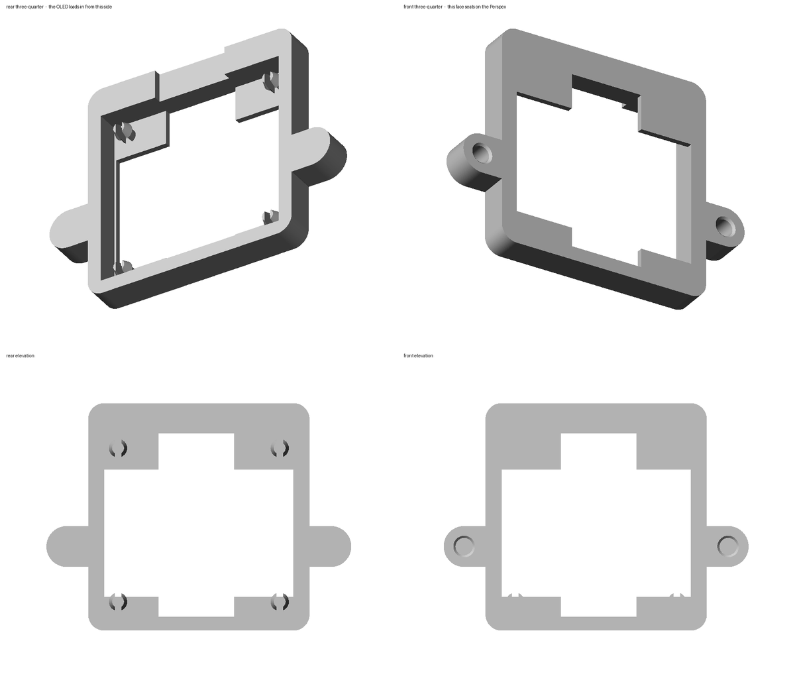
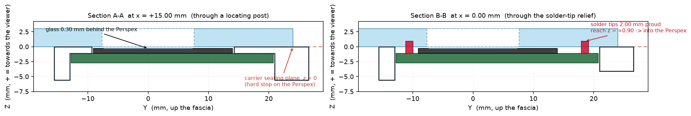

# Decca OLED Display Mount — CAD Build Review (Rev O)

Supersedes Rev N. Clean redesign; nothing from the Rev N feature tree is reused.
Platform: Autodesk Fusion 360, script-generated parametric build.

Sources:
`mechanical/CAD/Decca_Display_Mount_revO_fusion.py` (the model),
`mechanical/CAD/Decca_Display_Mount_revO_verify.py` (the checks below).



---

## 1. What Rev O changes

The OLED now loads from the **rear**. The glass projects forward through a window
in the carrier, the PCB seats on lands behind that window, and the carrier bolts
flat to the Perspex on its own seating face.

| | Rev N | **Rev O** |
|---|---|---|
| Load direction | front-loaded | **rear-loaded** |
| Forward retention | 1.10 mm full-area front plate | **two short lands at the PCB top and bottom edges** |
| Primary retention | separate glued retainer bar | **none needed — deleted** |
| Snap features | 4 sprung pegs, 0.100 mm hook, 3.06 % strain | **4 split posts, 0.35 mm barb, 1.95 % strain** |
| PCB datum bearing | 97.4 mm² | **218.9 mm²** |
| Parts to print | 3 | **2** (carrier + unchanged bezel) |
| Carrier | 56.50 × 45.10 × 6.20, 3.004 cm³ | **56.60 × 42.20 × 5.60, 3.512 cm³** |

The retainer bar is gone, and so is the requirement for it: the seating lands are
in front of the PCB and the snap barbs are behind it, so the board is captured by
the carrier alone.

---

## 2. ⚠ Blocking: the brief quotes superseded panel geometry

The Rev O brief lists the original Decca interface as authoritative:

> aperture 35.50 × 15.80 mm, M2 fixing pitch 48.00 mm

Those are the **Spec v1.0** figures. They were superseded by physical measurement:

- `docs/Revision History.md`, Rev C — *"Corrected two spec-locked panel dimensions
  from physical measurement: fixing pitch 48.00 → 49.00 mm and opening
  35.50 × 15.80 → 35.20 × 15.30 mm."*
- Rev D — *"Fixing pitch 49.00 confirmed correct on the print."*
- The Rev N model that was actually printed uses ±24.50 and ±17.60 / ±7.65.

**Rev O is built on the measured values (49.00 pitch, 35.20 × 15.30 aperture).**

Building at 48.00 would put each M2 screw 0.50 mm off its hole. An M2 screw in a
2.40 mm clearance hole has 0.20 mm of radial slop, so the screws would not enter
the inserts and the carrier would not bolt on. Shipping that was not a defensible
option, so the measured geometry won and the deviation is recorded here.

If the 48.00 figure is ever re-confirmed on the real panel, change
`panel_fix_pitch` in the generator and rebuild — nothing else depends on it.

---

## 3. The depth chain

Everything forward of the PCB follows from two numbers: how far the glass stands
proud of the PCB face, and how much gap you want behind the Perspex.

```
z = +3.000   front face of the Perspex
z =  0.000   rear face of the Perspex  == carrier seating plane (hard stop)
z = -0.300   OLED glass front face          <- oled_perspex_gap
z = -1.100   OLED PCB front face == seating lands   <- + oled_glass_proud 0.80
z = -2.700   OLED PCB rear face
z = -2.800   snap barb shoulder             <- 0.10 mm float, no PCB preload
z = -5.600   carrier rear face
```



### Why 0.30 mm and not 0.15 mm

The brief asks for the most robust nominal in the 0.15–0.30 mm band. Estimated
one-sided contributors to the glass-to-Perspex gap:

| Source | ± mm |
|---|---:|
| Land Z position on the print (layer quantisation, first-layer squish) | 0.10 |
| Seating-face flatness / warp across 56.6 mm | 0.10 |
| `oled_glass_proud` variation between modules (0.80 measured, one sample) | 0.10 |
| Land face flatness and finish | 0.05 |
| Debris or finish on the rear of the Perspex | 0.05 |
| **RSS** | **0.19** |
| **Arithmetic worst case** | **0.40** |

| Nominal | Gap left at RSS worst case |
|---:|---:|
| 0.15 | **−0.04 — contact** |
| 0.20 | 0.01 |
| **0.30** | **0.11** |

0.30 mm is the only value in the approved band that keeps a positive gap under
the RSS stack. It also raises the solder-tip threshold (§6) and thickens the
seating land from 0.95 to 1.10 mm. Through 3 mm of Perspex the optical
difference between 0.15 and 0.30 mm is not perceptible — the tunnel effect is
dominated by the Perspex thickness, which is fixed.

---

## 4. Load path — verified

```
M2 screw -> carrier -> seating face (z = 0) -> Perspex
```

| Check | Result |
|---|---:|
| Forward-most carrier material | z = 0.000 |
| Forward-most OLED glass | z = −0.300 (0.300 mm clear) |
| Forward-most OLED PCB | z = −1.100 (1.100 mm clear) |
| Seating-face area | 833.3 mm² |
| Seating pad at each M2 boss | 40.3 mm² |

The glass and the PCB are both strictly behind the plane the Perspex can touch,
so the carrier bottoms out before anything reaches the module. **Further M2
torque cannot close the optical gap or load the glass.** That was Rev N's stated
intent too, but Rev N reached it through a full-area 1.10 mm plate; Rev O reaches
it through short lands that are backed by the 2.60 mm frame within 0.40 mm.

---

## 5. Retention

The Rev N snap-pin concept is kept — same four PCB holes, same positions
(±15.00, −10.25 / +18.25) — but the rear-load architecture lets the posts be
much stronger.

| | Rev N peg | **Rev O post** |
|---|---:|---:|
| Free length | 2.10–2.60 mm | **3.40 mm** |
| Leg thickness | 0.85 / 1.00 mm | **0.75 mm** |
| Hook / barb | 0.100 mm | **0.350 mm** |
| Deflection on insertion | — | **0.200 mm per leg** |
| Peak strain | 2.00 % / 3.06 % | **1.95 %** |
| Root relief pocket in the front plate | required | **none** |

The posts stand on the land plane rather than being sunk into it, so Rev N's peg
relief pockets — which thinned the front plate and caused the Rev C seating
problem — are gone entirely.

Their role is location and handling retention, as the brief requires:
0.30 mm diametral clearance in the Ø3.00 holes sets X/Y; a 0.20 mm radial step on
the PCB rear face stops the board falling out while the carrier is offered up;
0.10 mm of float under that step means the posts cannot preload or bow the PCB.
The forward datum is the lands, not the posts.

If the first print shows the retention is too light, `pin_barb` has headroom —
0.60 mm still only reaches 2.6 % strain.

---

## 6. ⚠ The solder tips: Rev O cannot remove this requirement

The brief asks Rev O to remove the need to trim solder tips. **It cannot, and
neither could any other carrier architecture.** The constraint is between the
module and the original panel, and the carrier is not in the path.

Anything standing on the PCB's display-side face taller than

```
oled_glass_proud (0.80) + oled_perspex_gap (0.30) = 1.10 mm
```

reaches past z = 0 and strikes the Perspex. Reversing the load direction moves
the carrier out of the way — it does not move the Perspex.

What Rev O *does* fix is the carrier's own contribution. A full-height relief
slot through the lands at x −6.50…+7.50 means no carrier material sits in front
of either solder-pad strip:

| Tip proud of the PCB face | vs carrier | vs Perspex |
|---:|---|---|
| 0.60 mm | CLEAR | CLEAR |
| 0.90 mm | CLEAR | CLEAR |
| 1.10 mm | CLEAR | CLEAR |
| 1.40 mm | **CLEAR** | HIT 2.71 mm³ |
| 2.00 mm (Rev N worst case) | **CLEAR** | HIT 8.14 mm³ |

Minimum carrier-to-tip clearance at 2.00 mm proud: **1.85 mm**.

### Recommended module preparation

The clean answer is to stop putting anything on the display-side face:

1. **Preferred** — remove the pin header and solder the four flying leads
   directly to the pads **from the rear**, dressing the joints flush on the
   front. Rev O leaves the whole rear of the board open for this, and the header
   region is unenclosed.
2. **Acceptable** — keep the header and trim the front-side pins and solder
   flush, below 1.10 mm proud. This is what Rev N required, unchanged.
3. **If neither is acceptable** — the gap must grow to `tip_proud − 0.80`, which
   for 2.00 mm proud is 1.20 mm. That is four times the approved band and puts
   the screen visibly back behind the Perspex. Not recommended.

**Measure your module before printing.** `oled_tip_proud` in the generator is
still the Rev N worst-case assumption of 2.00 mm and has never been measured.

---

## 7. Validation

Booleans and clearances computed on the real solid (OpenCascade), not asserted.

| Pair | Result |
|---|---|
| carrier × Perspex | **CLEAR** |
| carrier × OLED PCB | **CLEAR** |
| carrier × OLED glass | **CLEAR** |
| carrier × active area | **CLEAR** |
| carrier × header keep-out | **CLEAR** |
| carrier × solder tips | **CLEAR** |
| bezel × carrier / Perspex / glass | **CLEAR** |
| OLED glass × Perspex | **CLEAR** |
| header body × Perspex | **CLEAR** |
| solder tips × Perspex | **HIT — see §6** |

| Clearance | mm |
|---|---:|
| OLED glass → Perspex | **0.300** |
| active area → carrier | 1.850 |
| header body → carrier | 0.250 |
| solder tips → carrier | 1.850 |
| OLED glass → carrier | 0.000 * |
| OLED PCB → carrier | 0.000 * |

\* Intended plane contact, zero interference volume. The PCB rests on the lands;
the posts rise from the same plane the glass is bonded to, inside the Ø3.00
holes, so they touch that plane without bearing on the glass.

A 19-point solid-membership probe confirms every feature is where the design says
it is (lands, window, tip relief, post legs and split slots, barb heads, insert
bores, blind backing, tie slots, wire notch, seating pads). All 19 pass.

### Optical alignment

The active area is centred on (0, 0) — the aperture centre — by construction; the
PCB outline is offset 4.00 mm above it and is never used as the datum.

| | mm |
|---|---:|
| Active area | 29.42 × 14.70 |
| Aperture (measured) | 35.20 × 15.30 |
| Margin to the aperture | x 2.89, **y 0.30** |
| Bezel window (Rev N, unchanged) | 30.40 × 14.90 |
| Margin to the bezel window | x 0.49, **y 0.10** |

The vertical margin is unchanged from Rev N and is why **firmware must still mask
2 pixel rows top and bottom** — that leaves 0.56 mm of lit-area margin each side.

---

## 8. Front bezel — unchanged

Carried over from Rev N untouched, per the brief. No Rev O geometry requires a
change and no bezel problem was reported. `Front_Bezel_revN.step` /
`Front_Bezel_revN.stl` remain the files of record; the Rev O build imports the
STEP as a reference body and re-checks it against the new carrier (all clear).

---

## 9. Printing and assembly

**Orientation: seating face (z = 0) flat on the bed.** Everything then builds
upward from a squished first layer, which puts the flattest, most accurate
surface exactly where the Perspex datum is. No supports.

| Section | mm |
|---|---:|
| Structural wall | 2.60 |
| M2 boss wall around the insert | 2.20 |
| Material behind the blind insert bore | 1.10 |
| PCB seating land | 1.10 |
| Snap-post leg | 0.75 |
| Material behind a cable-tie slot | 1.00 |

Only two overhangs: the 0.35 mm barb shoulder and the 2.50 mm tie-slot roof. Both
bridge without support.

Material PETG / PETG-HF. Hardware: 2 × M2 heat-set inserts (Ø3.2 × 4.0), 2 × M2×6
screws entering from the front. The insert should be pressed **0.50 mm below the
seating face**; the bore has a 0.40 mm chamfer at the mouth to take displaced
plastic, because anything proud of that face lifts the carrier off the Perspex.
M2×6 gives 2.5 mm of engagement and cannot bottom out; do not fit longer screws
without checking against the 1.10 mm blind backing.

**Assembly**

1. Press the two inserts into the rear carrier.
2. Prepare the module per §6 and check nothing on the display-side face stands
   more than 1.10 mm proud.
3. Push the OLED into the carrier pocket from the rear until all four barbs
   click. It should seat on the lands with no force.
4. Offer the carrier to the rear of the Perspex and fit the two M2 screws from
   the front. Tighten until the carrier is flat — it will not go further.
5. Fit the bezel to the front of the aperture.
6. Strain-relieve the cable with a tie through the flange slots.

---

## 10. Open items

1. **Panel geometry — blocking.** §2. Rev O is built at 49.00 / 35.20 × 15.30.
   Confirm against the real fascia before printing.
2. **Solder-tip length — blocking.** §6. Never measured; still the Rev N
   worst-case 2.00 mm assumption.
3. **`oled_glass_proud` = 0.80 mm** is from a single measured sample. It sets
   the whole depth chain. A second sample would be worth ten minutes.
4. **`oled_active_off_y` = 4.00 mm** remains assumed. Light the display and
   report the offset.
5. **Firmware must mask 2 pixel rows top and bottom.** Unchanged from Rev N.
6. **Bezel retention is adhesive** on recessed pads. Unchanged since Rev G.

---

## 11. Producing the Fusion file

`Decca_Display_Mount_revO.f3d` is written **by Fusion**, from the generator:

1. Open Fusion 360 with nothing important unsaved.
2. Utilities → Add-Ins → Scripts and Add-Ins → Scripts → the green `+` → pick
   `mechanical/CAD/Decca_Display_Mount_revO_fusion.py`.
3. Edit `OUT_DIR` at the top of the script to point at your clone.
4. Run.

It creates a **new** design document — it does not open, modify or Save-As the
Rev N file — writes all 60-odd values into `design.userParameters`, builds
`REF_Decca_Panel`, `REF_SH1106_1P3` and `Rear_Display_Carrier`, imports the
unchanged bezel, prints the interference matrix and clearance table to the text
console, and exports the `.f3d`, both STEPs and the STL.

The STEP and STL in this repository were produced offline by
`Decca_Display_Mount_revO_verify.py`, which parses the parameter table and the
body recipes straight out of the generator and rebuilds them on OpenCascade — so
what was validated is the same recipe Fusion will run, not a second description
of it. Run it with `pip install cadquery && python3
mechanical/CAD/Decca_Display_Mount_revO_verify.py`.

---

## 12. Design decision

Rev O is accepted for a geometry-validation prototype print, subject to the two
blocking measurements in §10. Rev N receives no further work.
