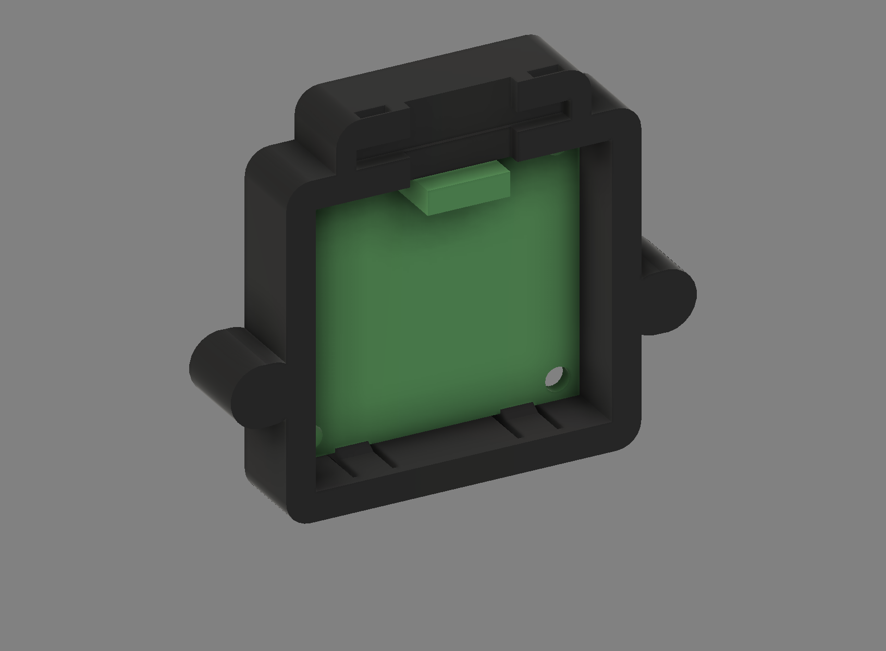
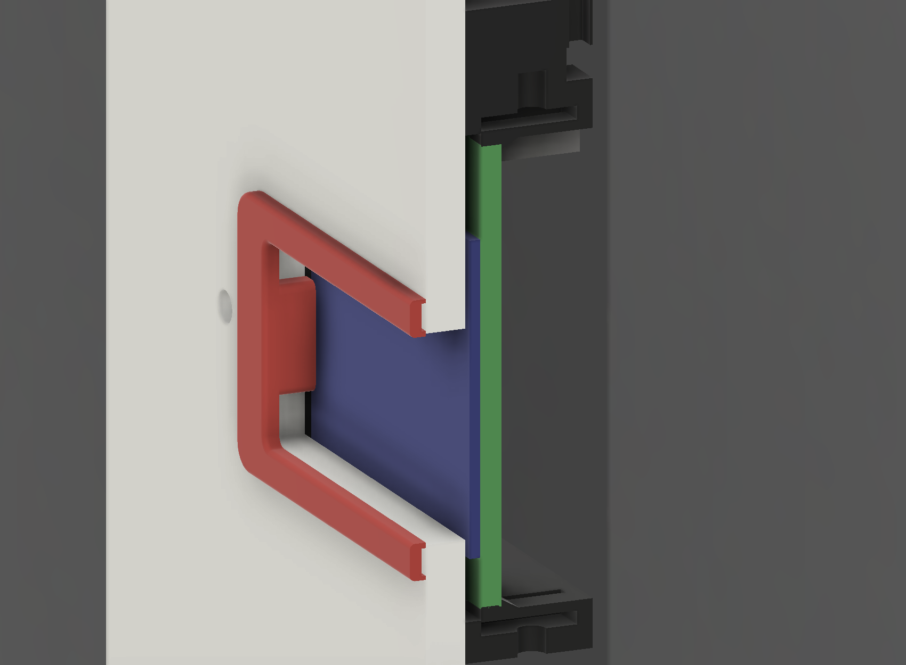

# Decca OLED Display Mount — CAD Build Review (Rev P)

Supersedes Rev N. Implements the corrected rear-loaded architecture specified in
`Decca_OLED_Display_Mount_CAD_Review_revO.md`.
Platform: Autodesk Fusion 360, script-generated parametric build.

> **Status: NOT released for print.** The carrier geometry is complete and
> **every** mandatory validation passes except one, and that one cannot be fixed
> by any carrier geometry: the brief's 1.50 mm trimmed solder tips strike the
> original Perspex by 0.40 mm. See **§8**. It is a one-line decision, not a
> measurement, and it does not change the carrier.

Sources:

| File | Role |
|---|---|
| `mechanical/Drawings/Decca_OLED_Display_Mount_Topology_revP.md` | Stage 1 pre-CAD topology gate |
| `mechanical/CAD/Decca_Display_Mount_revP_fusion.py` | the generator — single source of truth for every dimension |
| `mechanical/CAD/Decca_Display_Mount_revP_verify.py` | independent verification of the exported STL |
| `mechanical/CAD/Decca_Display_Mount_revP.f3d` | **editable source of truth** |



---

## 1. What Rev P changes

Rev N was front-loaded: a 1.10 mm full-area front plate stood between the OLED
PCB and the Perspex and set the screen depth, and a separately printed retainer
bar was the primary retention. Rev P inverts the whole arrangement.

| | Rev N | **Rev P** |
|---|---|---|
| Load direction | front-loaded | **rear-loaded** |
| Material between the PCB face and the Perspex | 1.10 mm front plate | **none — proven, §5** |
| OLED Z datum | forward plate face | **rear support shoulders at the PCB rear face** |
| Final axial capture | retainer bar glued to the carrier | **the Perspex, when the carrier is bolted on** |
| Primary retention | separate glued retainer bar | **none needed — deleted** |
| Snap features | 4 sprung pegs, 0.100 mm hook, 3.06 % strain | **4 cantilever fingers, 0.40 mm shoulder, 1.73 % strain** |
| Features entering the PCB mounting holes | 4 pegs | **none** |
| Parts to print | 3 | **2** (carrier + unchanged bezel) |
| Carrier | 56.50 × 45.10 × 6.20, 3.004 cm³ | **56.60 × 47.20 × 9.60, 7.151 cm³** |
| Carrier × solder tips | needed a relief slot | **impossible to interfere, at any tip length** |

The carrier got deeper and heavier. That is bought deliberately: the rear support
shoulders sit 2.70 mm behind the Perspex, so a snap finger that reaches them from
the carrier's rear frame needs 5.70 mm of free length to stay under 2 % strain.
9.60 mm of depth is what that costs, and it is still 1.20 mm shallower than the
header, which projects to z = −10.80 regardless.

---

## 2. Panel geometry — measured values, unchanged

Built on the physically measured fascia dimensions, exactly as Rev N was:

- Perspex 3.00 mm; aperture **35.20 × 15.30 mm**; M2 pitch **49.00 mm**.

These were corrected from Spec v1.0 by measurement at Rev C, print-confirmed at
Rev D, and re-confirmed by the project owner on 2026-08-28. No additional
drilling, cutting or modification of the original fascia.

---

## 3. The optical Z-chain

Everything forward of the PCB follows from two numbers: how far the glass stands
proud of the PCB face (measured, 0.80 mm) and how much gap you want behind the
Perspex (chosen, 0.30 mm).

```text
z = +3.000   Perspex front face — M2 screw heads bear here
z =  0.000   Perspex rear face  == carrier hard stop            DATUM A
z = -0.300   OLED glass front face          <- oled_perspex_gap 0.30
z = -1.100   OLED PCB front face             <- + oled_glass_proud 0.80
z = -1.200   forward limit of ALL carrier material in the aperture
z = -2.700   OLED PCB rear face == rear support shoulder        DATUM B
z = -8.400   snap-finger cantilever root
z = -9.600   carrier rear face
z = -10.800  header rear extent — clear of the carrier
```

```text
oled_perspex_gap 0.30 + oled_glass_proud 0.80 + oled_pcb_t 1.60 = 2.700
```



Section at x = +10.00, through a snap finger. White is the original Perspex, red
the unchanged Rev N bezel, blue the OLED glass, green the PCB, black the carrier.
The glass projects forward through the carrier aperture and stops 0.30 mm short
of the Perspex. Between the two there is nothing at all.

### Why 0.30 mm and not 0.15 mm

Unchanged from the Rev O analysis, which remains sound: the one-sided
contributors to the gap (land Z position on the print, seating-face flatness
across 56.6 mm, `oled_glass_proud` sample variation, face finish, debris) sum to
0.19 mm RSS. 0.30 mm is the only value in the approved 0.15–0.30 band that keeps
a positive gap under that stack. Through 3 mm of Perspex the optical difference
between 0.15 and 0.30 is not perceptible; the tunnel effect is dominated by the
Perspex thickness, which is fixed.

---

## 4. M2 load path — verified

```text
M2 screw head → Perspex front face → Perspex 3.00 → Perspex rear face
              → carrier seating rim  (z = 0, DATUM A)
              → M2 boss → heat-set insert → screw thread
```

| Check | Result |
|---|---:|
| Forward-most carrier material | **z = +0.00000** |
| Forward-most OLED glass | z = −0.300 → 0.300 mm clear |
| Forward-most OLED PCB | z = −1.100 → 1.100 mm clear |
| Seating-face area at z = 0 | **707.8 mm²** |
| Synthetic Perspex fixture plate × carrier | **no penetration** |
| Insert bore | z 0.00 … −4.50, backing 5.10 mm, boss wall 2.20 mm |

The carrier and the module are in **parallel**, not in series. The carrier
bottoms out on the Perspex 0.30 mm before anything can reach the glass and
1.10 mm before anything can reach the PCB, so **no amount of M2 torque can alter
OLED depth or load the glass or the PCB**. Rev N reached the same intent through
a full-area 1.10 mm plate; Rev P reaches it by having no material there at all.

---

## 5. The proof: nothing ahead of the PCB front face

Stated as an invariant and machine-checked, rather than inspected.

> **P1.** With `A` = the module-aperture prism
> `{ |x| ≤ 18.55, −13.60 ≤ y ≤ +21.60 }`, `Carrier ∩ A ∩ { z > −1.20 } = ∅`.
>
> **P2.** The whole OLED module envelope lies strictly inside `A` — the PCB by
> 0.85 mm on all four sides, the glass by 1.30/4.55/7.65 mm, the solder tips by
> 2.45 mm, the header by 0.85 mm.

P1 ∧ P2 ⟹ no carrier plate, land, lip, shoulder, snap or datum exists between
the OLED PCB front face and the Perspex anywhere within the OLED module
envelope, with a 0.10 mm margin.

| Verification | Method | Result |
|---|---|---|
| P1 at z > −1.20 | Fusion boolean | **empty** |
| P1 at z > the PCB front face | Fusion boolean | **empty** |
| P1 at z > −1.20 | triangle/AABB on the exported STL | **empty** |
| P1 over the PCB footprint | triangle/AABB on the exported STL | **empty** |
| Forward-most carrier material | face enumeration | z = +0.00000 |

Every carrier feature satisfies P1 by construction: the rim, the M2 bosses, the
arms and the cable-tie flange are all outside `A`; the pocket walls, the four
fingers, their tongues and their shoulders all lie at z ≤ −1.20.

**Corollary.** Because the carrier has no material forward of z = −1.20 inside
`A`, **carrier × solder-tip interference is geometrically impossible at any tip
length**. Confirmed at 0.40, 0.80, 1.00, 1.10, 1.20, 1.50 and 2.00 mm proud:
CLEAR every time, minimum clearance 1.853 mm. Rev N needed a relief slot for
this; Rev P gets it free from the topology.

---

## 6. Rear support, location and retention

**DATUM B — the rear Z datum.** Four forward-facing shoulders at z = −2.70 bear
on the PCB rear face, 0.40 × 4.00 mm each, 6.40 mm² total, measured 6.40 mm² on
the solid. They are one-sided: material behind DATUM B, none ahead of it, all
four confirmed by point probe in two independent tools. They carry no load in
service — nothing pushes the PCB rearward — so they position rather than support,
and bearing area is not the figure of merit.

**X/Y location** is by the rigid pocket walls, 0.25 mm clearance, engaging the
PCB edge over z −1.20 … −2.70, i.e. 1.50 mm of the 1.60 mm board thickness.
**Nothing enters the four Ø3.00 mm PCB mounting holes.**

**The four fingers.** Cantilevers at x = ±10.00, section 0.75 (Y) × 4.00 (X),
rooted at the carrier's **rear** frame (z = −8.40) and reaching **forward**, so
the whole finger including its root is behind the PCB front plane.

| z range | inner face y (top finger) | function |
|---|---:|---|
| −9.60 … −8.40 | +21.00 | rigid root, flush with the pocket wall |
| −8.40 … −4.00 | +21.00 | free cantilever, 0.25 mm clear of the PCB |
| −4.00 … −2.70 | +21.00 → +20.25 | 30° insertion lead-in ramp |
| **z = −2.70** | +20.25 → +20.65 | **retaining shoulder — DATUM B**, 0.40 mm, square |
| −2.70 … −1.20 | +20.65 | tongue, 0.10 mm interference on the PCB **edge** |

| Quantity | Value |
|---|---:|
| Effective cantilever length | 5.70 mm |
| Deflection to pass the shoulder | 0.50 mm |
| Peak strain, PCB centred | **1.73 %** |
| Peak strain, PCB hard against one pocket wall | **2.60 %** |
| Seated deflection / strain | 0.10 mm / 0.35 % |
| Insertion force (30° ramp, µ 0.30) | 2.42 N per finger → **9.7 N total** |
| Seated normal force | 0.46 N per finger |
| Friction hold | **0.55 N** vs 0.039 N module weight → **14×** |
| Z preload on the PCB | **zero** |
| PCB bending from retention | **none** — four opposed in-plane forces |
| Spring section measured off the exported STL | **0.750 mm** |
| Flex relief measured off the exported STL | **1.000 mm** |

The tongue is what actually retains the loose module, and it does it by friction
on the PCB **edge**, not by overlapping the PCB face. It ends at z = −1.20,
0.10 mm behind the PCB front face, so it cannot act as a forward datum — checked
separately on the STL.

**What the fingers are not.** They are not the final retention system. Final
axial capture happens only when the carrier is bolted to the Perspex, which
closes the front of the pocket. The module is then trapped between DATUM B and
the Perspex, 0.30 mm apart, with **no preload path in any position within that
float**. The assembly is on a near-vertical fascia, so Z is horizontal and
gravity does not push the module forward; 0.55 N of friction against 0.039 N of
weight holds it on the datum.

---

## 7. Insertion and removal — validated as swept corridors, not final positions

Rev O passed a static interference matrix, a 19-point probe, a load-path check
and a clearance table while being physically impossible to assemble. Rev P
treats the corridor as a first-class requirement and, more usefully, is
*designed* so that the corridor is clear by construction.

Motion is a **pure ±Z translation** — no tilt, no rotation, no lateral shift.
That is a deliberate choice: it is the only motion whose swept point set is
exactly the module cross-section extruded along Z, which makes the corridor
impossible to fudge.

| Swept body, 12 mm travel | Fusion boolean | STL triangle/AABB |
|---|---|---|
| OLED glass | **CLEAR** | **CLEAR** |
| Solder tips @ 1.50 mm proud | **CLEAR** | **CLEAR** |
| Header body | **CLEAR** | **CLEAR** |
| OLED PCB | HIT 5.8641 mm³ | — |
| OLED PCB, outside the four spring footprints | **CLEAR** | **CLEAR** |
| Four PCB mounting holes, full axial corridor | — | **CLEAR** |

The 5.8641 mm³ is the designed 0.50 mm finger deflection and nothing else: the
residual after subtracting the four finger envelopes is an empty solid, and the
STL check re-derives the same result by decomposing the corridor into seven boxes
that exclude the spring footprints exactly.

**Removal.** The retaining shoulder is square rather than tapered. A release
taper on a µ = 0.30 interface is self-locking below about 17°, so any taper
shallow enough to preserve a crisp Z datum would not release, and any taper steep
enough to release would spoil the datum. Instead the carrier carries **four
Ø2.20 mm radial prise holes** at z = −5.00, one per finger, opening on the
outside of the rim. A 2 mm pin pushes each finger the 0.50 mm it needs.

Validated by rebuilding the carrier with all four fingers modelled retracted
0.55 mm (0.50 required + 0.05 margin) and re-running the full corridor set:

| Retracted carrier × | Result |
|---|---|
| Swept PCB | **CLEAR** |
| Swept glass | **CLEAR** |
| Swept tips | **CLEAR** |
| Swept header | **CLEAR** |
| Prise access to all four fingers | **4 of 4 open** |

### Rev O's blocking unknown is designed out

Rev O died because barbs sat in the four PCB mounting holes, which made an
**unmeasured** dimension — the glass envelope relative to those holes —
load-bearing on the whole design. Rev P puts nothing in those holes.

| | Rev O | **Rev P** |
|---|---|---|
| Features in the PCB holes | 4 barbs | **none** |
| Nearest sprung feature to the modelled glass edge | 0.500 mm **overlap** | **3.20 mm clear** |
| Result if the glass envelope is wrong | unassemblable | no effect until it is wrong by > 3.20 mm |

Worst case, with the glass modelled as the **full PCB outline** and swept: clear
of every rigid feature; only the four springs are in the path. **That
measurement is no longer required.**

---

## 8. ⚠ The one blocking item: 1.50 mm solder tips versus a 0.30 mm gap

This is arithmetic between the module and the original panel. The carrier is not
in the path, and no carrier architecture can change it.

Anything standing on the PCB's display-side face has a budget of exactly

```text
oled_perspex_gap 0.30  +  oled_glass_proud 0.80  =  1.10 mm
```

before it reaches z = 0 and strikes the Perspex. Modelled at the brief's
1.50 mm, the tips reach **z = +0.40 and interfere with the Perspex by
3.6191 mm³**.

| Tip proud of the PCB face | vs Perspex | vs carrier | Verdict |
|---:|---|---|---|
| 0.40 | CLEAR | CLEAR | PASS |
| 0.80 | CLEAR | CLEAR | PASS |
| **1.00** | **CLEAR (+0.10)** | CLEAR | **PASS — the release limit** |
| 1.10 | CLEAR (0.00) | CLEAR | zero margin |
| 1.20 | HIT 0.905 mm³ | CLEAR | FAIL |
| **1.50** | **HIT 3.619 mm³** | CLEAR | **FAIL** |
| 2.00 | HIT 8.143 mm³ | CLEAR | FAIL |

What Rev P *does* deliver, and unconditionally, is the carrier's own
contribution: **carrier × tips is CLEAR at every length**, by the §5 corollary.
Reversing the load direction moved the carrier out of the tips' way. It cannot
move the Perspex.

### Two resolutions. Both are one line, neither changes the carrier.

1. **Prepare the module to ≤ 1.00 mm front-side protrusion.** Optical gap stays
   at 0.30 mm; the carrier STL in this PR is already correct and is released the
   moment this is accepted. Preferred method: remove the pin header and solder
   the four leads to the pads **from the rear**, dressing the front-side joints
   flush. Rev P leaves the entire rear of the board open, so this is easy.
   Acceptable alternative: keep the header and trim the front-side pins and
   solder below 1.00 mm.
2. **Accept 1.50 mm tips and open the gap.** Set `oled_perspex_gap = 0.80` and
   re-run the generator. No topology change, no other parameter moves. But
   0.80 mm is 2.7× the approved 0.15–0.30 band and puts the screen visibly
   deeper behind the fascia, which is the opposite of the brief's governing
   objective.

**Rev P is built at gap 0.30 with a stated preparation limit of 1.00 mm**,
because the brief's governing objective is to place the glass close to the
Perspex. Both cases are validated in the model. **This decision is the only
thing standing between this PR and print release.**

---

## 9. Validation summary

Run with `main()` then `validate()` inside Fusion, and
`python mechanical/CAD/Decca_Display_Mount_revP_verify.py` offline.

| # | Mandatory check | Result |
|---|---|---|
| 1 | carrier × Perspex | **CLEAR** — plane contact only |
| 2 | carrier × OLED glass | **CLEAR** (0.707 mm) |
| 3 | carrier × PCB | 2.4000 mm³ — the designed 0.10 mm edge grip, at the four tongues only |
| 4 | carrier × header | **CLEAR** (0.250 mm) |
| 5 | carrier × trimmed 1.50 mm tips | **CLEAR** (1.853 mm) |
| 6 | trimmed 1.50 mm tips × Perspex | **FAIL — 3.6191 mm³, see §8** |
| 7 | OLED glass × Perspex nominal gap | **0.300 mm** |
| 8 | rear PCB datum correctness | **6.40 mm² at z = −2.70, one-sided, 4 of 4** |
| 9 | M2 load path | **terminates at the seating face, 707.8 mm²** |
| 10 | no M2 preload through glass or PCB | **glass 0.300 / PCB 1.100 mm clear of z = 0** |
| 11 | no carrier geometry ahead of the PCB front face | **invariant P1, empty in both tools** |
| 12 | snap / locating strain | **1.73 % nominal, 2.60 % worst case** |
| 13 | full swept insertion corridor | **CLEAR outside the four springs** |
| 14 | full swept removal corridor | **CLEAR with the fingers retracted 0.55 mm** |
| 15 | glass never sweeps a rigid post or barb | **3.20 mm clear; nothing in the PCB holes** |
| 16 | carrier seats flat | **continuous rim at z = 0, no protrusion** |
| 17 | active-area alignment | **centred on (0.0000, 0.0000)** |
| 18 | printability and minimum sections | **single closed solid, 0 slivers** |
| 19 | front bezel × everything | **CLEAR, unchanged from Rev N** |
| 20 | cable-tie path | **3.50 × 1.40 mm section passes, never reaches z = 0** |

**One failure, #6, and it is §8.**

### Clearance table

| Interface | mm |
|---|---:|
| OLED glass → Perspex | **0.300** |
| carrier → OLED glass | 0.707 |
| carrier → active area | 3.350 |
| carrier → header body | 0.250 |
| carrier → solder tips | 1.853 |
| carrier → OLED PCB | 0.000 * |
| header → Perspex | 2.700 |

\* Intended line contact: the four tongues press 0.10 mm into the PCB edge.

### Optical alignment

The active area is centred on (0, 0) — the aperture centre — by construction.
The PCB outline is offset 4.00 mm above it and is never used as the datum.

| | mm |
|---|---:|
| Active area | 29.42 × 14.70 |
| Aperture (measured) | 35.20 × 15.30 |
| Margin to the aperture | x 2.89, **y 0.30** |

Unchanged from Rev N, so **firmware must still mask 2 pixel rows top and
bottom**.

---

## 10. Verification independence

The Rev O check set ran the same parameter table and the same body recipes
through a second geometry kernel. Both sides agreed and both were wrong in the
same way, because agreement between two transcriptions of one recipe proves only
that the transcription was faithful.

`Decca_Display_Mount_revP_verify.py` is built so that it cannot repeat that
mistake. It never imports, parses or executes the generator. It:

* reads the **exported binary STL** — the artefact that actually gets printed;
* re-enters the requirements from the **measured repository values and the
  brief**, so a silent parameter drift in the generator shows up as a failure;
* uses different algorithms in kind — triangle/AABB separating-axis tests,
  ray-cast point membership, edge-manifold counting, a divergence-theorem
  volume — rather than BRep booleans;
* covers the seated state, the assembly path, the disassembly path, the load
  path, the retention function and the dimensional assumptions.

It **measures sections off the mesh** instead of trusting the generator's
numbers: the spring section reads 0.750 mm and the flex relief 1.000 mm from the
STL alone.

It also earned its keep. On its first run it flagged three things the Fusion
BRep checks had reported as clean, and working each one out changed the
documentation:

1. **12 triangles "intruding" on invariant P1.** All 12 lie *exactly on* the
   aperture boundary planes — those planes *are* the pocket wall inner faces.
   Tangency is not intrusion; Fusion's booleans return empty, the SAT test
   returns a hit. The check now tests for material strictly inside and reports
   the tangency separately, which is a more honest statement of the invariant
   than "empty".
2. **The carrier envelope reading 56.58 instead of 56.60.** Real, and only
   visible on the mesh: the STL tessellates the cylindrical M2 ear ends, so the
   printed part is 0.022 mm under nominal at those radii. Now toleranced and
   stated.
3. **"Shoulder material ahead of DATUM B".** The check box was too wide in Y and
   was catching the 0.10 mm edge-grip tongue, which is a different feature with
   a different job. Splitting the two produced the extra check that the tongue
   stops 0.10 mm behind the PCB front face — a check that did not exist before
   and that directly guards the brief's central prohibition.

Independent verdict on the exported STL: **1880 triangles, closed 2-manifold, 0
non-manifold edges, consistent winding, 7.1506 cm³ by divergence theorem against
Fusion's 7.154 cm³, 15 of 15 ray-cast membership probes agreeing with Fusion's
21 of 21, every geometric check passing except §8.**

---

## 11. Printing and assembly

**Orientation: the carrier REAR FACE flat on the bed, building forward (+Z).**

This is the opposite of what Rev O chose, and the reason is the fingers. They are
rooted at the carrier's rear frame, so rear-face-down puts all four roots on the
bed and every finger becomes a self-supporting column. It also makes the aperture
step at z = −1.20 an *upward*-facing ledge and the 30° nose lead-in a 60°
self-supporting face. **No supports anywhere.** The trade is that the Perspex
seating face becomes a top surface rather than a bed-flat one — use 4+ top layers
or ironing. It is a narrow continuous 3.00 mm rim, which prints flat.

The optical chain's accuracy is unaffected by the choice: DATUM A (z = 0) and
DATUM B (z = −2.70) are both in the same Z stack, so the 2.70 mm between them is
layer-count accurate in either orientation.

| Section | mm |
|---|---:|
| Structural wall | 3.00 |
| M2 boss wall around the insert | 2.20 |
| Material behind the blind insert bore | 5.10 |
| Local rim wall outboard of a finger relief | 1.85 |
| Snap-finger spring section | 0.75 |
| Finger side gap / flex relief | 0.80 / 1.00 |

The 0.75 mm finger is a spring by intent — 2 perimeters at 0.35 mm line width.
Print it slowly: it is a 0.75 × 4.00 mm column standing 8.40 mm tall.

Material PETG / PETG-HF. Hardware: 2 × M2 heat-set inserts (Ø3.2 × 4.0),
2 × M2×6 screws entering from the front. Press each insert **0.50 mm below the
seating face** — anything proud of that face lifts the carrier off the Perspex —
into a bore with a 0.40 mm chamfer at the mouth to take displaced plastic. M2×6
gives 2.5 mm of engagement and cannot bottom out in 5.10 mm of backing.

### Assembly preparation — required

**Prepare the OLED module so that nothing on its display-side face stands more
than 1.00 mm proud** (§8). Preferred: remove the pin header and solder the four
leads to the pads from the rear, dressing the front-side joints flush. The whole
rear of the board is open, so this is comfortable to do.

### Assembly sequence

1. Press the two M2 inserts into the carrier from the seating face.
2. Prepare the module per §8 and verify the front-side protrusion.
3. Push the OLED into the carrier pocket **from the rear**, glass forward, header
   at the top, until all four fingers click. About 10 N by thumb on the PCB rear
   face. It then rests on the four shoulders with zero Z preload.
4. Offer the carrier to the rear of the Perspex and fit the two M2 screws from
   the front. Tighten until the carrier is flat — it will not go further, and
   further torque cannot reach the module.
5. Fit the bezel to the front of the aperture (removable adhesive on the recessed
   pads, unchanged since Rev G).
6. Strain-relieve the cable with a tie through the flange relief and slots.

**To remove the module:** push a 2 mm pin into each of the four Ø2.20 mm radial
prise holes to lift each finger 0.50 mm clear, then withdraw the board rearward.

---

## 12. Front bezel — unchanged

Carried over from Rev N untouched, per the brief. Imported into the Rev P design
as a reference body from `Front_Bezel_revN.step` and re-checked against the new
carrier: clear of the carrier, the glass, the PCB and the solder tips.

| | mm |
|---|---:|
| Bezel envelope | 40.00 × 20.30 × 4.00 |
| Locating lip depth into the 3.00 mm Perspex | 2.80 |
| Rearmost bezel material | z = **+0.200** |
| Clearance to the OLED glass front face | **0.500** |

`Front_Bezel_revN.step` / `Front_Bezel_revN.stl` remain the files of record.
No Rev P geometry requires a change, so no duplicate revP-named bezel file is
added.

---

## 13. Open items

| # | Item | Blocks print? | Blocks CAD? |
|---|---|---|---|
| 1 | **Front-side solder protrusion — the §8 decision** | **YES** | no |
| 2 | `oled_glass_proud` = 0.80 mm from a single sample; it sets the whole chain | no | no |
| 3 | `oled_pcb_off_y` = 4.00 mm still assumed — affects active-area centring only | no | no |
| 4 | Anything on the PCB front face other than glass and solder tips is assumed absent | no | no |
| 5 | Firmware must mask 2 pixel rows top and bottom | no | no |
| 6 | Bezel retention is removable adhesive on recessed pads | no | no |
| ~~7~~ | ~~Glass envelope relative to the four mounting holes~~ | **CLOSED** — designed out, §7 | — |

Rev O listed four unmeasured OLED properties as gating items. Rev P closes the
one that was blocking, by not depending on it.

---

## 14. Prototype acceptance tests

First Rev P print is a geometry-validation prototype. Check, in order:

1. rear insertion of the OLED — all four fingers click, ~10 N, no board flex;
2. the module rests on the four shoulders with no rattle and no rock;
3. removal via the four prise holes;
4. carrier seats flat against the Perspex before the screws are snug;
5. actual OLED-to-Perspex gap (target 0.30 mm);
6. M2 tightening does not change OLED depth — measure the gap before and after;
7. prepared solder joints and header clear the Perspex;
8. active-area centring when powered, and the real `oled_pcb_off_y`;
9. bezel alignment in the aperture;
10. cable tie threads and holds.

---

## 15. Reproducing this build

`Decca_Display_Mount_revP.f3d` is written **by Fusion**, from the generator:

1. Open Fusion 360.
2. Utilities → Add-Ins → Scripts and Add-Ins → Scripts → green `+` → pick
   `mechanical/CAD/Decca_Display_Mount_revP_fusion.py`.
3. Set `OUT_DIR` to your clone's `mechanical` folder (currently
   `D:\GitHub\Decca\mechanical`).
4. Run `main()`, then `validate()`, then `import_bezel()`, then `export()`.

`main()` creates a **new** document on the first run — it never opens, modifies
or Save-As's the Rev N or Rev O files — and rebuilds in place on later runs, so
re-running never accumulates stray documents and never touches a document you
opened. It writes all 80 values into `design.userParameters`, builds
`REF_Decca_Panel`, `REF_SH1106_1P3` and `Rear_Display_Carrier`, and exports the
`.f3d`, both STEPs and the STL.

Then, offline and independently:

```bash
python mechanical/CAD/Decca_Display_Mount_revP_verify.py
```

It exits non-zero when a check fails, so it is usable as a gate. It only reads
the STL — it never writes any CAD artefact, so the repository keeps a single
source for each file.

---

## 16. Design decision

**Rev P is not released for print, pending one decision.**

The architecture is delivered in full and validated on the real solid and again,
independently, on the exported mesh: rear-loaded, rear PCB Z datum, separate
carrier-to-Perspex hard stops carrying all M2 preload, nothing whatsoever between
the PCB front face and the Perspex, locating and light-retention snaps only,
no separate retainer bar, active area centred, both swept corridors clear, and
Rev O's blocking unknown designed out rather than deferred.

The single open item is §8: at the brief's 1.50 mm the solder tips foul the
Perspex by 0.40 mm. Choose the ≤ 1.00 mm preparation limit and this PR is
released unchanged; choose 1.50 mm and set `oled_perspex_gap = 0.80`, rebuild,
and accept a visibly deeper screen.

Rev N receives no further work.
