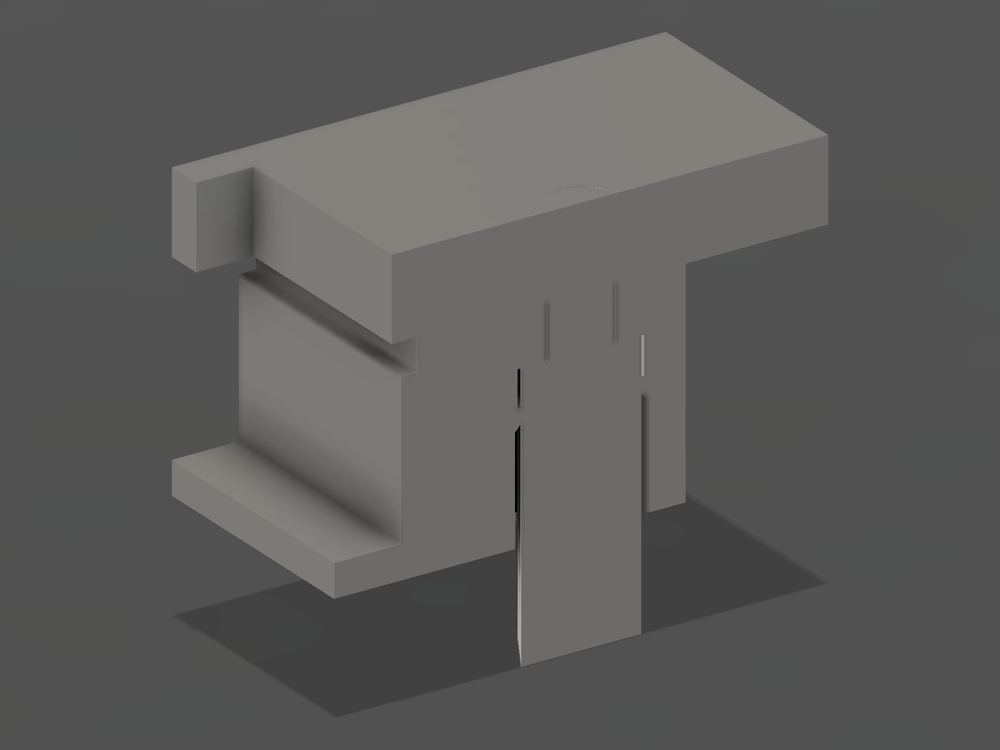

# Decca OLED Display Mount — CAD Build Review (Rev P)

Supersedes Rev N. Implements the corrected flush-side-insertion architecture,
the lighting-unit / original-fastener amendments and the integral rear light
shield required by `Decca_OLED_Display_Mount_CAD_Review_revO.md` §8.1, §8.2,
§8.3, §9, §10 and §12 as amended 2026-08-29 (`main` @ `e3a9aa1`).
Platform: Autodesk Fusion 360, script-generated parametric build.

> ## Status: Rev P.2 OLED architecture PHYSICALLY VALIDATED — Rev P.4 corrects the radio-side interface only
>
> **What is proven.** The printed **Rev P.2** carrier **passed** its physical
> tests for **OLED retention and Perspex tolerance**. Flush-side insertion, the
> fixed rear PCB datum pads, the plain and sprung locating posts, the sprung-post
> retention and release behaviour, the OLED Z position, the 0.30 mm Perspex gap,
> active-area centring, the 35.20 × 15.30 mm aperture, the exact 49.00 mm fixing
> pitch, the carrier-to-Perspex hard stops and the existing bezel are all
> validated hardware and are **carried into Rev P.3 unchanged**.
>
> **What this amendment changes.** Two integration failures against the radio,
> neither of which touches the OLED architecture:
>
> 1. **Lighting-unit clearance (§20).** The continuous end rail below the
>    sprung-post pair and its integral cable-tie projection collide with the
>    retained original Decca lighting unit, which cannot be removed. Both are
>    deleted. The carrier is now an **open-ended frame**; nothing is put back
>    inside the keep-out.
> 2. **Original Decca fasteners (§21).** The original front bolts have a
>    **non-standard thread**. The entire M2 heat-set-insert architecture is
>    deleted and the two original bolts and their two original matching nuts are
>    reused, in **captive rear-accessible hex pockets** at the unchanged pitch.
>
> **Rev P.4 corrects two things in Rev P.3**, again without touching the OLED
> architecture:
>
> 3. **The synthetic lighting keepout is deleted (§20.6).** Rev P.3 shipped a
>    reference body — `REF_Lighting_Keepout` / `LIGHTING_UNIT_KEEPOUT` — whose
>    boundary was taken from the carrier's own pedestals. A keep-out derived
>    from the part it checks cannot fail, so it proved nothing, and in the
>    browser, the assembly STEP and the manufacturing pack it read as measured
>    lighting-unit geometry. **It was never measured.** It is gone, with every
>    check against it, and nothing replaces it. The physical rail cut it was
>    invented to justify is kept exactly as printed.
> 4. **The rear of the OLED bay is closed (§24).** Rev P.3 left a full-height
>    open rear window, so the retained Decca cabinet LEDs could light the back
>    and edges of the OLED and glow through the Perspex. An **integral opaque
>    rear light shield**, 1.20 mm thick and part of the carrier, now closes it,
>    with a single local **four-pin/header opening** and nothing else.
>
> **Rev P remains OPEN and is not released.** Four measurements gate the print
> and the brief §12 tests gate release:
>
> | # | Gate | Where |
> |---|---|---|
> | 1 | OLED glass envelope at the two header-side mounting holes — never measured | §9 |
> | 2 | Original nut across flats **and** across corners — 3.80 mm is assumed to be across flats | §21.6 |
> | 3 | Original bolt length under the head — neither engagement nor bottoming is measured | §21.6 |
> | 4 | Hex-pocket fit coupon on the selected printer/material | §21.6 |
>
> Then: **installed clearance against the lighting unit (§12.14 of the brief) —
> which is now the *only* evidence for that interface, since no lighting-unit
> geometry exists in CAD at all** — the **powered light-leak test (§12.22)**,
> rack/twist of the open frame (§12.15), and the captive-nut and bolt tests
> (§12.17–19).

Sources:

| File | Role |
|---|---|
| `mechanical/Drawings/Decca_OLED_Display_Mount_Topology_revP.md` | Stage 1 pre-CAD topology gate, corrected |
| `mechanical/CAD/Decca_Display_Mount_revP_fusion.py` | the generator — single source of truth for every dimension |
| `mechanical/CAD/Decca_Display_Mount_revP_verify.py` | independent verification of the exported STL |
| `mechanical/CAD/Decca_Display_Mount_revP.f3d` | **editable source of truth** |


The open end at the top of that view is the lighting-unit side. The two towers
either side of it are the retained sprung-post pedestals; there is nothing
between them. Note that "the lighting-unit side" here means *the side the
lighting unit is on* — there is no lighting-unit body anywhere in this model.

---

## 1. The Rev P.1 failure, and what changes

### 1.1 Root cause

Rev P.1 inserted the OLED **from the rear**, moving forwards towards the
Perspex. Its four snap-finger shoulders sat at the **PCB rear plane**
(z = −2.70) and stopped motion **rearward** — back out of the pocket. Once the
board passed them, nothing prevented further forward travel.

The only loose-carrier restraint was four 0.10 mm edge-grip tongues pressing on
the PCB **edge** through assumed PETG friction. The Rev P.1 gate verified that:

- the rear shoulders exist — they do, and they restrain the wrong direction;
- the tongues stop behind the PCB front plane — they do, which is precisely why
  they cannot block forward travel;
- computed friction (0.55 N) exceeds module weight (0.039 N) — a calculation,
  not a geometric stop.

It never demonstrated a positive geometric stop against forward movement. There
was not one to demonstrate.

**None of the following was attempted as a fix**, and none would have addressed
the defect: increasing `finger_grip`, revising the assumed friction coefficient,
increasing spring force, or adding another rear-loaded edge finger.

### 1.2 Rev P.1 → Rev P.2

| | Rev P.1 (failed) | **Rev P.2** |
|---|---|---|
| Insertion direction | from the **rear**, moving forward | **from the flush / Perspex side, moving rearward** |
| Rearward stop | snap-finger shoulders on a moving spring | **four fixed, rigid datum pads** at z = −2.70 |
| Forward stop | **none** | **two sprung post hooks, 0.10 mm radial overlap, square face** |
| Retention basis | assumed friction, 0.55 N vs 0.039 N | **positive geometric interference** |
| PCB X/Y location | pocket walls | four posts in the four mounting holes, plus the pocket walls |
| Features in the PCB mounting holes | none | **four locating posts** |
| Carrier × PCB, seated | 2.40 mm³ (the tongues gripping the edge) | **CLEAR — nothing touches the board but the pads** |
| Removal | four Ø2.20 mm radial prise holes | pinch the two barbs from the front and withdraw forwards (§10, revised at Rev P.4) |
| Carrier | 56.60 × 47.20 × 9.60, 7.154 cm³ | **56.60 × 47.20 × 8.00, 6.928 cm³** |
| Parts to print | 2 | 2 (carrier + unchanged Rev N bezel) |

**Deleted:** the four PCB-edge friction fingers, their shoulders, their 0.10 mm
tongues, their four radial prise holes, and the friction-versus-weight
acceptance gate. Neither tool contains a friction criterion any more.

**Retained unchanged:** the 49.00 mm measured M2 pitch, the 35.20 × 15.30 mm
measured Perspex opening, the 0.30 mm nominal glass-to-Perspex gap, the ≤ 1.00 mm
front-side solder protrusion, the Rev N bezel, the direct carrier-to-Perspex
hard-stop rim, the M2 load path through Perspex → carrier rim → boss → insert
only, active-area centring, rear header and cable access (local to the header
from Rev P.4 — §24), and no separate retainer bar.

The carrier lost 1.60 mm of depth because Rev P.1's 9.60 mm existed only to give
its 8.40 mm cantilever fingers room. With the fingers gone, the depth falls out
of the fastener stack and the post root relief instead. Rev P.3 then removes
another 1.60 mm of height at the lighting-unit end - see §20.

---

## 2. Panel geometry — measured values, unchanged

- Perspex 3.00 mm; aperture **35.20 × 15.30 mm**; M2 pitch **49.00 mm**.

Corrected from Spec v1.0 by measurement at Rev C, print-confirmed at Rev D,
re-confirmed by the project owner on 2026-08-28, and locked in **Spec v1.1 §2**.
No modification of the original fascia.

---

## 3. The optical Z-chain

Unchanged from Rev P.1 forward of the PCB. Everything follows from two numbers:
how far the glass stands proud of the PCB face (measured, 0.80 mm) and the gap
chosen behind the Perspex (0.30 mm).

```text
z = +3.000   Perspex front face - ORIGINAL bolt heads bear here
z =  0.000   Perspex rear face  == carrier hard stop            DATUM A
z = -0.300   OLED glass front face          <- oled_perspex_gap 0.30
z = -0.400   sprung post nose tip — 0.400 mm clear of the Perspex
z = -0.750   barb full-diameter land begins
z = -1.000   SNAP-HOOK RETAINING FACE — the forward stop
z = -1.100   OLED PCB front face            <- + oled_glass_proud 0.80
z = -1.200   forward limit of all carrier material in the aperture, noses aside
z = -1.350   plain post tops
z = -2.700   OLED PCB rear face == FIXED DATUM PADS             DATUM B
z = -3.000   post pedestal tops
z = -3.700   plain post root relief floor
z = -5.900   sprung post root relief floor
z = -8.000   carrier rear face
z = -10.800  header rear extent — clear of the carrier
```

```text
oled_perspex_gap 0.30 + oled_glass_proud 0.80 + oled_pcb_t 1.60 = 2.700
```


Section on x = +15.00, through a sprung locating post, clipped to a window
around the module so the reference Perspex patch does not swamp the view. The
slab on the right is the original 3.00 mm Perspex; the carrier body is on the
left; the module sits between them. The sprung post runs up from its root
relief, through the PCB, and hooks over the PCB front face. The plain post at
the bottom of the frame stops short of that plane.

### Why 0.30 mm and not 0.15 mm

Unchanged from the Rev O analysis, which remains sound: the one-sided
contributors to the gap (land Z position on the print, seating-face flatness
across 56.6 mm, `oled_glass_proud` sample variation, face finish, debris) sum to
0.19 mm RSS. 0.30 mm is the only value in the approved 0.15–0.30 band that keeps
a positive gap under that stack.

### The assembled gap, and float

The module seats on the four fixed pads, so the **nominal assembled gap is
0.300 mm**. Its only freedom is the deliberate 0.10 mm axial clearance under the
hooks, so the worst case is **0.20 mm** and the glass can never reach the
Perspex.

---

## 4. Structural load path — verified

```text
ORIGINAL bolt head → Perspex front face → Perspex 3.00 → Perspex rear face
                   → carrier seating rim  (z = 0, DATUM A)
                   → captive ORIGINAL nut → original bolt thread
```

There is no heat-set insert anywhere in this part — see §21.

| Check | Result |
|---|---:|
| Forward-most carrier material | **z = +0.00000** |
| Forward-most OLED glass | z = −0.300 → 0.300 mm clear |
| Forward-most OLED PCB | z = −1.100 → 1.100 mm clear |
| Forward-most snap nose | z = −0.400 → 0.400 mm clear |
| Seating-face area at z = 0 | **405.4 mm²** (707.8 before the rail was deleted) |
| Synthetic Perspex fixture plate × carrier | **no penetration** |
| Bolt clearance bore | Ø2.60, z 0.00 … −2.00 |
| Boss wall around the hex pocket | **1.391 mm** minimum, continuous |

Carrier and module are in **parallel**, never in series. The carrier bottoms out
on the Perspex 0.30 mm before anything can reach the glass and 1.10 mm before
anything can reach the PCB, so **no amount of M2 torque can alter OLED depth or
load the glass or the PCB**. The retention features are not in the load path
either — the noses stop 0.40 mm short of the Perspex.

The seating face lost the rail and flange area but keeps a continuous rim on the
bottom rail, both side uprights and both fixing ears — 405.4 mm² is still nearly
six times the area the two fasteners need.

---

## 5. The two positive stops — the check Rev P.1 did not have

Both stops are demonstrated by moving the real PCB solid and asking whether it
runs into carrier material. Nothing below is a friction estimate.

### 5.1 Forward — the sprung hooks

The board is moved forward **continuously** from its seated position. Motion is
continuous, so an obstruction anywhere in the swept volume stops it; it cannot
skip past the hook.

| Swept forward excursion | Result |
|---:|---|
| +0.05 mm | free — inside the designed hook clearance |
| +0.10 mm | free — the clearance exactly |
| **+0.15 mm** | **BLOCKED**, 0.083 mm³ at the two barbs |
| +0.30 mm | **BLOCKED**, 0.333 mm³ |
| +0.50 … +12.00 mm | **BLOCKED**, 0.512 mm³ |

The hook could only be stripped by forcing the board **2.07 mm** forward, which
the swept result above shows is impossible — the board is stopped at 0.15 mm.
2.07 mm of travel is reachable only with the barbs held squeezed, and that *is*
the removal action.

The retaining land is a **straight cylinder, not a taper**: measured constant at
Ø3.200 mm over its full 0.25 mm height on the exported mesh. A square face
cannot cam open under an axial pull, so there is no release path under load.

### 5.2 Rearward — the fixed datum pads

| Rearward excursion | Result |
|---:|---|
| −0.02 mm | BLOCKED, 0.682 mm³, **0.000 mm³ of it outside the datum pads** |
| −0.05 mm | BLOCKED, 1.705 mm³, 0.000 mm³ outside the pads |
| −0.20 mm | BLOCKED, 6.820 mm³, 0.000 mm³ outside the pads |

Every scrap of rearward interference is on the pads and nowhere else. All four
pads are solid carrier body — confirmed by point probe in Fusion and, on the
mesh, by probing a continuous solid column from the pad face down through the
pedestal to the carrier rear face. **No spring appears anywhere in either
stop.**

### 5.3 Neither stop loads the glass, and neither preloads the board

| | |
|---|---|
| Rear stop acts on | the PCB **rear** face, 1.60 mm behind the glass |
| Forward stop acts on | the PCB **front** face, **inside a Ø3.00 mounting hole** — a keep-out on both faces of the board by construction |
| Seated spring deflection | **0.00 mm** — the barb clears the PCB front face entirely |
| Seated axial clearance under the hook | **0.10 mm** |
| Seated radial clearance, shaft in hole | **0.10 mm** (sprung), 0.15 mm (plain) |
| Carrier × OLED_PCB, seated | **CLEAR** |

That last line is the point of the whole revision. Seated, the module is touched
by **nothing except the four rigid pads it rests on**. It is not clamped, not
bent, and not preloaded in any direction.

---

## 6. Locating posts — geometry, inheritance and recalculated mechanics

### 6.1 Arrangement

| Pair | Position | Type | Why |
|---|---|---|---|
| Header side ("wide") | x ±15.00, y +18.25 | **two split sprung posts** | modelled 4.30 mm from the glass edge — the pair with room for a nose |
| Display side ("narrow") | x ±15.00, y −10.25 | **two plain posts** | the modelled glass *overhangs* these holes; a plain post that stops behind the PCB front plane is safe whatever the real envelope is |

Rev K put sprung pegs in the narrow pair on **0.20 mm of assumed glass
clearance**. That unmeasured dependency is not recreated.

### 6.2 Sprung post

| z range | feature | Ø | note |
|---|---|---:|---|
| −5.90 … −5.10 | R0.80 root fillet | 2.80 → 4.40 | inside the Ø4.80 relief, 2.40 mm behind DATUM B |
| −5.90 … −1.00 | split shaft | **2.80** | 0.10 mm radial clearance in the Ø3.00 hole |
| −1.10 … −1.00 | axial clearance zone | 2.80 | **0.10 mm — the hook does not clamp the PCB** |
| **z = −1.00** | **retaining face, square, rearward-facing** | 2.80 → **3.20** | **0.10 mm radial overlap = the forward stop** |
| −1.00 … −0.75 | full-diameter land | 3.20 | measured 3.200 mm on the mesh |
| −0.75 … −0.40 | insertion lead-in cone | 3.20 → 2.60 | 40.6° from the axis |
| slot | 0.70 mm, normal to Y, from the fillet top to the tip | | halves deflect **inward** only |

### 6.3 Plain post

| z range | feature | Ø |
|---|---|---:|
| −3.70 … −2.90 | R0.80 root fillet | 2.70 → 4.30 |
| −3.70 … −1.65 | shaft | **2.70** (0.15 mm radial clearance) |
| −1.65 … −1.35 | entry chamfer | 2.70 → 2.10 |

Top face **0.25 mm behind the PCB front plane**, so a plain post satisfies the
original prohibition without needing the controlled exception at all. Measured
clearance to the modelled glass: **0.292 mm**.

### 6.4 What was reused from Rev D / Rev K, and what changed

| Rev D / Rev K value | Rev P.2 | Change and reason |
|---|---|---|
| sprung shaft Ø2.80 | **Ø2.80** | reused unchanged — printed and fit-tested at Rev D |
| split slot 0.70 | **0.70** | reused unchanged; measured 0.700 mm on the exported mesh |
| barb Ø3.20, 0.10 mm radial hook | **Ø3.20, 0.10 mm** | reused unchanged — the brief's starting value, measured 3.200 mm |
| R0.80 root fillet | **R0.80** | reused unchanged; relief bore measured 4.800 mm |
| plain post Ø2.70 | **Ø2.70** | reused unchanged |
| root relief ≈ 1.00 mm | **3.20 mm sprung / 1.00 mm plain** | **changed.** In Rev D/K the relief sat *in front of* the PCB, so the glass capped its depth — that is what forced Rev K's narrow pair to a 0.40 mm relief on 0.20 mm of assumed clearance. In Rev P.2 the relief is **behind** the PCB, where the glass cannot constrain it, so the depth is set by strain instead. |
| hook land (Rev D, one layer or less) | **0.25 mm** | **changed.** A retaining land thinner than a print layer is not a retaining land. 0.25 mm is 1.25 layers at 0.20 mm. |
| Rev D peak strain 1.64 % (a = 3.10) | **0.83 %** (a = 4.35) | consequence of the deeper relief |
| Rev K narrow pair on 0.20 mm assumed glass clearance | **deleted** | replaced by plain posts — the dependency is removed, not re-estimated |

### 6.5 Recalculated mechanics

Split cantilever fixed at the top of the root fillet (z = −5.10),
loaded at the full-diameter land: **a = 4.35 mm**, half-section
t = (2.80 − 0.70)/2 = **1.05 mm**, PETG E = 2000 MPa.

| Quantity | Value |
|---|---:|
| Deflection to pass the barb, per half | 0.10 mm |
| **Peak strain, hole centred** | **0.83 %** |
| **Peak strain, board hard against one side** (0.20 mm on one half) | **1.66 %** |
| Strain limit | 3.00 % |
| Insertion force at a 40.6° cam | ≈ 6.1 N per post → **≈ 12.3 N total** |
| Seated deflection | **0.00 mm** |
| Seated preload on the PCB | **none, in any direction** |
| PCB bending from retention | **none** |
| Forward retention mechanism | **positive geometric overlap; square face, cannot cam** |

The µ 0.30 in the insertion-force estimate is used **only** to predict push-on
effort. No acceptance criterion in either tool depends on friction.

---

## 7. Fixed rear PCB datum

| | |
|---|---:|
| Four annular pads, concentric with the four Ø3.00 mounting holes | x ±15.00, y +18.25 / −10.25 |
| Outer Ø / inner Ø | 6.00 / 4.80 |
| Forward-facing pad area at z = −2.70 | **38.96 mm²** |
| Area actually bearing on the 35.40 × 33.50 PCB outline | **34.10 mm²** |
| Four-point pattern | **30.00 × 28.50 mm** |
| Carried on | Ø8.60 pedestals, z −8.00 … −3.00, merged into the pocket walls |
| Spring content | **none** |

They bear **inside the board's own mounting-hole keep-outs**, which are
component-free on both faces by construction. Every earlier revision took its
PCB datum from the board edge band, which is an assumption about where
components are not; this one is not an assumption. The 30.00 × 28.50 mm pattern
is the widest the board offers, so the seated board cannot rock.

Loading is the ≈ 12 N insertion push only — nothing pushes the module rearward
in service — which is 0.35 MPa across 34 mm².

The Ø8.60 pedestal diameter is not a round number for a reason: at Ø8.00 the
pedestal arc passes 0.033 mm inside the pocket corner and leaves four hair
slivers. Ø8.60 swallows the corner by 0.27 mm instead, and the sliver count goes
to zero.

---

## 8. Invariant P1′ — the controlled exception, stated as geometry

Rev P.1's invariant said the aperture prism is empty forward of the PCB face.
Rev P.2 needs positive forward retention, so the invariant is **tightened to
name its own exception** rather than relaxed:

> **P1′.** With `A` = the module-aperture prism
> `{ |x| ≤ 18.55, −13.60 ≤ y ≤ +21.60 }` and `N` = the two nose envelopes
> `{ (x ∓ 15.00)² + (y − 18.25)² ≤ 1.60², −1.20 < z ≤ −0.40 }`,
>
> `Carrier ∩ A ∩ { z > −1.20 } ⊆ N`, and `N` lies strictly inside the two
> Ø3.00 mounting-hole corridors.

| Verification | Method | Result |
|---|---|---|
| Material in `A` above z = −1.20 | Fusion boolean | 7.8298 mm³ |
| …all of it inside `N` | Fusion boolean residual | **EMPTY** |
| …all of it inside the hole keep-out, R2.10 | Fusion boolean residual | **EMPTY** |
| `A` above z = −1.20, outside `N` | triangle/AABB on the exported STL | **empty** |
| Nose radius about the hole centre | measured off the STL | **1.600 mm** ≤ 2.10 |
| PCB footprint above the PCB front face, `N` excepted | triangle/AABB on the STL | **empty** |
| Plain posts above z = −1.35 | triangle/AABB on the STL | **empty** |
| Forward-most carrier material | face enumeration | z = +0.00000 |

There is still **no carrier plate, seating land, structural shoulder or other
load-bearing feature** between the PCB front face and the Perspex. `N` carries no
load, sets no datum, and touches the PCB only when the module is being pulled
forwards out of the carrier.

### What `N` is proven clear of

| `N` vs | Result |
|---|---|
| the Perspex | **0.400 mm clear** (nose tip z = −0.40) |
| the Rev N bezel | **CLEAR** — rearmost bezel material z = +0.200 |
| the active display area | 9.30 mm clear in Y; carrier → active area 2.034 mm |
| solder joints / tips | 8.49 mm clear in X; carrier → tips 1.853 mm |
| the insertion and removal corridor | **CLEAR** — `N` sits inside the hole corridor it is meant to occupy |
| **the OLED glass** | **NOT DEMONSTRATED — §9** |

---

## 9. The one blocking measurement — reported, not assumed

The brief is explicit: *if the real glass envelope cannot be demonstrated clear,
stop and report the missing measurement rather than assuming it.*

**It cannot be demonstrated. It is reported, and it is not assumed away.**

| | |
|---|---|
| Missing dimension | the OLED glass X/Y envelope relative to the two **header-side** Ø3.00 mounting holes at (±15.00, +18.25) |
| Status | **never measured.** `oled_glass_w`, `_h` and `_off_y` are flagged NOT MEASURED in every revision since Rev B. The only measured glass dimension is `oled_glass_proud` = 0.80 mm. |
| Acceptance criterion | hole centre to nearest bonded-glass edge **≥ 2.10 mm**, at both holes — i.e. the glass must not pass y = +16.15 |
| How | digital calipers on the module in hand. One number, both ends. |
| Modelled, unmeasured | 4.30 mm |
| If it fails | the sprung noses foul the glass. The design does **not** go to a printer on an assumption. |

Evidence that is suggestive but deliberately **not** treated as proof: the
front-face solder pads sit at y ≈ +17.95 … +19.15 and bonded glass cannot cover
solder pads, which bounds a rectangular glass panel below y ≈ +17.95. That is
1.80 mm short of what the nose needs, and it rests on the pad position rather
than on the glass. Not sufficient.

Note what the modelled envelope itself implies: it puts the glass **0.30 mm over
the display-side mounting holes**, which would make the module unmountable with
any screw. The modelled numbers are known to be unreliable in exactly this
region — a further reason not to lean on them.

**The exposure is as small as it can be made.** Worst case, with the glass
modelled as the **full PCB outline** and swept through the whole corridor, every
scrap of contact is inside the two declared noses: the plain posts, the pads,
the pedestals, the pocket walls and the rim are clear of the glass even then.
Two Ø3.20 mm noses, inside two mounting holes, are the entire glass exposure of
the design.

Contingency if the measurement fails: move the sprung pair outboard in X within
the keep-out, or fall back to a forward stop bearing on the PCB **corners**
outside the glass footprint. Neither is designed until the number exists.

---

## 10. Insertion and removal — validated as swept corridors

Motion is a **pure ±Z translation** — no tilt, no rotation, no lateral shift.
Insertion is from the flush / Perspex side moving rearward; removal is the same
line forward, so one corridor covers both.

| Swept body, 12 mm travel | Fusion boolean | STL triangle/AABB |
|---|---|---|
| OLED glass (modelled envelope) | **CLEAR** | **CLEAR** |
| Solder tips @ 1.00 mm proud | **CLEAR** | **CLEAR** |
| Header body | **CLEAR** | **CLEAR** |
| OLED PCB | HIT 0.5123 mm³ | — |
| OLED PCB, outside the two nose envelopes | **CLEAR** | **CLEAR** |
| PCB corridor outside the four mounting holes | — | **CLEAR** |

**Only the two intended sprung noses deflect.** The entire 0.5123 mm³ is the
designed 0.10 mm snap deflection; the residual after subtracting the two nose
envelopes is an empty solid, and the STL check re-derives the same result by
decomposing the corridor into boxes that exclude the hole footprints exactly.

### Insertion sequence

1. Offer the module to the **front** of the carrier, glass towards the carrier,
   header at the top. The glass enters the open module aperture, 0.85 mm larger
   than the PCB all round.
2. The two sprung barb tips (Ø2.60 at z = −0.40) enter the header-side holes
   first and align the board.
3. The PCB rear face enters the pocket at z = −1.20, 0.25 mm clearance.
4. The barbs cam inward 0.10 mm per half; the plain posts enter the
   display-side holes.
5. The PCB rear face lands on the **four fixed datum pads** at z = −2.70. Motion
   stops there — on rigid carrier body, not on a spring. About 12 N by thumb.
6. As the PCB front face passes z = −1.00 the barbs snap fully clear and relax
   to zero deflection, standing 0.10 mm ahead of the board.

### Removal — identified tool path, no prise holes

1. Remove the two original bolts and lift the carrier off the Perspex.
2. From the front, squeeze each barb inward with fine-nose tweezers or snipe
   pliers, 0.10 mm per half. **0.70 mm of nose stands proud of the PCB front
   face and is completely exposed**, because nothing at all sits in front of
   the PCB.
3. With a barb pinched, lift that corner clear. The module aperture is 0.85 mm
   larger than the PCB on every side, so a spudger reaches the board edge at
   z = −1.20 all round and levers it forward.
4. If more purchase is wanted, the board's top edge (y = +20.75) overhangs the
   carrier's own termination (y = +20.50) by 0.25 mm and is reachable from the
   **open lighting-unit side**. Push forward there.
5. The plain posts slide straight out.

**Rev P.4: the rear wall does not change this.** §24 closes the rear of the bay,
so the Rev P.3 rear push-out is gone — but the release was never rearward. The
OLED still withdraws **forward, through the Perspex side**, and the wall's front
face sits at z = −6.80, **4.10 mm behind** the PCB rear face, so neither the
board nor the bonded glass ever reaches it at any point of the sweep. The module
is not trapped.

Validated by rebuilding the carrier with both barbs modelled squeezed 0.12 mm
per half (0.10 required + 0.02 margin) and re-running the full corridor set:

| Pinched carrier × | Result |
|---|---|
| Swept PCB | **CLEAR** |
| Swept glass | **CLEAR** |
| Swept tips | **CLEAR** |
| Swept header | **CLEAR** — through the four-pin slot |
| Barbs proud of the PCB front face for pinching | **0.70 mm** |
| PCB edge reachable from the front | **0.85 mm** ledge all round at z = −1.20 |
| PCB top edge reachable from the open side | **0.25 mm** overhang past y = +20.50 |
| PCB / glass vs the rear wall zone | **never enters it — 4.10 mm clear** |

---

## 11. The solder-tip budget — unchanged, resolved by module preparation

Arithmetic between the module and the original panel. The carrier is not in the
path at any tip length.

```text
oled_perspex_gap 0.30  +  oled_glass_proud 0.80  =  1.10 mm
```

**Decision, 2026-08-28: the tips will be reduced.** `oled_tip_proud` is modelled
at **1.00 mm** — the preparation limit with 0.10 mm of clearance.

| Tip proud of the PCB face | vs Perspex | vs carrier | Verdict |
|---:|---|---|---|
| 0.40 | CLEAR | CLEAR | PASS |
| 0.80 | CLEAR | CLEAR | PASS |
| **1.00** | **CLEAR (+0.10)** | CLEAR | **PASS — the modelled design input** |
| 1.10 | CLEAR (0.00) | CLEAR | zero margin — do not aim here |
| 1.20 | HIT 0.905 mm³ | CLEAR | FAIL |
| 1.50 | HIT 3.619 mm³ | CLEAR | FAIL — the brief's original figure |
| 2.00 | HIT 8.143 mm³ | CLEAR | FAIL — untrimmed |

**Carrier × tips is CLEAR at every length**, because the carrier has no material
forward of z = −1.20 inside the module aperture except the two noses, and the
noses are 8.49 mm away from the tips in X. Minimum measured clearance 1.853 mm.

### Required preparation

Prepare the module so that nothing on its display-side face stands more than
**1.00 mm** proud.

- **Preferred** — remove the pin header and solder the four leads to the pads
  **from the rear**, dressing the front-side joints flush. Rev P.2 leaves the
  entire rear of the board open.
- **Acceptable** — keep the header, trim the front-side pins and dress the
  solder below 1.00 mm proud.

Check with a depth gauge or straight edge before assembly. 1.10 mm is the hard
ceiling; aim for 1.00 mm or less.

---

## 12. Validation summary

Run `main()`, `validate()`, `import_bezel()`, `snapshots()` and `export()` inside
Fusion, then `python mechanical/CAD/Decca_Display_Mount_revP_verify.py` offline.

The gate is the **revised** one required by the corrected brief.

| # | Required proof | Result |
|---|---|---|
| 1 | OLED inserts from the flush/Perspex side by a straight controlled motion | **PASS** — pure −Z, corridor clear, §10 |
| 2 | Only intended sprung post noses deflect during insertion | **PASS** — 0.5123 mm³, residual outside the two noses EMPTY |
| 3 | PCB rear face seats on fixed, non-spring datum pads | **PASS** — 38.96 mm² at z = −2.70 on Ø8.60 pedestals, 4 of 4 rigid |
| 4 | The module cannot translate forward out of the loose carrier | **PASS** — blocked from +0.15 mm through +12.00 mm, §5.1 |
| 5 | Retention is positive geometric overlap, not assumed friction | **PASS** — 0.10 mm radial, square face; no friction criterion in either tool |
| 6 | Snap hooks have axial clearance and do not clamp or bend the PCB | **PASS** — 0.10 mm axial, 0.10 mm radial, carrier × PCB **CLEAR** seated |
| 7 | Plain and sprung posts correctly locate X/Y | **PASS** — 4 of 4 posts in the four holes, shafts measured 2.800 / 2.700 mm |
| 8 | Glass clear of all posts and roots through insertion, seating and removal | **PARTIAL — the two noses are the sole exposure and it is UNMEASURED, §9** |
| 9 | Assembled glass-to-Perspex gap remains 0.30 mm nominal | **PASS** — 0.300 mm; worst case 0.20 mm |
| 10 | Carrier-to-Perspex hard stops carry all M2 preload | **PASS** — 707.8 mm² at z = 0, module in parallel |
| 11 | Prepared ≤ 1.00 mm solder protrusions clear the carrier and Perspex | **PASS** — +0.10 mm to the Perspex, 1.853 mm to the carrier |
| 12 | Removal is possible with an identified tool path | **PASS** — pinch and push out; all four corridors clear when pinched |
| 13 | Print orientation supports the post roots, no unsupported critical barbs | **PASS** — rear-face-down, no supports; the only overhang is the 0.10 mm hook ledge |
| 14 | No retainer bar is required | **PASS** — two printed parts |
| 15 | Loose carrier passes a real inversion and gentle-shake handling test | **NOT DONE — this is a physical test, §14** |

Plus the carried-over checks:

| Check | Result |
|---|---|
| carrier × Perspex | **CLEAR** — plane contact only |
| carrier × OLED glass / active area / header / tips / PCB | **all CLEAR** |
| boolean slivers | **0 faces < 0.02 mm², 0 edges < 0.05 mm** |
| carrier is a single closed solid | **6.928 cm³, 130 faces** |
| active-area alignment | **centred on (0.0000, 0.0000)** |
| front bezel × everything | **CLEAR, unchanged from Rev N** |
| cable-tie path | **3.50 × 1.40 mm section passes, never reaches z = 0** |
| point probes | **26 of 26 in Fusion, 21 of 21 on the mesh** |

**The Fusion gate reports `GATE RESULT: ALL CHECKS PASS` with one blocking open
item, and the independent STL checker exits 0 with the same open item.**

### Clearance table

| Interface | mm |
|---|---:|
| OLED glass → Perspex | **0.300** |
| carrier → OLED glass | 0.292 * |
| carrier → active area | 2.034 |
| carrier → header body | 0.250 |
| carrier → solder tips | 1.853 |
| carrier → OLED PCB | 0.000 † |
| header → Perspex | 2.700 |
| snap nose tip → Perspex | 0.400 |

\* the plain post tops, 0.25 mm behind the PCB front plane and 0.15 mm outside
the modelled glass edge in Y.
† intended face contact: the PCB rear face rests on the four datum pads.

### Optical alignment

| | mm |
|---|---:|
| Active area | 29.42 × 14.70, centred on (0, 0) |
| Aperture (measured) | 35.20 × 15.30 |
| Margin to the aperture | x 2.89, **y 0.30** |

Unchanged, so **firmware must still mask 2 pixel rows top and bottom**.

---

## 13. Verification independence — and a silent failure it caught

`Decca_Display_Mount_revP_verify.py` never imports, parses or executes the
generator. It reads the **exported binary STL**, re-enters the requirements from
the measured repository values and the brief, and uses algorithms different in
kind — triangle/AABB separating-axis tests, ray-cast membership and material
spans, edge-manifold counting, a divergence-theorem volume.

It also now checks a different *class* of thing. Rev P.1's checkers agreed with
each other and with the model, and the model was exactly as drawn; the
**acceptance criteria** were what was wrong. So the verifier's §C does not ask
"does a named retention feature exist?" — it measures the barb's outer diameter
off the mesh at five heights and confirms it is larger than the hole it has to
hold, at a z ahead of the PCB front face. There is **no friction calculation
anywhere in the file**.

Independent verdict on the exported STL: **6240 triangles, closed 2-manifold, 0
non-manifold edges, consistent winding, 6.9232 cm³ by divergence theorem against
Fusion's 6.928 cm³, 21 of 21 ray-cast membership probes agreeing with Fusion's
26 of 26, split slot measured 0.700 mm, barb land measured 3.200 mm, root relief
bore measured 4.800 mm, every geometric check passing.**

### A silent Fusion API failure, caught and guarded

The R0.80 root fillets are built from primitive torus geometry, the Rev D
technique. In this Fusion build (2704.1.53) `TemporaryBRepManager.createTorus`
**ignores its `center` argument** and always returns a torus at the world origin.
A fillet built by subtracting such a torus therefore removes nothing, and the
result is a plain cylindrical **collar** — which passes every clearance,
interference and printability check, because it is smaller than the relief bore
that contains it. Nothing reports an error.

It was caught because the point probes disagreed with the intended profile. The
generator now translates the torus explicitly, and `root_fillet` raises if the
boolean leaves the collar volume intact, so the same failure cannot ship
silently again.

---

## 14. Prototype acceptance tests — the retention finding stays open

**CAD and mesh checks may release a corrected geometry-validation print. They
cannot close the retention finding.** Only a printed part can.

Before printing: take the §9 measurement.

Then, in order — tests 1 to 5 are mandatory before Rev P can regain any release
recommendation:

1. **flush-side insertion** of the OLED, straight in, no glass or component
   contact, no board flex; both barbs click;
2. the PCB rear face **seats consistently on all four fixed datum pads** — no
   rock, no rattle;
3. both sprung posts **engage with visible positive overlap**, and the board is
   not bowed;
4. **the loose carrier retains the OLED when inverted in every axis and through
   a gentle handling shake** — no fall-through, no fall-away. *This is the test
   Rev P.1 failed.*
5. the stated release method removes the OLED without damaging the posts or the
   board;
6. carrier seats flat against the Perspex before the screws are snug;
7. actual OLED-to-Perspex gap (target 0.30 mm);
8. active-area centring when powered, and the real `oled_pcb_off_y`;
9. bezel alignment in the aperture;
10. M2 tightening does not change OLED depth — measure the gap before and after;
11. prepared solder joints and header clear the Perspex and the carrier;
12. no rattle when assembled;
13. no separate retainer is required.

**Rev P.3 adds** (brief §12.14–19):

14. the carrier clears the original lighting unit throughout offering-up,
    seating and removal, **with the lighting unit left in place**;
15. the open-ended carrier shows no perceptible lateral rack or twist when
    handled and when the two original bolts are snug;
16. the OLED retention, removal, gap and centring results are **unchanged**
    after the end rail was removed;
17. both original nuts seat fully in their hex pockets without rotation,
    cracking or excessive insertion force, **remain captive with the loose
    carrier inverted**, and can still be deliberately removed for service;
18. both original non-standard-thread bolts engage freely, **do not bottom**,
    and clamp the carrier hard stops to the Perspex;
19. the captive-nut installation and engaged fasteners remain clear of the
    original lighting unit throughout offering-up, seating and removal.

**Rev P.4 adds** (brief §12.20–22):

20. **no synthetic lighting keepout component or proxy body** remains in the
    Fusion design, the assembly STEP export or the manufacturing pack —
    confirmed automatically by both tools, and by eye in the Fusion browser;
21. the **closed rear wall** clears the PCB and the four-pin connection, does
    not alter insertion, retention, release or the OLED-to-Perspex gap, and has
    **no unintended rear opening**;
22. **the powered optical test.** With the carrier printed in **opaque black**,
    install it with the **original lighting unit in place**. Operate the Decca
    cabinet LEDs throughout their usable brightness range while the OLED shows
    **black, dim and normal** content, in representative room lighting. Confirm
    there is:
    - **no visible glow from behind the OLED**;
    - **no edge leakage** around the PCB or the glass;
    - **no bright patch through the four-pin opening**;
    - **no visible Perspex illumination** around the aperture; and
    - **no unacceptable reduction in perceived OLED contrast**.

    If leakage remains **only** at the pin opening, refine that local opening
    (`pin_slot_clear_x` / `pin_slot_clear_y`) or add a **short integral hood**
    around it. **Do not reopen the main rear wall and do not add another printed
    component.**

Note that the cable-tie test is gone: there is no integral tie point any more.

> **Tests 14 and 22 cannot be replaced by CAD.** There is no measured
> lighting-unit geometry in this project and no measurement of the cabinet LEDs.
> Nothing in this report claims otherwise.

---

## 15. Printing and assembly

**Orientation: the carrier REAR FACE flat on the bed, building forward (+Z).
No supports.**

| Feature | In this orientation |
|---|---|
| Post pedestals | grow from the bed, fully supported columns |
| Root reliefs | upward-opening blind pockets |
| Post roots | start on the solid relief floor |
| Datum pads at z = −2.70 | upward-facing, on a layer boundary — layer-count accurate |
| Aperture step at z = −1.20 | upward-facing ledge |
| Barb retaining face at z = −1.00 | a **0.20 mm** radial downward-facing ledge, the step from the Ø2.80 shaft to the Ø3.20 barb — the Rev D / Rev K hook class, both of which printed |
| Barb lead-in cone | 49° from horizontal, self-supporting |
| Seating face at z = 0 | a top surface — use 4+ top layers or ironing |
| **Rear light shield, z = −8.00 … −6.80** | **the first 6 layers**, laid flat on the bed over 35.90 × 33.50 mm. No bridging, no supports. Print it **fully solid** — solid perimeters through the wall, never sparse infill and never a single translucent skin |
| **Four-pin slot** | a through-slot in those same first layers; no bridge needed |
| **Free top edge of the shield** | a 1.80 mm strip beyond the upright cap line, 1.20 mm thick and 35.90 mm wide — a plate edge, not a sliver |

DATUM A (z = 0) and DATUM B (z = −2.70) are in the same Z stack, so the 2.70 mm
between them is layer-count accurate.

| Section | mm |
|---|---:|
| Structural wall | 3.00 |
| M2 boss wall around the insert | 2.20 |
| Solid ring ahead of the nut seat | 2.00 |
| Boss wall around the hex pocket | 1.391 |
| Sprung post shaft | Ø2.80, 5.50 mm tall, 0.70 mm slot |
| Plain post shaft | Ø2.70, 2.35 mm tall |
| Datum pad annulus | 6.00 / 4.80 |
| Rear light shield | 1.20 (= 3 × 0.40 mm extrusion width) |

Print the posts slowly — the sprung ones are 2.80 mm split columns standing
5.50 mm tall. Material PETG / PETG-HF, **in opaque black** — the rear light
shield only works if the material does not transmit the cabinet lighting
(§24). If a different nozzle or extrusion width is used, raise
`rear_light_shield_t` to at least three *actual* extrusion widths and
regenerate.

> **Hardware: the two ORIGINAL Decca bolts and their two ORIGINAL matching
> nuts, reused.** There are no heat-set inserts, no replacement screws and no
> adhesive anywhere in this design. See §21.

**The assembly sequence is now the one in §23**, which supersedes the Rev P.2
sequence that used to sit here: it starts with the fit coupon, presses the
original nuts into their hex pockets from the rear, and offers the carrier up
with the lighting unit in place before any bolt is fitted.

---

## 16. Front bezel — unchanged

Carried over from Rev N untouched. Imported into the Rev P.2 design as a
reference body from `Front_Bezel_revN.step` and re-checked against the new
carrier: clear of the carrier, the Perspex, the glass, the PCB and the solder
tips.

| | mm |
|---|---:|
| Bezel envelope | 40.00 × 20.30 × 4.00 |
| Locating lip depth into the 3.00 mm Perspex | 2.80 |
| Rearmost bezel material | z = **+0.200** |
| Clearance to the OLED glass front face | **0.500** |
| Clearance to the snap-nose tips | **0.600** |

`Front_Bezel_revN.step` / `.stl` remain the files of record.

---

## 17. Open items

| # | Item | Blocks print? | Blocks CAD? |
|---|---|---|---|
| **1** | **Glass envelope vs the two header-side mounting holes — §9** | **YES** | no |
| **1a** | **Original nut across flats AND across corners — §21.6** | **YES** | no |
| **1b** | **Original bolt length under the head — §21.6** | **YES** | no |
| **1c** | **Hex-pocket fit coupon — §21.7** | **YES** | no |
| **2** | ~~Physical inversion and gentle-shake retention test~~ — **PASSED on the Rev P.2 print** | — | — |
| **2a** | **Installed clearance against the retained lighting unit — §20.6** | — | **blocks release** |
| **2b** | **Rack / twist of the open-ended frame — §20.7** | — | **blocks release** |
| **2c** | **Captive-nut and original-bolt tests — brief §12.17–19** | — | **blocks release** |
| **2d** | **External strain relief for the loom — §20.7** | no | no |
| 3 | `oled_glass_proud` = 0.80 mm from a single sample; it sets the whole chain | no | no |
| 4 | `oled_pcb_off_y` = 4.00 mm still assumed — affects active-area centring only | no | no |
| 5 | Anything on the PCB front face other than glass and solder tips is assumed absent | no | no |
| 6 | Nothing on the PCB **rear** face within the four Ø6.00 pad annuli — check at fit test | no | no |
| 7 | Firmware must mask 2 pixel rows top and bottom | no | no |
| 8 | Bezel retention is removable adhesive on recessed pads | no | no |
| ~~9~~ | ~~Front-side solder protrusion~~ | **CLOSED** 2026-08-28 — tips reduced, modelled at 1.00 mm | — |

Item 1 is the only thing standing between this geometry and a printer. Item 2 is
the only thing standing between a printed carrier and a release recommendation.

---

## 18. Reproducing this build

`Decca_Display_Mount_revP.f3d` is written **by Fusion**, from the generator:

1. Open Fusion 360.
2. Utilities → Add-Ins → Scripts and Add-Ins → Scripts → green `+` → pick
   `mechanical/CAD/Decca_Display_Mount_revP_fusion.py`.
3. Set `OUT_DIR` to your clone's `mechanical` folder (currently
   `D:\GitHub\Decca\mechanical`).
4. Run `main()`, then `validate()`, `import_bezel()`, `snapshots()`, `export()`.

`main()` creates a **new** document on the first run and rebuilds in place on
later runs. It writes 101 values into `design.userParameters`, builds
`REF_Decca_Panel`, `REF_SH1106_1P3` and `Rear_Display_Carrier`, and exports the
`.f3d`, both STEPs and the STL. `snapshots()` regenerates the four Drawings PNGs
from the live model, so the images always document the geometry in the file.

Then, offline and independently:

```bash
python mechanical/CAD/Decca_Display_Mount_revP_verify.py
```

It exits non-zero when a check fails, so it is usable as a gate. It only reads
the STL.

---

## 19. Design decision

**Rev P is OPEN. It is not released.**

The corrected architecture is delivered in full and validated on the real solid
and again, independently, on the exported mesh: flush-side insertion, fixed rear
PCB datum pads, positive geometric forward retention by two sprung post hooks,
zero preload on the seated module, separate carrier-to-Perspex hard stops
carrying all M2 preload, nothing structural between the PCB front face and the
Perspex, an identified removal path, no separate retainer bar, and both swept
corridors clear in both directions.

**The Rev P.2 OLED architecture is physically validated** — retention and
Perspex fit both passed — and Rev P.3 carries it through untouched. What Rev P.3
changes is only the radio-side interface: the lighting-unit collision and the
original non-standard fastener.

What remains, and none of it is a CAD result:

1. **Measure** — the glass envelope at the two header-side holes (§9), the nut
   across flats *and* across corners (§21.6), and the original bolt length
   (§21.6).
2. **Print the hex-pocket fit coupon** and set `nut_pocket_fit_allowance` from a
   physical part (§21.7).
3. **Print the carrier**, press the original nuts in, and offer it up **with the
   lighting unit in place** (brief §12.14).
4. **Run brief §12.15–19** — rack and twist, unchanged OLED results, captive-nut
   behaviour, and bolt engagement without bottoming.

Rev N receives no further work.


---

# Rev P.3 amendment

Sections 1–19 above describe the **physically validated** Rev P.2 OLED
architecture, carried forward unchanged. Everything in this amendment is
radio-side.

---

## 20. Lighting-unit clearance (brief §8.1)

### 20.1 The collision

The original Decca lighting unit is retained and cannot be removed. The Rev P.2
carrier put a **continuous transverse rail** across the two side uprights on the
lighting-unit side — y +21.60 … +24.60, the full 43.10 mm width — and stood a
**cable-tie flange** on it reaching y +30.60, with a rear relief and two slots.
The rail and that projection foul the lighting unit.

### 20.2 Deleted

The complete continuous end rail; its central integral cable-tie / strain-relief
projection; both tie slots and the flange rear relief; and the rear-open wire
notch that passed through the flange root.

Generator parameters removed: `top_flange`, `flange_w`, `wire_notch_w`,
`wire_notch_depth`, `tie_relief_w`, `tie_relief_h`, `tie_relief_depth`,
`tie_slot_x`, `tie_slot_w`, `tie_slot_h`, `tie_slot_z`. The cable-tie path check
is gone from the validation gate.

**Nothing is put back inside the keep-out.**

### 20.3 Retained

| Retained | Verified |
|---|---|
| both sprung posts, full Ø8.60 pedestals, Ø6.00 datum pads, Ø4.80 reliefs, R0.80 root fillets | intact at both posts in Fusion and on the mesh |
| the pedestal-to-side-upright connections | solid at the upright inner face, both sides |
| both side uprights | terminated and capped, §20.4 |
| both 49.00 mm fixing-boss load paths | 49.00000 mm exactly |
| the opposite transverse rail | untouched |
| OLED insertion, removal and wiring corridors | all re-run CLEAR |

### 20.4 How the carrier now ends

The two side uprights stop at **y = +20.50** — 0.50 mm short of the PCB pocket
wall line, so no part of the pocket wall survives as a bridge — and each is
capped with a **half-round of its own 3.60 mm width, R1.80**. That cap lands
alongside the retained sprung-post pedestal root, which the pedestal ties into
over a 6.26 mm lens up to 1.35 mm deep: a real overlap, not a tangent touch.

Above y = +20.50 the only carrier material anywhere is the two Ø8.60 pedestal
towers. Between them, over x −10.70 … +10.70, there is nothing.

| | Rev P.2 | **Rev P.3** |
|---|---:|---:|
| Extent on the lighting-unit side | y +30.60 | **y +22.55** |
| Projection returned | — | **8.05 mm** |
| Continuous bridge across the uprights | full width | **none** |
| Carrier envelope | 56.60 × 47.20 × 8.00 | **56.60 × 39.15 × 8.00** |
| Volume | 6.928 cm³ | **5.661 cm³** including the Rev P.4 rear shield (8.8 → 7.2 g in PETG) |
| Connected solids | 1 | **1** |

### 20.5 Evidence

| Check | Fusion | Exported STL |
|---|---|---|
| no `REF_Lighting_Keepout` component / keepout proxy body | **absent** | **absent from the assembly STEP** |
| no bridge across the uprights above y +20.50 | residual **EMPTY** — only the two towers | **empty** |
| open between the two towers | **EMPTY** over x ±10.70 | **empty** |
| old rail band y +21.60 … +24.60 | — | **empty** outside the towers |
| old flange band y +24.60 … +30.60 | — | **empty** |
| carrier extent | y max **+22.550** | y max **+22.545** |
| sprung pedestals intact at full diameter | 2 of 2 | 2 of 2 |
| pedestal-to-upright connection | solid both sides | solid both sides |
| **one connected solid** | **1 lump** | **1 connected component** over 3442 welded vertices |

### 20.6 There is no keepout component — Rev P.4 correction

**Rev P.3 was wrong here.** It created a reference solid —
`build_light_keepout()` / `REF_Lighting_Keepout` / `LIGHTING_UNIT_KEEPOUT` — and
checked the carrier against it. Its boundary was placed at the **carrier's own
sprung-pedestal tangent**, y = +22.55, because the brief mandates retaining the
full pedestals.

That is circular. A keep-out derived from the part it is meant to check can
never be violated by that part, so the check could not fail and demonstrated
nothing. And the body appeared in the Fusion browser, the assembly STEP and the
manufacturing pack, where a reader would reasonably take it for measured
lighting-unit geometry. **It was never measured. The lighting unit has never
been measured.**

Rev P.4 deletes all of it, and nothing replaces it — no proxy, no substitute
body, no "conservative envelope":

| Deleted | Where it was |
|---|---|
| `build_light_keepout()` | generator |
| component `REF_Lighting_Keepout` | Fusion browser, assembly STEP |
| body `LIGHTING_UNIT_KEEPOUT` | that component |
| derived `light_keepout_y`, used only to place it | `derive()` |
| `carrier × lighting-unit keep-out solid` gate | `validate()` §14 |
| `ORIGINAL_Nuts` / `ORIGINAL_Bolt_Envelope` × keep-out gates | `validate()` §15 |
| `zero carrier material inside the keep-out solid` | independent verifier §M |
| its rows in this report, the topology, the READMEs and the exports | documentation |

The generator keeps a `LEGACY_COMPONENTS` list so that re-running it against a
Rev P.3 document **removes** the component rather than leaving it behind, and
both tools now assert that no keepout proxy exists anywhere in the assembly.

**What is kept is the physical cut**, exactly as printed: the end rail and
cable-tie projection stay deleted, the uprights still terminate at +20.50 with
their R1.80 caps, and the lighting-unit side stays open. Only the *name* of the
reported boundary changes — `light_keepout_y` becomes **`carrier_max_y`**, and
it now means what it always physically was: *how far the carrier itself reaches
on that side*, +22.55, down from +30.60.

> **CAD does not prove lighting-unit clearance and this report does not claim
> it.** Brief §12.14 — offering the carrier up with the lighting unit left in
> place — is the sole authority, and it is **open and mandatory**. If the towers
> still foul, the next correction is a smaller `pedestal_d` on the sprung pair:
> one parameter, and the towers project only 2.05 mm past the upright caps.

### 20.7 Strain relief and rack

The integral cable tie is **not replaced** — the brief permits a replacement only
outside the keep-out and only with demonstrated radio-side clearance, which does
not exist. The header and loom now exit through a fully open end. **Open item.**

A closed frame has become an open one. Carrying the rack load: a 3.00 × 8.00 mm
bottom rail across the full width, two 3.00 × 8.00 mm uprights 37.10 mm long,
both fixing arms and bosses, a 637.7 mm² rear face, and the two pedestals tying
the uprights into the module pocket. **Brief §12.15 is the actual test.**

---

## 21. Original Decca bolt and captive-nut interface (brief §8.2)



### 21.1 Deleted — the whole M2 heat-set architecture

| Deleted | Was |
|---|---|
| `m2_insert_d` | 3.20 |
| `m2_insert_depth` | 4.00 |
| `m2_insert_recess` | 0.50 |
| `m2_bore_chamfer` | 0.40 |
| cylindrical heat-set insert bores | 2 blind bores, z 0.00 … −4.50 |
| insert backing calculation | `carrier_depth + z_insert_bore` |
| M2 heat-set insert BOM entry | 2 × Ø3.2 × 4.0 |
| replacement M2 screw BOM entry | 2 × M2×6 |

`m2_boss_d` → `fix_boss_d` and `m2_arm_h` → `fix_arm_h`: structural dimensions
with no thread implication. The hardware list is now **two original Decca bolts
and their two original matching nuts, reused**.

### 21.2 The measured nut — and the interpretation, on record

| Named parameter | Value | Status |
|---|---:|---|
| `original_nut_hex_width` | **3.80 mm** | **ASSUMED to be ACROSS FLATS** |
| `original_nut_head_seat_depth` | 1.40 mm | measured axial head seat |
| `original_nut_total_length` | 10.00 mm | measured, cleared in full |
| `nut_pocket_fit_allowance` | 0.20 mm | **printer/material fit**, coupon-validated |
| `nut_body_allowance` | 0.20 mm | clearance bore beyond the head across-corners |
| `nut_seat_depth` | 2.00 mm | solid carrier ahead of the shoulder |
| `nut_retain_lip` | 0.25 mm | captive retaining ridge |
| `bolt_clear_d` | 2.60 mm | original bolt clearance (panel hole 2.40) |

> **DRAWING NOTE.** The reported 3.80 mm is modelled as the distance across
> opposite **flat** faces. It is **not** derived from any standard M2, BA, UNC,
> metric or other catalogue nut — the original thread is non-standard and the
> physical part is the only authority. **Before release, check the real nut
> across flats and across corners.** If 3.80 mm proves to be across corners, the
> true across-flats is 3.29 mm; change `original_nut_hex_width` alone and
> regenerate the pocket.

The pocket fit allowance is a **print-process fit**. It is not permission to
alter the 3.80 mm physical measurement.

### 21.3 The pocket, front to rear

| z | Feature | Size |
|---:|---|---|
| 0.00 | carrier seating face on the Perspex — **DATUM A** | — |
| 0.00 … −2.00 | bolt clearance bore, in a solid carrier ring that carries the clamp load in compression | Ø2.60 |
| **−2.00** | **SEATING SHOULDER** — positive axial seat | **8.55 mm²** annulus |
| −2.00 … −3.40 | **regular-hex HEAD SEAT** — anti-rotation, exactly the measured **1.40 mm** | 4.00 mm af / 4.619 ac |
| −3.40 | step to the ridge — this is what makes the 1.40 mm positively defined | — |
| −3.40 … −3.70 | **captive retaining ridge** | 3.55 mm af |
| −3.70 … −4.10 | self-supporting lead-in that also aligns the hex | Ø4.82 → 4.10 |
| −4.10 … −8.00 | clearance bore for the rest of the nut | Ø4.82 |
| −8.00 | carrier rear face — the pocket opens here | — |
| −12.00 | rear end of the 10.00 mm nut, in free air behind the carrier | — |

Boss Ø7.60, minimum continuous wall **1.391 mm** nominal, **1.388 mm** measured
off the exported mesh.

### 21.4 Requirement by requirement

| Requirement | Met by | Evidence |
|---|---|---|
| exactly 49.00 mm fixing-centre pitch | unchanged `panel_fix_pitch` | **49.00000 mm** in both tools |
| both pockets concentric with the fixing centres | pocket built on the fixing centre | void to r = 1.90 all round at both centres |
| positive nut anti-rotation | regular hex head seat | measured **4.000 af / 4.619 ac** at both; the same nut rotated 30° interferes by **1.0162 mm³** — a round hole could not do that |
| positive axial seating shoulder | annulus at z = −2.00 | **8.55 mm²**, backed by 2.00 mm of solid carrier; the nut does not crush into printed material |
| defined 1.40 mm head seat | hex head seat ended by the step to the ridge | **1.40 mm** exactly |
| full 10.00 mm nut + engaged bolt clearance | hex + Ø4.82 bore through to the rear | nut and bolt envelopes **CLEAR** of glass, PCB, header/wiring, Perspex and the lighting keep-out |
| continuous measurable boss wall | Ø7.60 boss | **1.391 mm** nominal / **1.388 mm** measured |
| nut handling retention, carrier inverted | 0.25 mm retaining ridge, **0.125 mm interference per flat** | measured **3.55 mm af** off the mesh; pushed past on assembly; **no adhesive** |
| deliberate service removal | 2.2 mm pin through the Ø2.60 bolt bore | bears on the nut face and pushes it back out of the rear |
| no bolt bottoming or nut pull-through | shoulder backed by a 2.00 mm solid ring; through-pocket | see §21.6 item 2 for the bolt-length window |
| nut clear of OLED / PCB / wiring / keep-out | pocket at x ±24.50, y 0 | all **CLEAR** |

The nut is modelled at its full 3.80 mm across flats over the **whole 10.00 mm**
— the most pessimistic reading of the measurement — and the **only** carrier/nut
interference anywhere is the declared retaining ridge (0.9793 mm³, residual
outside it EMPTY). That is the same discipline the OLED snap noses are held to:
interference is allowed only where it is the point.

### 21.5 Load path

```text
original bolt head → Perspex → carrier seating face / hard stop
                   → captive original nut → original bolt thread
```

The glass sits 0.300 mm behind the seating plane and the PCB 1.100 mm behind it,
and the bolt envelope is CLEAR of both, so **no clamp load passes through the
OLED glass or PCB**. The bolt never touches the carrier — it only pulls the nut
onto the shoulder. Tightening therefore closes the carrier hard stops onto the
Perspex and nothing else.

### 21.6 Measurements that gate the print

| # | Item | Consequence if wrong |
|---|---|---|
| 1 | **nut across flats AND across corners** | if 3.80 mm is across corners, the true across-flats is 3.29 mm and this pocket is 0.51 mm oversize — the nut would spin. One parameter, then regenerate. |
| 2 | **original bolt length under the head** | must exceed the **5.00 mm** grip (Perspex 3.00 + carrier 2.00) to engage at all, and stay under **15.00 mm** to remain inside the 10.00 mm nut. Neither end is measured. |
| 3 | **hex-pocket fit coupon** | 0.20 mm allowance and 0.25 mm retaining lip are not yet demonstrated on this printer/material. |

### 21.7 The fit coupon

`mechanical/STL/Hex_Pocket_Fit_Coupon_revP.stl` — 55.60 × 11.60 × 8.00 mm,
4.570 cm³, one solid. Five stations at 11.00 mm pitch, each reproducing the
carrier's **exact** axial stack — bolt bore, hex head seat, retaining ridge,
lead-in, clearance bore — at the same depths and in the same print orientation,
so what the coupon proves transfers directly.

| Station | Notches on the front face | `nut_pocket_fit_allowance` | Pocket across flats |
|---:|---:|---:|---:|
| 1 | 1 | 0.10 | 3.90 |
| 2 | 2 | 0.15 | 3.95 |
| 3 | 3 | 0.20 | 4.00 ← current model |
| 4 | 4 | 0.25 | 4.05 |
| 5 | 5 | 0.30 | 4.10 |

Print it rear-face-down, no supports. For each station: push the original nut in
from the rear, invert and shake, then push it back out with a 2 mm pin. Record
the station that gives a firm push-in, holds inverted and still releases, set
`nut_pocket_fit_allowance` to it, and regenerate before printing the carrier.

---

## 22. Rev P.4 validation summary

Both tools re-run from scratch. **Fusion gate: ALL CHECKS PASS (52 of 52 point
probes). Independent STL verifier: exit 0, 64 checks.** Six blocking open items:
four measurements and two physical tests that CAD cannot substitute for.

### Rev P.2 architecture — re-proved unchanged

| Property | Rev P.2 | Rev P.4 |
|---|---|---|
| Flush-side insertion corridor | CLEAR | **CLEAR** |
| Forward escape blocked from | +0.15 mm | **+0.15 mm** |
| Rearward stop, off the pads | 0.000 mm³ | **0.000 mm³** |
| Only the two noses deflect | 0.5123 mm³ | **0.5123 mm³** |
| carrier × OLED PCB, seated | CLEAR | **CLEAR** |
| Datum pad area on the PCB | 34.10 mm² | **34.10 mm²** |
| Post strain, nominal / worst | 0.83 / 1.66 % | **0.83 / 1.66 %** |
| Glass-to-Perspex gap | 0.300 mm | **0.300 mm** |
| Active-area centre | (0.0000, 0.0000) | **(0.0000, 0.0000)** |
| Aperture | 35.20 × 15.30 | **35.20 × 15.30** |
| Fixing pitch | 49.00000 | **49.00000** |
| Bezel | unchanged | **unchanged, re-checked CLEAR** |
| Slivers | 0 / 0 | **0 / 0** |
| Front insertion / removal sweeps | CLEAR | **CLEAR — glass, tips and header** |
| Nut pockets, captive retention, service removal | as §21 | **identical** |
| Print orientation | rear face down | **rear face down, still suitable** |

### The amendment

| Evidence required by the brief | Result |
|---|---|
| exactly 49.00 mm fixing-centre pitch | **49.00000 mm** |
| both nut pockets concentric with the fixing centres | **void to r 1.90 all round, both** |
| positive nut anti-rotation | **4.000 af / 4.619 ac measured; 30° rotation interferes 1.0162 mm³** |
| nut handling retention, carrier inverted | **0.125 mm/flat ridge, measured 3.55 af** — physical test §12.17 |
| deliberate service removal | **2.2 mm pin through the bolt bore** |
| full 10.00 mm nut and bolt engagement clearance | **CLEAR against every body** |
| no bolt bottoming or nut pull-through | **8.55 mm² shoulder on a 2.00 mm ring**; bolt window 5.00–15.00 mm, **to be measured** |
| continuous measurable boss wall | **1.391 nominal / 1.388 measured** |
| no `Lighting_Keepout` component or body exists | **absent from the Fusion browser, the assembly STEP and the pack** |
| the assembly STEP contains no keepout proxy | **`PRODUCT` list: carrier, Perspex, OLED, fasteners, bezel — nothing else** |
| no bridge or cable-tie feature beneath the sprung pair | **none — residual EMPTY** |
| the deleted lower rail / cable-tie region remains empty | **y +21.00 … +30.60 empty outside the two towers** |
| the carrier remains exactly one connected solid | **1 lump / 1 connected component over 3442 welded vertices** |
| rear wall thickness equals the named parameter | **1.20 mm at 11 probes in Fusion and 11 spans on the mesh** |
| the wall is confined to the OLED bay | **nothing above y +20.50 in its Z band but the two pedestal towers** |
| the four-pin opening matches header + documented clearance | **11.20 × 3.35 mm from 10.00 × 3.00 + 0.60 / 0.60** |
| only one rear penetration, no second opening | **45.024 mm³ measured against 45.024 mm³ required; 4610 of 4610 swept points outside the slot are solid** |
| rear wall clear of the PCB and component envelopes | **4.10 mm behind DATUM B; header envelope crosses with zero contact** |
| front insertion and removal sweeps remain clear | **CLEAR, pinched and unpinched** |
| fixed datum and snap-retention results unchanged | **39.76 mm² pad, 0.10 mm hook overlap — identical** |
| OLED-to-Perspex gap unchanged | **0.300 mm** |
| original bolts do not bottom | **5.00 mm grip, 15.00 mm ceiling — window reported, bolt still to be measured** |
| no thin slivers or unsupported critical geometry | **0 faces < 0.02 mm², 0 edges < 0.05 mm** |
| rear-face-down print orientation remains suitable | **the wall is the first 6 layers, bed-supported over its full area** |
| unchanged OLED insertion, retention, release, Z datum, gap | **identical, table above** |
| unchanged post positions, datum contacts, centring | **identical** |
| one connected open-ended solid, no slivers | **1 lump / 1 component, 0 slivers** |
| no unacceptable lateral rack or twist | **sections reported** — physical test §12.15 |
| printable pocket geometry in the intended orientation | **§23** |
| hex-pocket fit coupon | **generated and exported — §21.7** |
| installed lighting-unit clearance | **NOT CLAIMED. No lighting-unit geometry exists in CAD — physical test §12.14** |
| light leakage | **NOT CLAIMED. No LED measurement exists — powered test §12.22** |

---

## 23. Printing — what changed

Orientation is unchanged: **carrier rear face flat on the bed, building forward
(+Z), no supports.** The posts still require it.

| New feature | In this orientation |
|---|---|
| Nut clearance bore | opens at the bed face; prints as a plain vertical bore |
| Lead-in cone below the ridge | narrows going up at 42° from the axis — self-supporting |
| Retaining ridge | 0.63 mm inward ledge then a 0.225 mm bridge back out — both trivial for FDM |
| Hex head seat | vertical prism, any rotation prints the same |
| **Seating shoulder at z = −2.00** | narrows from the 4.62 mm hex across-corners to the Ø2.60 bore: a **1.01 mm unsupported ledge**, bridged over the bore. FDM bridges this easily; expect ~0.05 mm of sag, which is irrelevant to a steel nut in compression and does not touch the z = 0 seating datum. |
| Upright end caps | R1.80 half-rounds, vertical — no overhang |
| Open end | removes all the former flange bridging; nothing new needs support |

The carrier is 5.661 cm³ (≈ 7.2 g in PETG) against Rev P.2's 6.928 cm³, and
39.15 mm tall against 47.20 mm. The Rev P.3 cut removed 2.456 cm³ and the
Rev P.4 rear shield adds 1.189 cm³ back, at the very rear of the part where it
costs nothing in print time or in external envelope.

Hardware: **2 × original Decca bolts, 2 × original matching nuts.** No inserts,
no replacement screws, no adhesive.

### Assembly sequence

1. Print the **fit coupon** first and set `nut_pocket_fit_allowance` (§21.7).
2. Push each original nut into its hex pocket **from the rear** until it is past
   the retaining ridge and seated on the shoulder. It should stay put with the
   loose carrier inverted.
3. Prepare the module per §11 and verify the front-side protrusion ≤ 1.00 mm.
4. Push the OLED into the pocket **from the front / seating-face side** until
   both barbs click (§10).
5. Offer the carrier up behind the Perspex **with the lighting unit in place**
   and confirm clearance before doing anything else.
6. Fit the two **original** bolts from the front and tighten until the carrier
   hard stops are flat on the Perspex.
7. Fit the bezel.
8. Strain-relieve the loom externally — there is no longer an integral tie point.

To service the nuts: remove the bolts, lift the carrier off, and push each nut
out from the front with a 2 mm pin through the bolt bore.

---

## 24. Integral rear light shield (brief §8.3) — Rev P.4


### 24.1 What was wrong

Rev P.3 cut the PCB pocket straight through to the rear face, leaving an open
window 35.90 × 34.00 mm behind the module. Installed, the retained Decca cabinet
LEDs sit on the other side of it. They light the rear and the edges of the OLED
directly, which shows as a glow through the Perspex aperture and as washed-out
contrast on the display. Nothing in the carrier stopped it, and the brief's
§8.3 requires the carrier itself to.

### 24.2 The wall

One continuous wall, **integral to `Rear_Display_Carrier`**. Not a cover, not a
second component, not a separate printed part — it is unioned into the carrier
body immediately after the pocket is cut, so it is part of the same solid.

| Property | Value | Why |
|---|---|---|
| named parameter | `rear_light_shield_t` = **1.20 mm** | 3 × 0.40 mm nozzle extrusion width. On a different extrusion width, raise it to at least three *actual* widths and regenerate |
| Z extent | −8.00 → **−6.80** | grown **forward** from the existing rear plane, so the external envelope stays 56.60 × 39.15 × **8.00** mm |
| X extent | −17.95 … +17.95 | exactly the PCB-pocket footprint, so it lands on both pocket side walls and bridges the two uprights **across the OLED bay only** |
| Y extent | −13.00 … **+20.50** | bottom rail up to `light_cut_y`. It stops where the carrier stops |
| clearance to the PCB | **4.10 mm** behind DATUM B | never touches the board, never preloads it, is never an OLED Z datum |
| wall area | 1202.65 mm² | of which 37.52 mm² (**3.1 %**) is the pin slot |
| connectivity | **1 lump** in Fusion, **1 connected component** over 3442 welded vertices on the mesh | joined continuously to the frame |
| material | **opaque black**, printed fully solid | solid perimeters through the wall — never sparse infill, never a single translucent skin |

It does **not** extend into or recreate the deleted end-rail / cable-tie region.
That material began at the pocket line y = +21.00 and ran outboard to +30.60;
the wall stops 0.50 mm short of the pocket line and 10.10 mm short of the
flange, and both old bands verify empty.

### 24.3 The only penetration — the four-pin opening

```
        y = +20.50 ──── wall's free top edge = the open §20 lighting side ────
                        ┌──────────────────┐
   solid wall           │    PIN SLOT      │           solid wall
   12.35 mm wide        │  11.20 × 3.35    │           12.35 mm wide
                        └──────────────────┘
        y = +17.15 ──── slot floor; 30.15 mm of solid wall below ────
                          x −5.60 … +5.60
```

Sized from the **existing header reference parameters** plus two **separate,
named** clearances, so the opening can be tuned without touching the general
OLED opening:

| Input | Value | Role |
|---|---|---|
| `oled_header_w` | 10.00 mm | header envelope, X |
| `oled_header_h` | 3.00 mm | header envelope, Y |
| `oled_header_off_y` | +19.25 mm | header centre |
| `oled_header_depth` | 8.10 mm | rearward of the PCB rear face → z = −10.80 |
| `pin_slot_clear_x` | **0.60 mm** per side | print allowance + conductor room |
| `pin_slot_clear_y` | **0.60 mm** | print allowance + the wire bend |

| Requirement | Result |
|---|---|
| aligns with the actual four-pin header | centred on `oled_header_off_y`, symmetric about x = 0 |
| pins and attached conductors pass without rubbing | the full 8.10 mm header/wiring envelope crosses the wall with **ZERO** contact |
| accommodates the wire bend immediately behind the header | that bend is inside the same envelope, 2.80 mm past the rear face — same check |
| close-fitting, not a significant light path | **3.1 %** of the wall; 12.35 mm of solid wall each side, 30.15 mm below |
| passes completely through the shield | measured void **45.024 mm³** against **45.024 mm³** required |

There is **no** general rear window, **no** solder-access window and **no** rear
release opening. A swept membership test over the whole bay slab finds material
at **4610 of 4610** points outside the slot, and open at **147 of 147** points
inside it.

### 24.4 Reported, not hidden: the slot's top boundary

The header row sits at `oled_header_off_y` = **+19.25** and its envelope tops out
at **+20.75**. The carrier's own termination on that side is **+20.50**. The
connector is therefore at the *open* lighting-unit end of the board, 0.25 mm
proud of where the carrier is permitted to reach.

So the slot is bounded by wall on **both X sides** and **below**, and above by
the wall's free edge. That edge **is** the mandated open lighting-unit side of
§20 — it is not a second opening, and there is nothing above it that could be
opened.

The two alternatives were both worse and both rejected:

| Alternative | Why not |
|---|---|
| enclose the slot on all four sides | needs printed material back above y = +20.50, across the two uprights, in exactly the band the physically-successful rail cut emptied — undoing §20 on unmeasured grounds |
| drop the wall below the header so no slot is needed | leaves a 3.15 × 35.90 mm open band, i.e. a general rear window under another name |

If the powered test (§14.22) shows leakage **only** at this opening, the fix is
to tighten it locally or add a **short integral hood** — never to reopen the
wall and never to add another printed component.

### 24.5 What the wall does not change

| Preserved | Evidence |
|---|---|
| front / Perspex-side insertion | swept corridor CLEAR, identical figures |
| fixed rear PCB datum pads | **39.76 mm²** still facing forward at z = −2.70 |
| plain and sprung locating posts | built before the wall; the wall cuts none of them |
| positive loose-carrier retention | 0.10 mm hook overlap, unchanged |
| deliberate OLED removal | §10, revised — still forward, never rearward |
| OLED Z position and Perspex gap | **0.300 mm**, untouched |
| active-area centring | (0.0000, 0.0000) |
| 35.20 × 15.30 aperture, 49.00000 mm pitch | untouched |
| captive-nut interface and hard-stop load path | pockets at x ±24.50, 6.55 mm outboard of the wall |
| the §20 rail cut | wall stops at +20.50; both old bands still empty |

### 24.6 Print orientation

Unchanged: **rear face on the bed, building +Z**. That makes the wall the
**first 6 layers**, laid flat on the bed over its full 35.90 × 33.50 mm area —
no bridging and no supports, and the four-pin slot is a through-slot in those
same layers. Its free top edge is a 1.80 mm strip beyond the upright cap line,
1.20 mm thick and 35.90 mm wide: a plate edge, not a sliver and not an
unsupported cantilever. The sliver check reports **0 faces < 0.02 mm² and 0
edges < 0.05 mm**.

### 24.7 What CAD does not prove

The wall thickness, the opaque black material and the pin-slot size are
**engineering choices**, not measurements against the Decca cabinet LEDs.
Nothing in this section is evidence that the installed display is free of light
contamination. **Brief §12.22, the powered optical test in §14.22, is the
authority**, and it is open.
