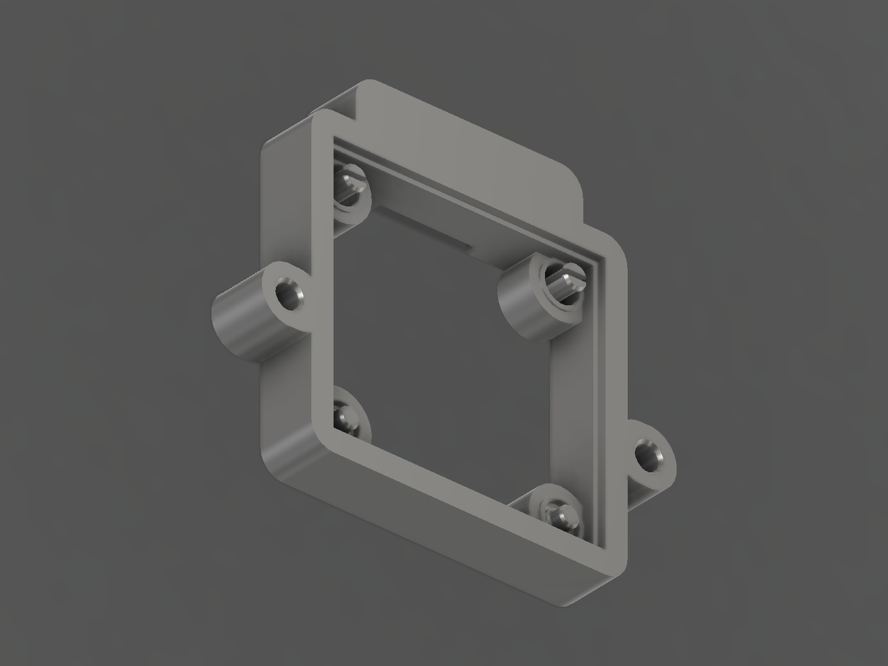

# Decca OLED Display Mount — CAD Build Review (Rev P)

Supersedes Rev N. Implements the corrected flush-side-insertion architecture
required by `Decca_OLED_Display_Mount_CAD_Review_revO.md` as amended
2026-08-29 (`main` @ `666abca`).
Platform: Autodesk Fusion 360, script-generated parametric build.

> ## Status: PHYSICAL RETENTION FAILURE — CORRECTIVE WORK IN PROGRESS
>
> The printed **Rev P.1** carrier **failed its retention test**: the OLED screen
> falls forward through the loose carrier.
>
> The failure is **architectural, not a tolerance adjustment**. Rev P.1 loaded
> the module from the rear and placed its only positive shoulders at the PCB
> rear plane, so they restrained the *opposite* direction; forward retention was
> left to four 0.10 mm edge-grip tongues acting through assumed friction. There
> was no positive geometric stop against forward movement, and the printed part
> proved it.
>
> This document now describes **Rev P.2**, the corrected geometry. Rev P remains
> an **OPEN** prototype revision. It is **not released**. The earlier
> "released / all validations pass" status is withdrawn.
>
> Two things stand between Rev P.2 and a closed finding:
>
> 1. **One blocking measurement before any print** — the OLED glass envelope
>    relative to the two header-side mounting holes (§9). It has never been
>    measured and it is **not** assumed here.
> 2. **The physical handling test** — a printed carrier with the OLED installed
>    must survive inversion in every axis and a gentle shake (§14). CAD and mesh
>    checks cannot close the retention finding.

Sources:

| File | Role |
|---|---|
| `mechanical/Drawings/Decca_OLED_Display_Mount_Topology_revP.md` | Stage 1 pre-CAD topology gate, corrected |
| `mechanical/CAD/Decca_Display_Mount_revP_fusion.py` | the generator — single source of truth for every dimension |
| `mechanical/CAD/Decca_Display_Mount_revP_verify.py` | independent verification of the exported STL |
| `mechanical/CAD/Decca_Display_Mount_revP.f3d` | **editable source of truth** |



---

## 1. The Rev P.1 failure, and what changes

### 1.1 Root cause

Rev P.1 inserted the OLED **from the rear**, moving forwards towards the
Perspex. Its four snap-finger shoulders sat at the **PCB rear plane**
(z = −2.70) and stopped motion **rearward** — back out of the pocket. Once the
board passed them, nothing prevented further forward travel.

The only loose-carrier restraint was four 0.10 mm edge-grip tongues pressing on
the PCB **edge** through assumed PETG friction. The Rev P.1 gate verified that:

- the rear shoulders exist — they do, and they restrain the wrong direction;
- the tongues stop behind the PCB front plane — they do, which is precisely why
  they cannot block forward travel;
- computed friction (0.55 N) exceeds module weight (0.039 N) — a calculation,
  not a geometric stop.

It never demonstrated a positive geometric stop against forward movement. There
was not one to demonstrate.

**None of the following was attempted as a fix**, and none would have addressed
the defect: increasing `finger_grip`, revising the assumed friction coefficient,
increasing spring force, or adding another rear-loaded edge finger.

### 1.2 Rev P.1 → Rev P.2

| | Rev P.1 (failed) | **Rev P.2** |
|---|---|---|
| Insertion direction | from the **rear**, moving forward | **from the flush / Perspex side, moving rearward** |
| Rearward stop | snap-finger shoulders on a moving spring | **four fixed, rigid datum pads** at z = −2.70 |
| Forward stop | **none** | **two sprung post hooks, 0.10 mm radial overlap, square face** |
| Retention basis | assumed friction, 0.55 N vs 0.039 N | **positive geometric interference** |
| PCB X/Y location | pocket walls | four posts in the four mounting holes, plus the pocket walls |
| Features in the PCB mounting holes | none | **four locating posts** |
| Carrier × PCB, seated | 2.40 mm³ (the tongues gripping the edge) | **CLEAR — nothing touches the board but the pads** |
| Removal | four Ø2.20 mm radial prise holes | pinch the two barbs from the front; push out through the open rear |
| Carrier | 56.60 × 47.20 × 9.60, 7.154 cm³ | **56.60 × 47.20 × 8.00, 6.928 cm³** |
| Parts to print | 2 | 2 (carrier + unchanged Rev N bezel) |

**Deleted:** the four PCB-edge friction fingers, their shoulders, their 0.10 mm
tongues, their four radial prise holes, and the friction-versus-weight
acceptance gate. Neither tool contains a friction criterion any more.

**Retained unchanged:** the 49.00 mm measured M2 pitch, the 35.20 × 15.30 mm
measured Perspex opening, the 0.30 mm nominal glass-to-Perspex gap, the ≤ 1.00 mm
front-side solder protrusion, the Rev N bezel, the direct carrier-to-Perspex
hard-stop rim, the M2 load path through Perspex → carrier rim → boss → insert
only, active-area centring, open rear header and cable access, and no separate
retainer bar.

The carrier lost 1.60 mm of depth because Rev P.1's 9.60 mm existed only to give
its 8.40 mm cantilever fingers room. With the fingers gone, the depth falls out
of the M2 insert stack and the post root relief instead.

---

## 2. Panel geometry — measured values, unchanged

- Perspex 3.00 mm; aperture **35.20 × 15.30 mm**; M2 pitch **49.00 mm**.

Corrected from Spec v1.0 by measurement at Rev C, print-confirmed at Rev D,
re-confirmed by the project owner on 2026-08-28, and locked in **Spec v1.1 §2**.
No modification of the original fascia.

---

## 3. The optical Z-chain

Unchanged from Rev P.1 forward of the PCB. Everything follows from two numbers:
how far the glass stands proud of the PCB face (measured, 0.80 mm) and the gap
chosen behind the Perspex (0.30 mm).

```text
z = +3.000   Perspex front face — M2 screw heads bear here
z =  0.000   Perspex rear face  == carrier hard stop            DATUM A
z = -0.300   OLED glass front face          <- oled_perspex_gap 0.30
z = -0.400   sprung post nose tip — 0.400 mm clear of the Perspex
z = -0.750   barb full-diameter land begins
z = -1.000   SNAP-HOOK RETAINING FACE — the forward stop
z = -1.100   OLED PCB front face            <- + oled_glass_proud 0.80
z = -1.200   forward limit of all carrier material in the aperture, noses aside
z = -1.350   plain post tops
z = -2.700   OLED PCB rear face == FIXED DATUM PADS             DATUM B
z = -3.000   post pedestal tops
z = -3.700   plain post root relief floor
z = -5.900   sprung post root relief floor
z = -8.000   carrier rear face
z = -10.800  header rear extent — clear of the carrier
```

```text
oled_perspex_gap 0.30 + oled_glass_proud 0.80 + oled_pcb_t 1.60 = 2.700
```


Section on x = +15.00, through a sprung locating post, clipped to a window
around the module so the reference Perspex patch does not swamp the view. The
slab on the right is the original 3.00 mm Perspex; the carrier body is on the
left; the module sits between them. The sprung post runs up from its root
relief, through the PCB, and hooks over the PCB front face. The plain post at
the bottom of the frame stops short of that plane.

### Why 0.30 mm and not 0.15 mm

Unchanged from the Rev O analysis, which remains sound: the one-sided
contributors to the gap (land Z position on the print, seating-face flatness
across 56.6 mm, `oled_glass_proud` sample variation, face finish, debris) sum to
0.19 mm RSS. 0.30 mm is the only value in the approved 0.15–0.30 band that keeps
a positive gap under that stack.

### The assembled gap, and float

The module seats on the four fixed pads, so the **nominal assembled gap is
0.300 mm**. Its only freedom is the deliberate 0.10 mm axial clearance under the
hooks, so the worst case is **0.20 mm** and the glass can never reach the
Perspex.

---

## 4. M2 load path — verified, unchanged

```text
M2 screw head → Perspex front face → Perspex 3.00 → Perspex rear face
              → carrier seating rim  (z = 0, DATUM A)
              → M2 boss → heat-set insert → screw thread
```

| Check | Result |
|---|---:|
| Forward-most carrier material | **z = +0.00000** |
| Forward-most OLED glass | z = −0.300 → 0.300 mm clear |
| Forward-most OLED PCB | z = −1.100 → 1.100 mm clear |
| Forward-most snap nose | z = −0.400 → 0.400 mm clear |
| Seating-face area at z = 0 | **707.8 mm²** |
| Synthetic Perspex fixture plate × carrier | **no penetration** |
| Insert bore | z 0.00 … −4.50, backing 3.50 mm, boss wall 2.20 mm |

Carrier and module are in **parallel**, never in series. The carrier bottoms out
on the Perspex 0.30 mm before anything can reach the glass and 1.10 mm before
anything can reach the PCB, so **no amount of M2 torque can alter OLED depth or
load the glass or the PCB**. The retention features are not in the load path
either — the noses stop 0.40 mm short of the Perspex.

M2×6 into a 4.00 mm insert gives 2.5 mm of engagement and cannot bottom out in
3.50 mm of backing.

---

## 5. The two positive stops — the check Rev P.1 did not have

Both stops are demonstrated by moving the real PCB solid and asking whether it
runs into carrier material. Nothing below is a friction estimate.

### 5.1 Forward — the sprung hooks

The board is moved forward **continuously** from its seated position. Motion is
continuous, so an obstruction anywhere in the swept volume stops it; it cannot
skip past the hook.

| Swept forward excursion | Result |
|---:|---|
| +0.05 mm | free — inside the designed hook clearance |
| +0.10 mm | free — the clearance exactly |
| **+0.15 mm** | **BLOCKED**, 0.083 mm³ at the two barbs |
| +0.30 mm | **BLOCKED**, 0.333 mm³ |
| +0.50 … +12.00 mm | **BLOCKED**, 0.512 mm³ |

The hook could only be stripped by forcing the board **2.07 mm** forward, which
the swept result above shows is impossible — the board is stopped at 0.15 mm.
2.07 mm of travel is reachable only with the barbs held squeezed, and that *is*
the removal action.

The retaining land is a **straight cylinder, not a taper**: measured constant at
Ø3.200 mm over its full 0.25 mm height on the exported mesh. A square face
cannot cam open under an axial pull, so there is no release path under load.

### 5.2 Rearward — the fixed datum pads

| Rearward excursion | Result |
|---:|---|
| −0.02 mm | BLOCKED, 0.682 mm³, **0.000 mm³ of it outside the datum pads** |
| −0.05 mm | BLOCKED, 1.705 mm³, 0.000 mm³ outside the pads |
| −0.20 mm | BLOCKED, 6.820 mm³, 0.000 mm³ outside the pads |

Every scrap of rearward interference is on the pads and nowhere else. All four
pads are solid carrier body — confirmed by point probe in Fusion and, on the
mesh, by probing a continuous solid column from the pad face down through the
pedestal to the carrier rear face. **No spring appears anywhere in either
stop.**

### 5.3 Neither stop loads the glass, and neither preloads the board

| | |
|---|---|
| Rear stop acts on | the PCB **rear** face, 1.60 mm behind the glass |
| Forward stop acts on | the PCB **front** face, **inside a Ø3.00 mounting hole** — a keep-out on both faces of the board by construction |
| Seated spring deflection | **0.00 mm** — the barb clears the PCB front face entirely |
| Seated axial clearance under the hook | **0.10 mm** |
| Seated radial clearance, shaft in hole | **0.10 mm** (sprung), 0.15 mm (plain) |
| Carrier × OLED_PCB, seated | **CLEAR** |

That last line is the point of the whole revision. Seated, the module is touched
by **nothing except the four rigid pads it rests on**. It is not clamped, not
bent, and not preloaded in any direction.

---

## 6. Locating posts — geometry, inheritance and recalculated mechanics

### 6.1 Arrangement

| Pair | Position | Type | Why |
|---|---|---|---|
| Header side ("wide") | x ±15.00, y +18.25 | **two split sprung posts** | modelled 4.30 mm from the glass edge — the pair with room for a nose |
| Display side ("narrow") | x ±15.00, y −10.25 | **two plain posts** | the modelled glass *overhangs* these holes; a plain post that stops behind the PCB front plane is safe whatever the real envelope is |

Rev K put sprung pegs in the narrow pair on **0.20 mm of assumed glass
clearance**. That unmeasured dependency is not recreated.

### 6.2 Sprung post

| z range | feature | Ø | note |
|---|---|---:|---|
| −5.90 … −5.10 | R0.80 root fillet | 2.80 → 4.40 | inside the Ø4.80 relief, 2.40 mm behind DATUM B |
| −5.90 … −1.00 | split shaft | **2.80** | 0.10 mm radial clearance in the Ø3.00 hole |
| −1.10 … −1.00 | axial clearance zone | 2.80 | **0.10 mm — the hook does not clamp the PCB** |
| **z = −1.00** | **retaining face, square, rearward-facing** | 2.80 → **3.20** | **0.10 mm radial overlap = the forward stop** |
| −1.00 … −0.75 | full-diameter land | 3.20 | measured 3.200 mm on the mesh |
| −0.75 … −0.40 | insertion lead-in cone | 3.20 → 2.60 | 40.6° from the axis |
| slot | 0.70 mm, normal to Y, from the fillet top to the tip | | halves deflect **inward** only |

### 6.3 Plain post

| z range | feature | Ø |
|---|---|---:|
| −3.70 … −2.90 | R0.80 root fillet | 2.70 → 4.30 |
| −3.70 … −1.65 | shaft | **2.70** (0.15 mm radial clearance) |
| −1.65 … −1.35 | entry chamfer | 2.70 → 2.10 |

Top face **0.25 mm behind the PCB front plane**, so a plain post satisfies the
original prohibition without needing the controlled exception at all. Measured
clearance to the modelled glass: **0.292 mm**.

### 6.4 What was reused from Rev D / Rev K, and what changed

| Rev D / Rev K value | Rev P.2 | Change and reason |
|---|---|---|
| sprung shaft Ø2.80 | **Ø2.80** | reused unchanged — printed and fit-tested at Rev D |
| split slot 0.70 | **0.70** | reused unchanged; measured 0.700 mm on the exported mesh |
| barb Ø3.20, 0.10 mm radial hook | **Ø3.20, 0.10 mm** | reused unchanged — the brief's starting value, measured 3.200 mm |
| R0.80 root fillet | **R0.80** | reused unchanged; relief bore measured 4.800 mm |
| plain post Ø2.70 | **Ø2.70** | reused unchanged |
| root relief ≈ 1.00 mm | **3.20 mm sprung / 1.00 mm plain** | **changed.** In Rev D/K the relief sat *in front of* the PCB, so the glass capped its depth — that is what forced Rev K's narrow pair to a 0.40 mm relief on 0.20 mm of assumed clearance. In Rev P.2 the relief is **behind** the PCB, where the glass cannot constrain it, so the depth is set by strain instead. |
| hook land (Rev D, one layer or less) | **0.25 mm** | **changed.** A retaining land thinner than a print layer is not a retaining land. 0.25 mm is 1.25 layers at 0.20 mm. |
| Rev D peak strain 1.64 % (a = 3.10) | **0.83 %** (a = 4.35) | consequence of the deeper relief |
| Rev K narrow pair on 0.20 mm assumed glass clearance | **deleted** | replaced by plain posts — the dependency is removed, not re-estimated |

### 6.5 Recalculated mechanics

Split cantilever fixed at the top of the root fillet (z = −4.90 effective),
loaded at the full-diameter land: **a = 4.35 mm**, half-section
t = (2.80 − 0.70)/2 = **1.05 mm**, PETG E = 2000 MPa.

| Quantity | Value |
|---|---:|
| Deflection to pass the barb, per half | 0.10 mm |
| **Peak strain, hole centred** | **0.83 %** |
| **Peak strain, board hard against one side** (0.20 mm on one half) | **1.66 %** |
| Strain limit | 3.00 % |
| Insertion force at a 40.6° cam | ≈ 6.1 N per post → **≈ 12.3 N total** |
| Seated deflection | **0.00 mm** |
| Seated preload on the PCB | **none, in any direction** |
| PCB bending from retention | **none** |
| Forward retention mechanism | **positive geometric overlap; square face, cannot cam** |

The µ 0.30 in the insertion-force estimate is used **only** to predict push-on
effort. No acceptance criterion in either tool depends on friction.

---

## 7. Fixed rear PCB datum

| | |
|---|---:|
| Four annular pads, concentric with the four Ø3.00 mounting holes | x ±15.00, y +18.25 / −10.25 |
| Outer Ø / inner Ø | 6.00 / 4.80 |
| Forward-facing pad area at z = −2.70 | **38.96 mm²** |
| Area actually bearing on the 35.40 × 33.50 PCB outline | **34.10 mm²** |
| Four-point pattern | **30.00 × 28.50 mm** |
| Carried on | Ø8.60 pedestals, z −8.00 … −3.00, merged into the pocket walls |
| Spring content | **none** |

They bear **inside the board's own mounting-hole keep-outs**, which are
component-free on both faces by construction. Every earlier revision took its
PCB datum from the board edge band, which is an assumption about where
components are not; this one is not an assumption. The 30.00 × 28.50 mm pattern
is the widest the board offers, so the seated board cannot rock.

Loading is the ≈ 12 N insertion push only — nothing pushes the module rearward
in service — which is 0.35 MPa across 34 mm².

The Ø8.60 pedestal diameter is not a round number for a reason: at Ø8.00 the
pedestal arc passes 0.033 mm inside the pocket corner and leaves four hair
slivers. Ø8.60 swallows the corner by 0.27 mm instead, and the sliver count goes
to zero.

---

## 8. Invariant P1′ — the controlled exception, stated as geometry

Rev P.1's invariant said the aperture prism is empty forward of the PCB face.
Rev P.2 needs positive forward retention, so the invariant is **tightened to
name its own exception** rather than relaxed:

> **P1′.** With `A` = the module-aperture prism
> `{ |x| ≤ 18.55, −13.60 ≤ y ≤ +21.60 }` and `N` = the two nose envelopes
> `{ (x ∓ 15.00)² + (y − 18.25)² ≤ 1.60², −1.20 < z ≤ −0.40 }`,
>
> `Carrier ∩ A ∩ { z > −1.20 } ⊆ N`, and `N` lies strictly inside the two
> Ø3.00 mounting-hole corridors.

| Verification | Method | Result |
|---|---|---|
| Material in `A` above z = −1.20 | Fusion boolean | 7.8298 mm³ |
| …all of it inside `N` | Fusion boolean residual | **EMPTY** |
| …all of it inside the hole keep-out, R2.10 | Fusion boolean residual | **EMPTY** |
| `A` above z = −1.20, outside `N` | triangle/AABB on the exported STL | **empty** |
| Nose radius about the hole centre | measured off the STL | **1.600 mm** ≤ 2.10 |
| PCB footprint above the PCB front face, `N` excepted | triangle/AABB on the STL | **empty** |
| Plain posts above z = −1.35 | triangle/AABB on the STL | **empty** |
| Forward-most carrier material | face enumeration | z = +0.00000 |

There is still **no carrier plate, seating land, structural shoulder or other
load-bearing feature** between the PCB front face and the Perspex. `N` carries no
load, sets no datum, and touches the PCB only when the module is being pulled
forwards out of the carrier.

### What `N` is proven clear of

| `N` vs | Result |
|---|---|
| the Perspex | **0.400 mm clear** (nose tip z = −0.40) |
| the Rev N bezel | **CLEAR** — rearmost bezel material z = +0.200 |
| the active display area | 9.30 mm clear in Y; carrier → active area 2.034 mm |
| solder joints / tips | 8.49 mm clear in X; carrier → tips 1.853 mm |
| the insertion and removal corridor | **CLEAR** — `N` sits inside the hole corridor it is meant to occupy |
| **the OLED glass** | **NOT DEMONSTRATED — §9** |

---

## 9. The one blocking measurement — reported, not assumed

The brief is explicit: *if the real glass envelope cannot be demonstrated clear,
stop and report the missing measurement rather than assuming it.*

**It cannot be demonstrated. It is reported, and it is not assumed away.**

| | |
|---|---|
| Missing dimension | the OLED glass X/Y envelope relative to the two **header-side** Ø3.00 mounting holes at (±15.00, +18.25) |
| Status | **never measured.** `oled_glass_w`, `_h` and `_off_y` are flagged NOT MEASURED in every revision since Rev B. The only measured glass dimension is `oled_glass_proud` = 0.80 mm. |
| Acceptance criterion | hole centre to nearest bonded-glass edge **≥ 2.10 mm**, at both holes — i.e. the glass must not pass y = +16.15 |
| How | digital calipers on the module in hand. One number, both ends. |
| Modelled, unmeasured | 4.30 mm |
| If it fails | the sprung noses foul the glass. The design does **not** go to a printer on an assumption. |

Evidence that is suggestive but deliberately **not** treated as proof: the
front-face solder pads sit at y ≈ +17.95 … +19.15 and bonded glass cannot cover
solder pads, which bounds a rectangular glass panel below y ≈ +17.95. That is
1.80 mm short of what the nose needs, and it rests on the pad position rather
than on the glass. Not sufficient.

Note what the modelled envelope itself implies: it puts the glass **0.30 mm over
the display-side mounting holes**, which would make the module unmountable with
any screw. The modelled numbers are known to be unreliable in exactly this
region — a further reason not to lean on them.

**The exposure is as small as it can be made.** Worst case, with the glass
modelled as the **full PCB outline** and swept through the whole corridor, every
scrap of contact is inside the two declared noses: the plain posts, the pads,
the pedestals, the pocket walls and the rim are clear of the glass even then.
Two Ø3.20 mm noses, inside two mounting holes, are the entire glass exposure of
the design.

Contingency if the measurement fails: move the sprung pair outboard in X within
the keep-out, or fall back to a forward stop bearing on the PCB **corners**
outside the glass footprint. Neither is designed until the number exists.

---

## 10. Insertion and removal — validated as swept corridors

Motion is a **pure ±Z translation** — no tilt, no rotation, no lateral shift.
Insertion is from the flush / Perspex side moving rearward; removal is the same
line forward, so one corridor covers both.

| Swept body, 12 mm travel | Fusion boolean | STL triangle/AABB |
|---|---|---|
| OLED glass (modelled envelope) | **CLEAR** | **CLEAR** |
| Solder tips @ 1.00 mm proud | **CLEAR** | **CLEAR** |
| Header body | **CLEAR** | **CLEAR** |
| OLED PCB | HIT 0.5123 mm³ | — |
| OLED PCB, outside the two nose envelopes | **CLEAR** | **CLEAR** |
| PCB corridor outside the four mounting holes | — | **CLEAR** |

**Only the two intended sprung noses deflect.** The entire 0.5123 mm³ is the
designed 0.10 mm snap deflection; the residual after subtracting the two nose
envelopes is an empty solid, and the STL check re-derives the same result by
decomposing the corridor into boxes that exclude the hole footprints exactly.

### Insertion sequence

1. Offer the module to the **front** of the carrier, glass towards the carrier,
   header at the top. The glass enters the open module aperture, 0.85 mm larger
   than the PCB all round.
2. The two sprung barb tips (Ø2.60 at z = −0.40) enter the header-side holes
   first and align the board.
3. The PCB rear face enters the pocket at z = −1.20, 0.25 mm clearance.
4. The barbs cam inward 0.10 mm per half; the plain posts enter the
   display-side holes.
5. The PCB rear face lands on the **four fixed datum pads** at z = −2.70. Motion
   stops there — on rigid carrier body, not on a spring. About 12 N by thumb.
6. As the PCB front face passes z = −1.00 the barbs snap fully clear and relax
   to zero deflection, standing 0.10 mm ahead of the board.

### Removal — identified tool path, no prise holes

1. Remove the two M2 screws and lift the carrier off the Perspex.
2. From the front, squeeze each barb inward with fine-nose tweezers or snipe
   pliers, 0.10 mm per half. **0.70 mm of nose stands proud of the PCB front
   face and is completely exposed**, because nothing at all sits in front of
   the PCB.
3. With a barb pinched, lift that corner clear; or push the PCB forward through
   the **open rear window** with a fingertip or spudger.
4. The plain posts slide straight out.

Validated by rebuilding the carrier with both barbs modelled squeezed 0.12 mm
per half (0.10 required + 0.02 margin) and re-running the full corridor set:

| Pinched carrier × | Result |
|---|---|
| Swept PCB | **CLEAR** |
| Swept glass | **CLEAR** |
| Swept tips | **CLEAR** |
| Swept header | **CLEAR** |
| Open rear push-out window | **clear at the carrier rear face** |

---

## 11. The solder-tip budget — unchanged, resolved by module preparation

Arithmetic between the module and the original panel. The carrier is not in the
path at any tip length.

```text
oled_perspex_gap 0.30  +  oled_glass_proud 0.80  =  1.10 mm
```

**Decision, 2026-08-28: the tips will be reduced.** `oled_tip_proud` is modelled
at **1.00 mm** — the preparation limit with 0.10 mm of clearance.

| Tip proud of the PCB face | vs Perspex | vs carrier | Verdict |
|---:|---|---|---|
| 0.40 | CLEAR | CLEAR | PASS |
| 0.80 | CLEAR | CLEAR | PASS |
| **1.00** | **CLEAR (+0.10)** | CLEAR | **PASS — the modelled design input** |
| 1.10 | CLEAR (0.00) | CLEAR | zero margin — do not aim here |
| 1.20 | HIT 0.905 mm³ | CLEAR | FAIL |
| 1.50 | HIT 3.619 mm³ | CLEAR | FAIL — the brief's original figure |
| 2.00 | HIT 8.143 mm³ | CLEAR | FAIL — untrimmed |

**Carrier × tips is CLEAR at every length**, because the carrier has no material
forward of z = −1.20 inside the module aperture except the two noses, and the
noses are 8.49 mm away from the tips in X. Minimum measured clearance 1.853 mm.

### Required preparation

Prepare the module so that nothing on its display-side face stands more than
**1.00 mm** proud.

- **Preferred** — remove the pin header and solder the four leads to the pads
  **from the rear**, dressing the front-side joints flush. Rev P.2 leaves the
  entire rear of the board open.
- **Acceptable** — keep the header, trim the front-side pins and dress the
  solder below 1.00 mm proud.

Check with a depth gauge or straight edge before assembly. 1.10 mm is the hard
ceiling; aim for 1.00 mm or less.

---

## 12. Validation summary

Run `main()`, `validate()`, `import_bezel()`, `snapshots()` and `export()` inside
Fusion, then `python mechanical/CAD/Decca_Display_Mount_revP_verify.py` offline.

The gate is the **revised** one required by the corrected brief.

| # | Required proof | Result |
|---|---|---|
| 1 | OLED inserts from the flush/Perspex side by a straight controlled motion | **PASS** — pure −Z, corridor clear, §10 |
| 2 | Only intended sprung post noses deflect during insertion | **PASS** — 0.5123 mm³, residual outside the two noses EMPTY |
| 3 | PCB rear face seats on fixed, non-spring datum pads | **PASS** — 38.96 mm² at z = −2.70 on Ø8.60 pedestals, 4 of 4 rigid |
| 4 | The module cannot translate forward out of the loose carrier | **PASS** — blocked from +0.15 mm through +12.00 mm, §5.1 |
| 5 | Retention is positive geometric overlap, not assumed friction | **PASS** — 0.10 mm radial, square face; no friction criterion in either tool |
| 6 | Snap hooks have axial clearance and do not clamp or bend the PCB | **PASS** — 0.10 mm axial, 0.10 mm radial, carrier × PCB **CLEAR** seated |
| 7 | Plain and sprung posts correctly locate X/Y | **PASS** — 4 of 4 posts in the four holes, shafts measured 2.800 / 2.700 mm |
| 8 | Glass clear of all posts and roots through insertion, seating and removal | **PARTIAL — the two noses are the sole exposure and it is UNMEASURED, §9** |
| 9 | Assembled glass-to-Perspex gap remains 0.30 mm nominal | **PASS** — 0.300 mm; worst case 0.20 mm |
| 10 | Carrier-to-Perspex hard stops carry all M2 preload | **PASS** — 707.8 mm² at z = 0, module in parallel |
| 11 | Prepared ≤ 1.00 mm solder protrusions clear the carrier and Perspex | **PASS** — +0.10 mm to the Perspex, 1.853 mm to the carrier |
| 12 | Removal is possible with an identified tool path | **PASS** — pinch and push out; all four corridors clear when pinched |
| 13 | Print orientation supports the post roots, no unsupported critical barbs | **PASS** — rear-face-down, no supports; the only overhang is the 0.10 mm hook ledge |
| 14 | No retainer bar is required | **PASS** — two printed parts |
| 15 | Loose carrier passes a real inversion and gentle-shake handling test | **NOT DONE — this is a physical test, §14** |

Plus the carried-over checks:

| Check | Result |
|---|---|
| carrier × Perspex | **CLEAR** — plane contact only |
| carrier × OLED glass / active area / header / tips / PCB | **all CLEAR** |
| boolean slivers | **0 faces < 0.02 mm², 0 edges < 0.05 mm** |
| carrier is a single closed solid | **6.928 cm³, 130 faces** |
| active-area alignment | **centred on (0.0000, 0.0000)** |
| front bezel × everything | **CLEAR, unchanged from Rev N** |
| cable-tie path | **3.50 × 1.40 mm section passes, never reaches z = 0** |
| point probes | **26 of 26 in Fusion, 21 of 21 on the mesh** |

**The Fusion gate reports `GATE RESULT: ALL CHECKS PASS` with one blocking open
item, and the independent STL checker exits 0 with the same open item.**

### Clearance table

| Interface | mm |
|---|---:|
| OLED glass → Perspex | **0.300** |
| carrier → OLED glass | 0.292 * |
| carrier → active area | 2.034 |
| carrier → header body | 0.250 |
| carrier → solder tips | 1.853 |
| carrier → OLED PCB | 0.000 † |
| header → Perspex | 2.700 |
| snap nose tip → Perspex | 0.400 |

\* the plain post tops, 0.25 mm behind the PCB front plane and 0.15 mm outside
the modelled glass edge in Y.
† intended face contact: the PCB rear face rests on the four datum pads.

### Optical alignment

| | mm |
|---|---:|
| Active area | 29.42 × 14.70, centred on (0, 0) |
| Aperture (measured) | 35.20 × 15.30 |
| Margin to the aperture | x 2.89, **y 0.30** |

Unchanged, so **firmware must still mask 2 pixel rows top and bottom**.

---

## 13. Verification independence — and a silent failure it caught

`Decca_Display_Mount_revP_verify.py` never imports, parses or executes the
generator. It reads the **exported binary STL**, re-enters the requirements from
the measured repository values and the brief, and uses algorithms different in
kind — triangle/AABB separating-axis tests, ray-cast membership and material
spans, edge-manifold counting, a divergence-theorem volume.

It also now checks a different *class* of thing. Rev P.1's checkers agreed with
each other and with the model, and the model was exactly as drawn; the
**acceptance criteria** were what was wrong. So the verifier's §C does not ask
"does a named retention feature exist?" — it measures the barb's outer diameter
off the mesh at five heights and confirms it is larger than the hole it has to
hold, at a z ahead of the PCB front face. There is **no friction calculation
anywhere in the file**.

Independent verdict on the exported STL: **6240 triangles, closed 2-manifold, 0
non-manifold edges, consistent winding, 6.9232 cm³ by divergence theorem against
Fusion's 6.928 cm³, 21 of 21 ray-cast membership probes agreeing with Fusion's
26 of 26, split slot measured 0.700 mm, barb land measured 3.200 mm, root relief
bore measured 4.800 mm, every geometric check passing.**

### A silent Fusion API failure, caught and guarded

The R0.80 root fillets are built from primitive torus geometry, the Rev D
technique. In this Fusion build (2704.1.53) `TemporaryBRepManager.createTorus`
**ignores its `center` argument** and always returns a torus at the world origin.
A fillet built by subtracting such a torus therefore removes nothing, and the
result is a plain cylindrical **collar** — which passes every clearance,
interference and printability check, because it is smaller than the relief bore
that contains it. Nothing reports an error.

It was caught because the point probes disagreed with the intended profile. The
generator now translates the torus explicitly, and `root_fillet` raises if the
boolean leaves the collar volume intact, so the same failure cannot ship
silently again.

---

## 14. Prototype acceptance tests — the retention finding stays open

**CAD and mesh checks may release a corrected geometry-validation print. They
cannot close the retention finding.** Only a printed part can.

Before printing: take the §9 measurement.

Then, in order — tests 1 to 5 are mandatory before Rev P can regain any release
recommendation:

1. **flush-side insertion** of the OLED, straight in, no glass or component
   contact, no board flex; both barbs click;
2. the PCB rear face **seats consistently on all four fixed datum pads** — no
   rock, no rattle;
3. both sprung posts **engage with visible positive overlap**, and the board is
   not bowed;
4. **the loose carrier retains the OLED when inverted in every axis and through
   a gentle handling shake** — no fall-through, no fall-away. *This is the test
   Rev P.1 failed.*
5. the stated release method removes the OLED without damaging the posts or the
   board;
6. carrier seats flat against the Perspex before the screws are snug;
7. actual OLED-to-Perspex gap (target 0.30 mm);
8. active-area centring when powered, and the real `oled_pcb_off_y`;
9. bezel alignment in the aperture;
10. M2 tightening does not change OLED depth — measure the gap before and after;
11. prepared solder joints and header clear the Perspex and the carrier;
12. no rattle when assembled;
13. cable tie threads and holds;
14. no separate retainer is required.

---

## 15. Printing and assembly

**Orientation: the carrier REAR FACE flat on the bed, building forward (+Z).
No supports.**

| Feature | In this orientation |
|---|---|
| Post pedestals | grow from the bed, fully supported columns |
| Root reliefs | upward-opening blind pockets |
| Post roots | start on the solid relief floor |
| Datum pads at z = −2.70 | upward-facing, on a layer boundary — layer-count accurate |
| Aperture step at z = −1.20 | upward-facing ledge |
| Barb retaining face at z = −1.00 | a **0.10 mm** radial downward-facing ledge — the Rev D 0.10 / Rev K 0.175 class, both of which printed |
| Barb lead-in cone | 49° from horizontal, self-supporting |
| Seating face at z = 0 | a top surface — use 4+ top layers or ironing |

DATUM A (z = 0) and DATUM B (z = −2.70) are in the same Z stack, so the 2.70 mm
between them is layer-count accurate.

| Section | mm |
|---|---:|
| Structural wall | 3.00 |
| M2 boss wall around the insert | 2.20 |
| Material behind the blind insert bore | 3.50 |
| Sprung post shaft | Ø2.80, 5.50 mm tall, 0.70 mm slot |
| Plain post shaft | Ø2.70, 2.35 mm tall |
| Datum pad annulus | 6.00 / 4.80 |

Print the posts slowly — the sprung ones are 2.80 mm split columns standing
5.50 mm tall. Material PETG / PETG-HF. Hardware: 2 × M2 heat-set inserts
(Ø3.2 × 4.0), 2 × M2×6 screws entering from the front. Press each insert
**0.50 mm below the seating face** into a bore with a 0.40 mm mouth chamfer.

### Assembly sequence

1. Press the two M2 inserts into the carrier from the seating face.
2. Prepare the module per §11 and verify the front-side protrusion.
3. Push the OLED into the carrier pocket **from the front / seating-face side**,
   glass towards the carrier, header at the top, until both barbs click. About
   12 N by thumb. It then rests on the four fixed pads with zero preload.
4. Offer the carrier to the rear of the Perspex and fit the two M2 screws from
   the front. Tighten until the carrier is flat — further torque cannot reach
   the module.
5. Fit the bezel to the front of the aperture (removable adhesive on the
   recessed pads, unchanged since Rev G).
6. Strain-relieve the cable with a tie through the flange relief and slots.

---

## 16. Front bezel — unchanged

Carried over from Rev N untouched. Imported into the Rev P.2 design as a
reference body from `Front_Bezel_revN.step` and re-checked against the new
carrier: clear of the carrier, the Perspex, the glass, the PCB and the solder
tips.

| | mm |
|---|---:|
| Bezel envelope | 40.00 × 20.30 × 4.00 |
| Locating lip depth into the 3.00 mm Perspex | 2.80 |
| Rearmost bezel material | z = **+0.200** |
| Clearance to the OLED glass front face | **0.500** |
| Clearance to the snap-nose tips | **0.600** |

`Front_Bezel_revN.step` / `.stl` remain the files of record.

---

## 17. Open items

| # | Item | Blocks print? | Blocks CAD? |
|---|---|---|---|
| **1** | **Glass envelope vs the two header-side mounting holes — §9** | **YES** | no |
| **2** | **Physical inversion and gentle-shake retention test — §14** | — | **blocks release** |
| 3 | `oled_glass_proud` = 0.80 mm from a single sample; it sets the whole chain | no | no |
| 4 | `oled_pcb_off_y` = 4.00 mm still assumed — affects active-area centring only | no | no |
| 5 | Anything on the PCB front face other than glass and solder tips is assumed absent | no | no |
| 6 | Nothing on the PCB **rear** face within the four Ø6.00 pad annuli — check at fit test | no | no |
| 7 | Firmware must mask 2 pixel rows top and bottom | no | no |
| 8 | Bezel retention is removable adhesive on recessed pads | no | no |
| ~~9~~ | ~~Front-side solder protrusion~~ | **CLOSED** 2026-08-28 — tips reduced, modelled at 1.00 mm | — |

Item 1 is the only thing standing between this geometry and a printer. Item 2 is
the only thing standing between a printed carrier and a release recommendation.

---

## 18. Reproducing this build

`Decca_Display_Mount_revP.f3d` is written **by Fusion**, from the generator:

1. Open Fusion 360.
2. Utilities → Add-Ins → Scripts and Add-Ins → Scripts → green `+` → pick
   `mechanical/CAD/Decca_Display_Mount_revP_fusion.py`.
3. Set `OUT_DIR` to your clone's `mechanical` folder (currently
   `D:\GitHub\Decca\mechanical`).
4. Run `main()`, then `validate()`, `import_bezel()`, `snapshots()`, `export()`.

`main()` creates a **new** document on the first run and rebuilds in place on
later runs. It writes 101 values into `design.userParameters`, builds
`REF_Decca_Panel`, `REF_SH1106_1P3` and `Rear_Display_Carrier`, and exports the
`.f3d`, both STEPs and the STL. `snapshots()` regenerates the four Drawings PNGs
from the live model, so the images always document the geometry in the file.

Then, offline and independently:

```bash
python mechanical/CAD/Decca_Display_Mount_revP_verify.py
```

It exits non-zero when a check fails, so it is usable as a gate. It only reads
the STL.

---

## 19. Design decision

**Rev P is OPEN. It is not released.**

The corrected architecture is delivered in full and validated on the real solid
and again, independently, on the exported mesh: flush-side insertion, fixed rear
PCB datum pads, positive geometric forward retention by two sprung post hooks,
zero preload on the seated module, separate carrier-to-Perspex hard stops
carrying all M2 preload, nothing structural between the PCB front face and the
Perspex, an identified removal path, no separate retainer bar, and both swept
corridors clear in both directions.

Two things remain, and neither is a CAD result:

1. **Measure the glass envelope at the two header-side mounting holes** (§9).
   Until that number exists, no corrected carrier is printed.
2. **Print one and try to shake the screen out of it** (§14). The Rev P.1
   retention finding closes when a real carrier holds a real module upside down,
   and not before.

Rev N receives no further work.
